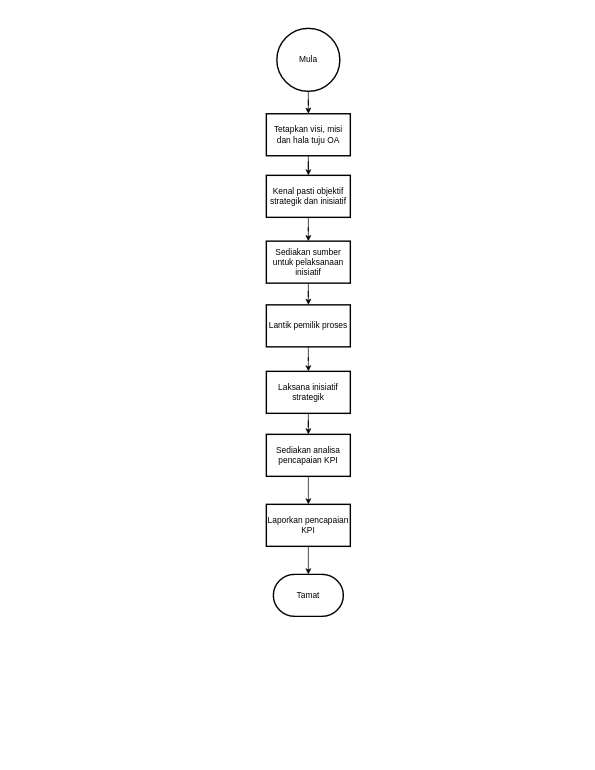
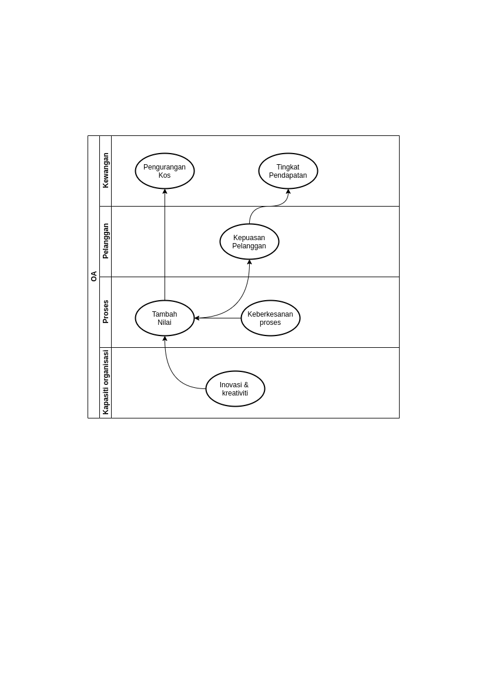

\newpage
\fancyhead[R]{\textbf{No: Keluaran: 01\\No Pindaan: 00\\Tarikh Kuatkuasa: `r params$doc_date`}}
\fancyhead[L]{\textbf{MS ISO 9001:2015\\OpenApps Sdn Bhd (548151-W)\\`r params$doc_id`}}
\clearpage
\pagenumbering{Roman}

# I    Rekod Pindaan

|Tarikh Pindaan|No Pindaan/No Keluaran|Rujukan Pindaan Mukasurat |Butir-butir Pindaan|Diluluskan Oleh|
|-------------|-------------|-------------|-------------|-------------|
|             |             |             |             |             |
|             |             |             |             |             |
|             |             |             |             |             |
|             |             |             |             |             |
|             |             |             |             |             |
|             |             |             |             |             |
|             |             |             |             |             |
|             |             |             |             |             |
|             |             |             |             |             |

# II   Senarai Pemegang Dokumen

| No. Salinan Terkawal   | Pemegang Dokumen              |
|------------------------|-------------------------------|
| `r params$doc_id`(01)  | `r a_list$pemilik_dok[1]`     |
|                        |                               |
| `r params$doc_id`(02)  | `r a_list$pemilik_dok[2]`     |
|                        |                               |
| `r params$doc_id`(03)  | `r a_list$pemilik_dok[3]`     |
|                        |                               |
| `r params$doc_id`(04)  | `r a_list$pemilik_dok[4]`     |
|                        |                               |
| `r params$doc_id`(05)  | `r a_list$pemilik_dok[5]`     |
|                        |                               |
| `r params$doc_id`(06)  | `r a_list$pemilik_dok[6]`     |
|                        |                               |
| `r params$doc_id`(07)  | `r a_list$pemilik_dok[7]`     |
|                        |                               |
| `r params$doc_id`(08)  | `r a_list$pemilik_dok[8]`     |
|                        |                               |
| `r params$doc_id`(09)  | `r a_list$pemilik_dok[9]`     |
|                        |                               |
| `r params$doc_id`(10)  | `r a_list$pemilik_dok[10]`    |
|                        |                               |
| `r params$doc_id`(11)  | `r a_list$pemilik_dok[11]`    |
|                        |                               |
| `r params$doc_id`(12)  | `r a_list$pemilik_dok[12]`    |
|                        |                               |
| `r params$doc_id`(13)  | `r a_list$pemilik_dok[13]`    |

\newpage
\clearpage
\pagenumbering{arabic}
\setcounter{page}{1}

# 1.0   Objektif

Syarikat mengambil pendekatan pengurusan dan perancangan strategik dengan melibatkan setiap jabatan untuk merangka sasaran jangka sederhana. Kaedah pengurusan dan perancangan strategik *Balanced scorecard* (BSC) dipilih atas sebab-sebab berikut:

i. Komunikasi perancangan dan objektif yang ingin dicapai;

i. Jajarkan pencapaian dengan strategi setiap pelaksanaan kepada pihak yang terlibat; 

i. Memberi keutamaan kepada projek, produk dan penyampaian perkhidmatan; dan

i. Mengukur dan memantau pencapaian yang dijajarkan dengan strategi syarikat.

# 2.0   Skop

BSC dipantau oleh pengurusan atasan syarikat di mana setiap inisiatif merentas jabatan untuk mencapai sasaran dengan penglibatan pegawai dan staf.

# 3.0   Rujukan

Pelaksanaan BSC merujuk kepada seksyen-seksyen di dalam MK.OA.01 yang berikut: 

i. Seksyen 5.1  Kepimpinan dan komitmen;

i. Seksyen 6.2.1 Objektif kualiti pada fungsi, aras dan proses yang relevan yang diperlukan;

i. Seksyen 6.2.2 Strategi dan perancangan untuk mencapai objektif kualiti;

i. Seksyen 9.1 Pemantauan, pengukuran, analisis dan penilaian; dan

i. Seksyen 10.3 Penambahbaikan berterusan.

# 4.0   Definisi

 4.1 *Balanced scorecard* (BSC)
~ Kaedah pengurusan strategik dan prestasi yang menetapkan pencapaian objektif tempoh jangka masa lima (5) tahun. BSC mengkomunikasi visi dan misi syarikat untuk pertumbuhan yang berterusan dengan mengambil kira sumber tersedia.

 4.2. Perspektif
 ~ Dimensi, aras atau domain yang diukur dalam konteks menetapkan sasaran serta dijajarkan dengan strategi. Perspektif tersebut adalah:    
    a. Kapasiti organisasi;  
    c. Pelanggan atau pemegang taruh (Stake holder); dan    
    d. Kewangan.

 4.3 Objektif
~ Matlamat strategik syarikat yang menjurus kepada pencapaian setiap perspektif dan saling menyokong antara satu sama lain dan rentas jabatan. 

 4.4 Inisiatif
~ Projek atau daya usaha yang dilaksanakan bagi mencapai objektif strategik.

 4.5 Petunjuk prestasi utama (KPI)
~ Set pengukuran petunjuk prestasi setiap pencapaian disasarkan yang menyumbang ke arah objektif strategik syarikat. KPI dalam konteks QMS mengukur prestasi objektif-objektif kualiti (Seksyen 6.2.2 dan seksyen 9.1).

 4.6 Kamus data
~ Keterangan setiap parameter/pemboleh ubah yang menjelaskan kaedah pengukuran, kriteria dan pencapaian.

 4.7 Hamparan elektronik (Spreadsheet)
~ Perisian automasi pejabat cth *MS excel*, *Google sheet* atau *Libreoffice spreadsheet* yang digunakan sebagai templat untuk menjana pengiraan KPI dan prestasi keseluruhan.

 4.8 Skor
~ Untuk mentrasformasi unit ukuran yang pelbagai (cth bilangan, hari atau %) kepada satu ukuran berskala (lihat Jadual 1). Prestasi diukur sebagai nisbah skor setiap objektif kepada jumlah keseluruhan skor.

 4.9 Rumus pengiraan KPI dan prestasi
~ Seperti persamaan matematik yang berikut:  
jika x~i~ dan max~y~(a,b) min~y~(a,b) masing-masing adalah objektif dan jumlah objektif yang diukur;  

\begin{align*}
x_{i} = \displaystyle\sum\limits_{i=0}^n u_{i}\ast val_{i}-\:u_{i} \ast\min(a,b);\\
y_{i} = \displaystyle\sum\limits_{i=0}^n max_{i}(a:b) - min_{i}(a:b) \ \\
KPI\colon \\
\chi_{i} = \frac{x_{i}}{y_{i}} \ast 100 \hspace{2em} \\
\end{align*} 

 4.9 Penetapan kriteria prestasi
~ Seperti Jadual 1 di bawah.

Jadual 1: Kriteria prestasi KPI

\begin{table}[ht!]
\begin{tabular}{lllll}
                            &                 & \multicolumn{3}{c}{Pengukuran} \\
KPI                         & Kriteria        & Unit        & Skor & Tahap     \\
                            &                 &             &      &           \\
a. \% keseluruhan, kepuasan & 70\% ke 100\%   & \%          & 5    & Cemerlang \\
                            & 40\% ke 69\%    &             & 3    & Memuaskan \\
                            & Bawah 40\%      &             & 1    & Sederhana \\
                            &                 &             &      &           \\
b. Pembayaran PO dan invois & Kurang 8 hari   & hari        & 5    & Cemerlang \\
                            & 14 ke 8 hari    &             & 3    & Memuaskan \\
                            & Lebih 14 hari   &             & 1    & Sederhana \\
                            &                 &             &      &           \\
c. Pembayaran DO            & 25 hari atau kurang & hari    & 5    & Cemerlang \\
                            & 26 ke 30 hari   &             & 3    & Memuaskan \\
                            & Lebih 30 hari   &             & 1    & Sederhana \\
                            &                 &             &      &           \\
d. Serahan projek           & Awal dr jadual  & \# serahan  & 5    & Cemerlang \\
                            & Tepati jadual   &             & 3    & Memuaskan \\
                            & Lewat dr jadual &             & 1    & Sederhana
\end{tabular}
\end{table}

\newpage

# 5.0   Singkatan

KPI 
~ Petunjuk prestasi utama.

# 6.0   Tanggungjawab dan Tindakan

\begin{table}[th]
\begin{tabular}{|l|l|}
\hline
Tanggungjawab                   & Tindakan                                                      \\ \hline
MD                              & 1. Tetapkan visi, misi dan hala tuju syarikat.                \\ \hline
Pengurus Jabatan                & 2. Kenal pasti objektif strategik dan inisiatif untuk projek. \\
                                & 3. Sediakan sumber untuk pelaksanaan inisiatif dan            \\
                                & lantik pemilik proses untuk pelaksanaan.                      \\ \hline
Wakil pengurusan                & 4. Rekod objek strategik, inisiatif dan pemilik proses.       \\ \hline
Pemilik proses                  & 5. Laksana inisiatif strategik dan laporkan prestasi KPI.     \\ \hline
Pemilik proses/Wakil pengurusan & 6. Sediakan analisa pencapaian KPI dan laporan BSC.           \\ \hline
Wakil pengurusan                & 7. Laporkan pencapaian KPI kepada pengurusan atasan syarikat. \\ \hline
\end{tabular}
\end{table}

\newpage

# 7.0 Aliran Kerja

{width=100%}
\newpage

# 8.0 Rekod Kualiti

| Bil | Rekod          | Tempoh Penyimpanan |Lokasi                    |Klasifikasi|
|-----|----------------|--------------------|--------------------------|-----------|
| 1.  | Kad skor       | 5 tahun            | Pejabat Wakil Pengurusan |Terhad     |
| 2.  | Pencapaian KPI | 5 tahun            | Pejabat Wakil Pengurusan |Terhad     |

# 9.0 Lampiran

## A Peta Strategi

{width=100%}
\newpage

## B Kad skor

Jadual 2: Contoh prestasi objektif kualiti

|     |                           |                                            |                                              |            |      | Skor |       |      |
|-----|---------------------------|--------------------------------------------|----------------------------------------------|------------|------|------|-------|------|
| id  | Perspektif                | Objektif                                   | Item                                         | Ukuran     | Unit | skor | Jlh   | maks |
| l11 | Kapasiti organisasi (L&G) | Inovasi/Kreativiti: Tambah nilai proses    | # unit (Tempoh audit)                        | # unit     | 3    | 3    | 9     | 15   |
| l12 | Kapasiti organisasi (L&G) | Inovasi/Kreativiti: Tingkat kemahiran staf | # staf                                       | # staf     | 7    | 5    | 35    | 35   |
| l1  | Kapasiti organisasi (L&G) | Inovasi/Kreativiti                         | # unit                                       | # unit     | 10   |      | 44    | 50   |
| p11 | Proses                    | Serahan projek                             | # serahan menepati jadual                    | # unit     | 15   | 3    | 45    | 75   |
| p12 | Proses                    | Serahan projek                             | # serahan awal dr jadual                     | # unit     | 5    | 5    | 25    | 25   |
| p13 | Proses                    | Serahan projek                             | # serahan lewat dr jadual                    | # unit     | 0    | 1    | 0     | 0    |
| p21 | Proses                    | Keberkesanan proses                        | # PO dikeluarkan 7 hari atau kurang          | # unit     | 20   | 5    | 100   | 100  |
| p22 | Proses                    | Keberkesanan proses                        | # PO dikeluarkan 8 ke 14 hari                | # unit     | 20   | 3    | 60    | 100  |
| p23 | Proses                    | Keberkesanan proses                        | # PO dikeluarkan lebih 14 hari               | # unit     | 10   | 1    | 10    | 50   |
| p24 | Proses                    | Keberkesanan proses                        | # DO dikeluarkan 7 hari atau kurang          | # unit     | 20   | 5    | 100   | 100  |
| p25 | Proses                    | Keberkesanan proses                        | # DO dikeluarkan 8 ke 14 hari                | # unit     | 20   | 3    | 60    | 100  |
| p26 | Proses                    | Keberkesanan proses                        | # DO dikeluarkan lebih 14 hari               | # unit     | 10   | 1    | 10    | 50   |
| p27 | Proses                    | Keberkesanan proses                        | # Sebut harga dikeluarkan 7 hari atau kurang | # unit     | 20   | 5    | 100   | 100  |
| p28 | Proses                    | Keberkesanan proses                        | # Sebut harga dikeluarkan 8 ke 14 hari       | # unit     | 20   | 3    | 60    | 100  |
| p29 | Proses                    | Keberkesanan proses                        | # Sebut harga dikeluarkan lebih 14 hari      | # unit     | 10   | 1    | 10    | 50   |
| c11 | Pelanggan                 | Kepuasan pelanggan                         | # % kepuasan                                 | % kepuasan | 75%  | 5    |       | 5    |
| c12 | Pelanggan                 | Kepuasan pelanggan                         | # Bayar pembekal 25 hari atau kurang         | # unit     | 25   | 5    | 125   | 125  |
| c14 | Pelanggan                 | Kepuasan pelanggan                         | # Bayar pembekal 26 ke 30 hari               | # unit     | 14   | 3    | 42    | 70   |
| c14 | Pelanggan                 | Kepuasan pelanggan                         | # Bayar pembekal lebih 30 hari               | # unit     | 3    | 1    | 3     | 15   |

\newpage

## C Ringkasan pencapaian

Jadual 3: Contoh ringkasan prestasi objektif kualiti mengikut perspektif

|    |                               |                        |                                         |        |      | Skor |       |      |
|----|-------------------------------|------------------------|-----------------------------------------|--------|------|------|-------|------|
| id | Perspektif                    | Objektif               | Item                                    | Ukuran | Unit | skor | Jlh   | maks |
| l1 | Kapasiti organisasi (L&G)     | Inovasi/Kreativiti     | # unit                                  | # unit | 10   |      | 44    | 50   |
| l  | Kapasiti organisasi (L&G)     |                        |                                         |        |      |      | 88.0% |      |
| p1 | Proses (p1)                   | Serahan projek         | # unit serahan                          | # unit | 20   |      | 70    | 100  |
| p2 | Proses (p2)                   | Keberkesanan  proses | # PO/DO/sebut harga                       | # unit | 150  |      | 510   | 750  |
| p  | proses                        |                        |                                         |        |      |      | 68.0% |      |
| c1 | Pelanggan                     | Kepuasan pelanggan | # Bayar pembekal/Kepuasan pelanggan         | # unit | 41   |      | 170   | 200  |
| c1 | Pelanggan                     |                        |                                         |        |      |      | 85.0% |      |
|    | Keseluruhan                   |                        |                                         |        |      |      | 72.2% |      |

## D Sasaran pencapaian tahun 2022 hingga 2026

Jadual 4: Sasaran pencapaian tahun 2022 hingga 2026

| Id | Perspektif                | Objektif                | Item                                 | Ukuran     | Sasaran |    |    |    |    |
|----|---------------------------|-------------------------|--------------------------------------|------------|---------|----|----|----|----|
|    |                           |                         |                                         |       | 22      | 23 | 24 | 25 | 26 |
| l1 | Kapasiti organisasi (L&G) | Inovasi/  Kreativiti | # unit                                  |# unit | 1       | 2  | 3  | 4  | 5  |
| p1 | Proses                    | Serahan projek          | # unit serahan                          |# unit |         |    |    |    |    |
| p2 | Proses                    | Keberkesanan proses     | # PO/DO/sebut harga                     |# hari | 14      | 13 | 12 | 11 | 10 |
| c1 | Pelanggan                 | Kepuasan pelanggan      | # Bayar pembekal/Kepuasan pelanggan     |# hari | 30      | 29 | 28 | 27 | 26 |
