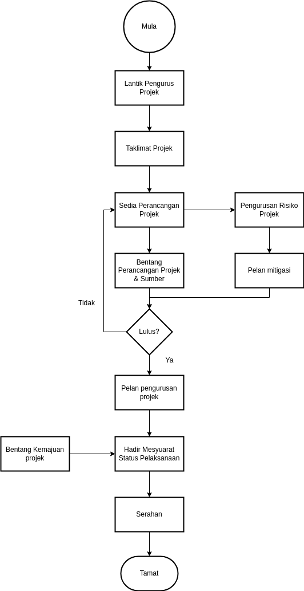

\newpage
\fancyhead[R]{\textbf{No: Keluaran: 01\\No Pindaan: 00\\Tarikh Kuatkuasa: `r params$doc_date`}}
\fancyhead[L]{\textbf{MS ISO 9001:2015\\OpenApps Sdn Bhd (548151-W)\\`r params$doc_id`}}
\clearpage
\pagenumbering{Roman}

# I    Rekod Pindaan

|Tarikh Pindaan|No Pindaan/No Keluaran|Rujukan Pindaan Mukasurat |Butir-butir Pindaan|Diluluskan Oleh|
|-------------|-------------|-------------|-------------|-------------|
|             |             |             |             |             |
|             |             |             |             |             |
|             |             |             |             |             |
|             |             |             |             |             |
|             |             |             |             |             |
|             |             |             |             |             |
|             |             |             |             |             |
|             |             |             |             |             |
|             |             |             |             |             |

# II   Senarai Pemegang Dokumen

| No. Salinan Terkawal   | Pemegang Dokumen              |
|------------------------|-------------------------------|
| `r params$doc_id`(01)  | `r a_list$pemilik_dok[1]`     |
|                        |                               |
| `r params$doc_id`(02)  | `r a_list$pemilik_dok[2]`     |
|                        |                               |
| `r params$doc_id`(03)  | `r a_list$pemilik_dok[3]`     |
|                        |                               |
| `r params$doc_id`(04)  | `r a_list$pemilik_dok[4]`     |
|                        |                               |
| `r params$doc_id`(05)  | `r a_list$pemilik_dok[5]`     |
|                        |                               |
| `r params$doc_id`(06)  | `r a_list$pemilik_dok[6]`     |
|                        |                               |
| `r params$doc_id`(07)  | `r a_list$pemilik_dok[7]`     |
|                        |                               |
| `r params$doc_id`(08)  | `r a_list$pemilik_dok[8]`     |
|                        |                               |
| `r params$doc_id`(09)  | `r a_list$pemilik_dok[9]`     |
|                        |                               |
| `r params$doc_id`(10)  | `r a_list$pemilik_dok[10]`    |
|                        |                               |
| `r params$doc_id`(11)  | `r a_list$pemilik_dok[11]`    |
|                        |                               |
| `r params$doc_id`(12)  | `r a_list$pemilik_dok[12]`    |
|                        |                               |
| `r params$doc_id`(13)  | `r a_list$pemilik_dok[13]`    |

\newpage
\clearpage
\pagenumbering{arabic}
\setcounter{page}{1}

# 1.0   Objektif

Prosedur bagi proses mengurus, memantau perkhidmatan integrasi sistem dan seterusnya menyerahkan kepada pelanggan mengikut jadual dan kos yang ditetapkan di dalam kontrak. 

# 2.0   Skop

Pelaksanaan oleh Jabatan Teknikal bagi proses mengurus, memantau dan menyerahkan perkhidmatan integrasi sistem.

# 3.0   Rujukan

MK.OA.01 dengan seksyen-seksyen berikut:

a. 8.1. Perancangan dan kawalan operasi; dan

a. 8.2.2 Menentukan keperluan untuk produk dan perkhidmatan.

# 4.0   Definisi

## 4.1 Projek Integrasi Sistem

Proses mewujudkan sistem maklumat termasuk mereka bentuk, membangunkan aplikasi atau mengubahsuai aplikasi tersedia dan/atau sedia ada seterusnya mengintegrasikannya dengan arkitektur, perkakasan dan sistem komunikasi yang baharu dan/atau sedia ada.

"The process of creating a complex information system that may include designing or building a customized architecture or application, integrating it with new or existing hardware, packaged and custom software, and communications."

# 5.0   Singkatan

  a.    DO - "Delivery Order".

\newpage

# 6.0   Tanggungjawab dan Tindakan

\begin{table}[th]
\begin{tabular}{|l|l|}
\hline
Tanggungjawab     & Tindakan                                                         \\ \hline
Pengurus Teknikal & A.  MENUBUHKAN PASUKAN PROJEK                                    \\
                  & 1.  Melantik Pengurus Projek;                                    \\
                  & i.    Tawaran yang diiklankan;                                   \\
                  & ii.   Skop projek;                                               \\
                  & iii.  Tarikh kuatkuasa; dan                                      \\
                  & iv.   Terma dan Rujukan.                                         \\
                  & 2.  Memberi garis panduan dan keperluan projek.                  \\ \hline
Pengurus Projek   & 3.  Sedia perancangan projek dan keperluan sumber.               \\
                  & 4.  Sedia pengurusan risiko dan langkah mitigasi projek.         \\
                  & 5.  Bentang perancangan projek dan keperluan sumber              \\
                  & kepada Pengurus Teknikal.                                        \\ \hline
Pengurus Teknikal & 6.  Luluskan perancangan projek.                                 \\ \hline
Pengurus Projek   & 7.  Hadir mesyuarat pelaksanaan projek bersama pelanggan.        \\
                  & 8.  Bentang laporan hasil mesyuarat pelaksanaan projek.          \\
                  & 9.  Serah DO kepada pelanggan dan salinan kepada Jabatan Jualan. \\ \hline
Kerani            & 10.  Failkan:                                                    \\
                  & i.    DO;                                                        \\
                  & ii.   Minit Mesyuarat Status Kemajuan Projek.                    \\ \hline
\end{tabular}
\end{table}

\newpage

# 7.0 Aliran Kerja

{width=45%}

\newpage

# 8.0 Rekod Kualiti

|Bil   |Rekod                                    |Tempoh Penyimpanan|Lokasi     |Klasifikasi|
|------|-----------------------------------------|------------------|-----------|-----------|
|1.    |Delivery Order                           |5 tahun           |Bilik Fail |Terhad     |
|2.    |Minit Mesyuarat Status Kemajuan Projek   |5 tahun           |Bilik Fail |Terhad     |

# 9.0 Lampiran
