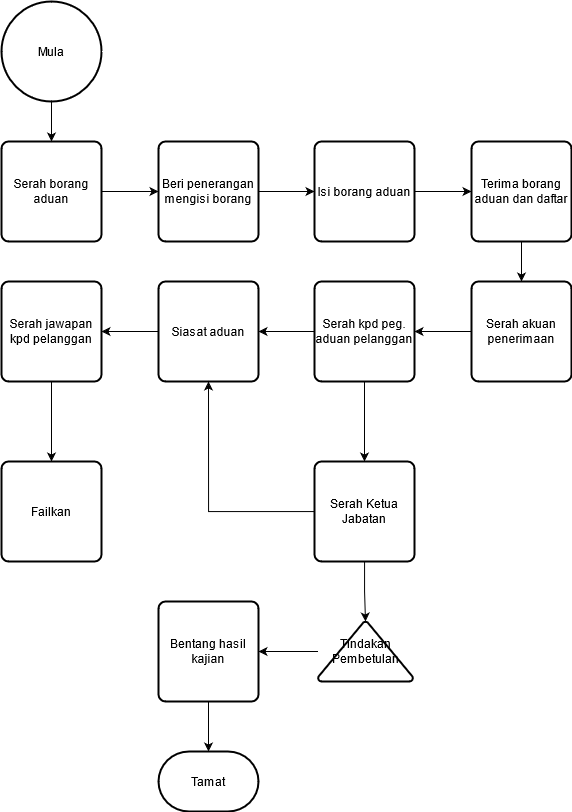
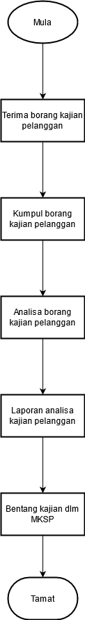
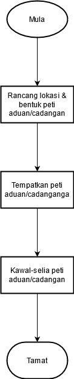

\newpage
\fancyhead[R]{\textbf{No: Keluaran: 01\\No Pindaan: 00\\Tarikh Kuatkuasa: `r params$doc_date`}}
\fancyhead[L]{\textbf{MS ISO 9001:2015\\OpenApps Sdn Bhd (548151-W)\\`r params$doc_id`}}
\clearpage
\pagenumbering{Roman}

# I    Rekod Pindaan

|Tarikh Pindaan|No Pindaan/No Keluaran|Rujukan Pindaan Mukasurat |Butir-butir Pindaan|Diluluskan Oleh|
|-------------|-------------|-------------|-------------|-------------|
|             |             |             |             |             |
|             |             |             |             |             |
|             |             |             |             |             |
|             |             |             |             |             |
|             |             |             |             |             |
|             |             |             |             |             |
|             |             |             |             |             |
|             |             |             |             |             |
|             |             |             |             |             |

# II   Senarai Pemegang Dokumen

| No. Salinan Terkawal   | Pemegang Dokumen              |
|------------------------|-------------------------------|
| `r params$doc_id`(01)  | `r a_list$pemilik_dok[1]`     |
|                        |                               |
| `r params$doc_id`(02)  | `r a_list$pemilik_dok[2]`     |
|                        |                               |
| `r params$doc_id`(03)  | `r a_list$pemilik_dok[3]`     |
|                        |                               |
| `r params$doc_id`(04)  | `r a_list$pemilik_dok[4]`     |
|                        |                               |
| `r params$doc_id`(05)  | `r a_list$pemilik_dok[5]`     |
|                        |                               |
| `r params$doc_id`(06)  | `r a_list$pemilik_dok[6]`     |
|                        |                               |
| `r params$doc_id`(07)  | `r a_list$pemilik_dok[7]`     |
|                        |                               |
| `r params$doc_id`(08)  | `r a_list$pemilik_dok[8]`     |
|                        |                               |
| `r params$doc_id`(09)  | `r a_list$pemilik_dok[9]`     |
|                        |                               |
| `r params$doc_id`(10)  | `r a_list$pemilik_dok[10]`    |
|                        |                               |
| `r params$doc_id`(11)  | `r a_list$pemilik_dok[11]`    |
|                        |                               |
| `r params$doc_id`(12)  | `r a_list$pemilik_dok[12]`    |
|                        |                               |
| `r params$doc_id`(13)  | `r a_list$pemilik_dok[13]`    |

\newpage
\clearpage
\pagenumbering{arabic}
\setcounter{page}{1}

# 1.0  Objektif

Prosedur ini menggariskan langkah-langkah untuk mengendalikan aduan, maklumbalas pelanggan, kajian kepuasan pelanggan, penghargaan serta peti aduan/cadangan dengan berkesan dan sistematik.

# 2.0  Skop

Prosedur ini digunapakai oleh kakitangan Syarikat dalam mengendalikan aduan dari penerimaan aduan sehingga perlaksanaan siasatan aduan. Mengendalikan maklumbalas pelanggan, kajian hasil maklumbalas pelanggan dan kepuasan pelanggan, pengendalian penghargaan yang diterima serta pengendalian dan penjagaan peti aduan/cadangan pelanggan.

# 3.0   Rujukan

MK.OA.01 merujuk seksyen-seksyen berikut:

a. Seksyen 4.4.2 Menyelenggarakan maklumat didokumentasikan;

a. Seksyen 5.1.2 Fokus kepada pelanggan;

a. Seksyen 8.2.1 Komunikasi dengan pelanggan; dan

a. Seksyen 9.1.2 Kepuasan pelanggan.

# 4.0  Definisi

##    4.1 Aduan

Merupakan pernyataan rasa tidak puashati pelanggan terhadap perkhidmatan yang diberikan Syarikat melalui cara berikut:

 i\) Bertemu Pelanggan.

 ii\) Telefon/Faksimili.

 iii\) Bertulis (samada melalui surat, Media massa, e-mel atau laman web).

##    4.2 Maklumbalas Pelanggan

Maklumbalas pelanggan yang diterima sama ada secara lisan dan bertulis melalui surat, memo, faks, e-mel, telefon atau pelanggan (pengadu) hadir ke pejabat untuk membuat aduan yang berkaitan.

##    4.3.  Mesyuarat

Mesyuarat bertujuan untuk membincangkan hal-hal pentadbiran semasa dan Sistem Pengurusan Kualiti serta membuat keputusan ke atas perkara yang dibincangkan. Ia termasuk keputusan Tindakan Pembetulan terhadap aduan pelanggan yang diterima dan diminitkan dalam Mesyuarat MD atau Mesyuarat Operasi. Keahlian mesyuarat ialah:

a.  MD/WP;

b. TWP;

c. Pengurus Kewangan/Pentadbiran; dan

d. Wakil Jabatan.

##    4.4 Pelanggan

Sebagaimana yang dimaksudkan di dalam seksyen 3.6 MK.OA.01.

# 5.0   Singkatan

5.1 MK - Manual Kualiti.

5.2 MKSP - Mesyuarat Kajian Semula Pengurusan.

5.3 PK - Prosedur Kualiti.

5.4 TWP - Timbalan Wakil Pengurusan.

5.5 WP - Wakil Pengurusan.

# 6.0   Tanggungjawab dan Tindakan

\begin{longtable}{|l|l|}
\hline
Tanggungjawab        & Tindakan                                                                  \\ \hline
\endhead
%
\hline
\endfoot
%
\endlastfoot
%
WP/TWP               & \textbf{A.   Pengendalian Aduan/Maklumbalas Pelanggan}                    \\
                     & 1. Arahkan pelanggan mengisi Borang Aduan dan Maklumbalas Pelanggan       \\
                     & dengan lengkap.                                                           \\
                     & 2. Beri penerangan tatacara pengisian.                                    \\
                     & 3. Daftarkan dalam Buku Log Aduan Pelanggan/Maklumbalas Pelanggan.        \\
                     & 4.Isikan Borang Aduan jika aduan lengkap diterima melalui                 \\
                     & telefon/faksimili/media massa.Terima dan teliti semua aduan yang diterima \\
                     & daripada pelanggan.                                                       \\
                     & 5. Serahkan Akuan Penerimaan Aduan dan Maklumbalas Pelanggan kepada       \\
                     & pelanggan.                                                                \\
                     & 6. Majukan Akuan Penerimaan Aduan dan Maklumbalas Pelanggan kepada        \\
                     & pelanggan jika aduan lengkap diterima melalui telefon/faksmili/media      \\
                     & massa dalam tempoh 3 hari waktu bekerja dari tarikh terima aduan.         \\
                     & 7. Serahkan Borang Borang Aduan dan Maklumbalas Pelanggan kepada          \\
                     & Pegawai Sekretariat/Pegawai Pengendali Aduan Pelanggan.                   \\
                     & 8. Terima dan teliti aduan/maklumbalas pelanggan.                         \\
                     & 9. Serahkan kepada Ketua Cawangan yang bertanggungjawab ke atas           \\
                     & aduan/maklumbalas yang diajukan.                                          \\ \hline
Ketua Jabatan        & 10. Buat siasatan dan catatkan maklumat punca aduan serta cadangan        \\
                     & tindakan pembetulan.                                                      \\
                     & 11. Serahkan Borang Aduan/Maklumbalas Pelanggan kepada Wakil              \\
                     & Pengurusan/Timbalan Wakil Pengurusan.                                     \\ \hline
WP/TWP               & 12. Catatkan butiran keputusan tindakan Pembetulan/Penilaian.             \\
                     & 13. Serahkan kepada MD untuk pengesahan Tindakan                         \\
                     & Pembetulan/Penilaian.                                                     \\ \hline
MD                  & 14. Sahkan catatan keputusan Tindakan Pembetulan/Penilaian yang telah     \\
                     & dibuat komen (jika berkenaan).                                            \\
                     & 15. Serahkan kepada Pegawai Sekretariat/Pegawai Pengendali Aduan          \\
                     & Pelanggan untuk difailkan.                                                \\ \hline
Sekretariat ISO/     & 16. Pastikan keseluruhan Borang Aduan/Maklumbalas Pelanggan               \\
WP/TWP               & dilengkapkan dalam tempoh 5 hari bekerja dari tarikh terima aduan.        \\
                     & Sekiranya Tindakan Pembetulan hendak diputuskan dalam Mesyuarat           \\
                     & Jawatankuasa Pengendalian Aduan Pelanggan, pastikan ia dilaksanakan       \\
                     & dalam tempoh 30 hari dari tarikh terima aduan.                            \\
                     & 17. Majukan keputusan Tindakan Pembetulan yang telah disahkan kepada      \\
                     & pelanggan (jika perlu).                                                   \\
                     & 18. Arahkan Cawangan yang berkaitan supaya melaksanakan tindakan          \\
                     & telah disahkan oleh MD.                                                  \\
                     & 19. Failkan Borang Aduan/Maklumbalas Pelanggan yang telah disahkan.       \\ \hline
MD/WP               & 20. Pengerusikan mesyuarat dan bentang prestasi aduan/maklumbalas         \\
                     & pelanggan dan keputusan TindakanPembetulan (jika ada).                    \\
                     & 21. Bentangkan laporan kajian dan analisis aduan pelanggan semasa MKSP.   \\ \hline
Sekretariat ISO      & 22. Failkan Minit Mesyuarat.                                              \\ \hline
Ketua Jabatan        & 23. Laksanakan Tindakan Pembetulan.                                       \\ \hline
                     & \textbf{B. Pengendalian Kajian Kepuasan Pelanggan}                        \\ 
Sekretariat ISO Peg. & 24. Terima Borang Kepuasan Pelanggan dari pelanggan.                      \\
Pengendali Aduan     & 25. Jika borang dimasukkan oleh pelanggan ke dalam peti aduan/cadangan    \\
Pelanggan            & rujuk pengendalian Peti Aduan/Cadangan.                                   \\
                     & 26. Kumpul, semak dan analisa semua Borang Kepuasan Pelanggan yang        \\
                     & diterima.                                                                 \\
                     & 27. Buat analisa berdasarkan maklumat yang diisi oleh pelanggan di dalam  \\
                     & Borang Kepuasan Pelanggan.                                                \\
                     & 28. Serahkan analisa kepuasan pelanggan kepada WP/TWP untuk               \\
                     & keputusan/penilaian analisa                                               \\ \hline
WP/TWP               & 29. Buat keputusan/penilaian analisa dan serah kembali kepada Sekretariat \\
                     & ISO/ Pegawai Pengendali Aduan Pelanggan.                                  \\ \hline
WP                   & 30. Pengerusikan mesyuarat dan bentangkan keputusan analisa.              \\ \hline
Sekretariat ISO      & 31. Arahkan Cawangan yang berkaitan untuk melaksanakan Tindakan           \\
                     & Pembetulan hasil dari keputusan analisa/mesyuarat.                        \\
                     & 32. Failkan analisa kepuasan pelanggan dan Borang Kepuasan Pelanggan.     \\ \hline
Ketua Jabatan        & 33. Laksanakan Tindakan Pembetulan (jika berkenaan).                      \\ \hline
WP/TWP               & 34. Bentangkan laporan kajian dan analisa semasa MKSP.                    \\ \hline
MD WP/TWP           & \textbf{C. Pengendalian Penghargaan}                                      \\
                     & 35. Terima penghargaan daripada pelanggan dalaman dan luaran.             \\
                     & 36. Arahkan Kerani rekodkan dalam Buku/Fail Daftar Penghargaan.           \\ \hline
Kerani               & 37. Terima penghargaan dari MD/WP.                                       \\
                     & 38. Rekodkan dalam Buku/Fail Daftar Penghargaan.                          \\
                     & 39. Pamerkan penghargaan mengikut tempoh bersesuaian (jika perlu).        \\ \hline
MD WP/TWP           & \textbf{D. Pengendalian Peti Aduan/Cadangan}                              \\
                     & 40. Rancang bentuk, lokasi dan keperluan Peti Aduan/Cadangan.             \\
                     & 41. Arahkan Eks. Kewangan/Pentadbiran untuk menyediakan Peti              \\
                     & Aduan/Cadangan.                                                           \\
                     & 42. Lantik pegawai pengendali untuk mengawal selia Peti Aduan/Cadangan    \\
                     & sebilangmasa.                                                             \\ \hline
Eks. Kewangan/       & 43. Sedia dan daftarkan penempatan Peti Aduan/Cadangan di lokasi yang     \\
Pentadbiran          & telah ditetapkan.                                                         \\ \hline
Sekretariat ISO      & 44. Kawal selia Peti Aduan/Cadangan sebilangmasa.                         \\ \hline
Sekretariat ISO      & \textbf{E. Aduan Pelanggan}                                               \\
                     & 45. Kumpul Borang Kepuasan Pelanggan dari Peti Aduan/Cadangan             \\
                     & setiap hari (jika ada).                                                   \\
                     & 46. Patuhi Bhg B Pengendalian Kajian kepuasan Pelanggan                   \\
                     & bilangan 24 hingga 34.                                                    \\ \hline
\end{longtable}

\newpage
# 7.0  Aliran Kerja

{width=60%}
\newpage
{width=60%}
\newpage
{width=60%}
\newpage
{width=60%}

# 8.0 Rekod Kualiti

----------------------------------------------------  -----------  ------------
Bil   Rekod                             Tempoh        Lokasi       Klasifikasi   
                                        Penyimpanan
----  --------------------------------- ------------- -----------  ------------
 1.   Borang Aduan Pelanggan            5 Tahun       Sekretariat   Terhad        
                                                   
 2    Minit Mesyuarat Jawatankuasa      5 Tahun       Sekretariat   Terhad        
      Pengendalian Aduan Awam                                                  
------------------------------------------------------------------------------

\newpage

# 9.0 Lampiran

## A - Borang Maklum Balas Pelanggan

**BORANG MAKLUM BALAS PELANGGAN** [PK(S).OA.01-B01]

Maklumat Pelanggan:

No Kp: \___________________	Nama: \____________________________________ 

No tel/email: \_________________________

Tarikh: \__________________  Tandatangan: \_____________________________

Butiran:

\__________________________________________________

\__________________________________________________

\__________________________________________________

\__________________________________________________

\__________________________________________________

\__________________________________________________

Tindakan: Pegawai Perhubungan Pelanggan/Pengurus Jabatan

Kategori: 1 - Pertanyaan/Aduan 2 - Maklum balas 3 - Cadangan 

\__________________________________________________

\__________________________________________________

\__________________________________________________

\__________________________________________________

\__________________________________________________

\__________________________________________________

Tarikh: \__________________  Tandatangan: \_____________________________

Pengesahan Tindakan: Pegawai Perhubungan Pelanggan/Pengurus Jabatan

\__________________________________________________

\__________________________________________________

\__________________________________________________

\__________________________________________________

\__________________________________________________

\__________________________________________________

Tarikh: \__________________  Tandatangan: \_____________________________

\newpage

## B - Kajian Kepuasan Pelanggan

Kajian Kepuasan Pelanggan [PK(S).OA.01-B02]

Sila tandakan tahap penilaian perkara-perkara berikut di ruang yang disediakan.

Bil  Pemerhatian                                                         Terbaik   Baik       Sederhana   Tidak Memuaskan
---- ------------------------------------------------------------------- --------- ---------- ----------- ---------------
                                                                         (9)       (8 -- 7)   (6 -- 4)    (3 -- 1)
1.   Perkhidmatan yang disediakan                            
2.   Masa menunggu                                           
3.   Keselesaan tempat menunggu                              
4.   Layanan yang diberikan                                  
5.   Penjelasan oleh staf                                    
6.   Kemudahan yang disediakan                                
7.   Kebersihan persekitaran                                 
8.   Penampilan diri staf                                    
9.   Pengetahuan staf mengenai perkara dirujuk               
10.  Komunikasi staf                                        

Terima kasih di atas maklumat anda.
