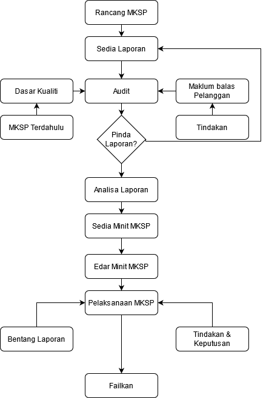

\newpage
\fancyhead[R]{\textbf{No: Keluaran: 01\\No Pindaan: 00\\Tarikh Kuatkuasa: `r params$doc_date`}}
\fancyhead[L]{\textbf{MS ISO 9001:2015\\OpenApps Sdn Bhd (548151-W)\\`r params$doc_id`}}
\clearpage
\pagenumbering{Roman}

# I    Rekod Pindaan

|Tarikh Pindaan|No Pindaan/No Keluaran|Rujukan Pindaan Mukasurat |Butir-butir Pindaan|Diluluskan Oleh|
|-------------|-------------|-------------|-------------|-------------|
|             |             |             |             |             |
|             |             |             |             |             |
|             |             |             |             |             |
|             |             |             |             |             |
|             |             |             |             |             |
|             |             |             |             |             |
|             |             |             |             |             |
|             |             |             |             |             |
|             |             |             |             |             |

# II   Senarai Pemegang Dokumen

| No. Salinan Terkawal   | Pemegang Dokumen              |
|------------------------|-------------------------------|
| `r params$doc_id`(01)  | `r a_list$pemilik_dok[1]`     |
|                        |                               |
| `r params$doc_id`(02)  | `r a_list$pemilik_dok[2]`     |
|                        |                               |
| `r params$doc_id`(03)  | `r a_list$pemilik_dok[3]`     |
|                        |                               |
| `r params$doc_id`(04)  | `r a_list$pemilik_dok[4]`     |
|                        |                               |
| `r params$doc_id`(05)  | `r a_list$pemilik_dok[5]`     |
|                        |                               |
| `r params$doc_id`(06)  | `r a_list$pemilik_dok[6]`     |
|                        |                               |
| `r params$doc_id`(07)  | `r a_list$pemilik_dok[7]`     |
|                        |                               |
| `r params$doc_id`(08)  | `r a_list$pemilik_dok[8]`     |
|                        |                               |
| `r params$doc_id`(09)  | `r a_list$pemilik_dok[9]`     |
|                        |                               |
| `r params$doc_id`(10)  | `r a_list$pemilik_dok[10]`    |
|                        |                               |
| `r params$doc_id`(11)  | `r a_list$pemilik_dok[11]`    |
|                        |                               |
| `r params$doc_id`(12)  | `r a_list$pemilik_dok[12]`    |
|                        |                               |
| `r params$doc_id`(13)  | `r a_list$pemilik_dok[13]`    |

\newpage
\clearpage
\pagenumbering{arabic}
\setcounter{page}{1}

# 1.0 Objektif    

Prosedur ini bertujuan untuk menyediakan langkah-langkah yang diambil bagi Mesyuarat Kajian Semula Pengurusan bagi melakukan penilaian keberkesanan QMS OA dalam proses memastikan usaha penambahbaikan dapat diambil secara berterusan.

# 2.0 Skop    

Prosedur ini digunapakai oleh Pengurusan OA dan semua Ketua Cawangan untuk melakukan penilaian semula pelaksanaan QMS OS bagi memastikan kesesuaiannya yang berterusan.

# 3.0   Rujukan

MK.OA.01 merujuk seksyen-seksyen berikut:

a. Seksyen 4.4.2 Menyelenggarakan maklumat didokumentasikan;

a. Seksyen 5.2 Dasar Integriti, Akauntabiliti dan Anti-Rasuah.

a. Seksyen 5.2.1 Membangunkan dasar kualiti dan dasar integriti, akauntabiliti dan anti-rasuah; 

a. Seksyen 6.1 Tindakan menyatakan risiko dan peluang; 

a. Seksyen 6.2  Objektif kualiti dan perancangan untuk mencapainya; dan

a. seksyen 9.3. Kajian Semula Pengurusan.

# 4.0 Definisi

 4.1 Mesyuarat Kajian Semula Pengurusan

 Mesyuarat diperingkat pengurusan tertinggi Syarikat untuk mengkaji semula keberkesanan dan penambahbaikan Sistem Pengurusan Kualiti secara berterusan. Keahlian mesyuarat seperti berikut:

  a. MD - Pengerusi;
  b. WP - Timbalan Pengerusi;
  c. Pengurus Kewangan/Pengurusan;
  d. Pengurus Teknikal;
  e. Pengurus Jualan;
  f. TWP - Setiausaha;
  g. PD - Penolong Setiausaha; dan
  h. Semua Eksekutif Jabatan.

# 5.0 Singkatan

 5.1 WP - Wakil Pengurusan.

 5.2 TWP - Timbalan Wakil Pengurusan.

 5.3 PJ - Pengurus Jabatan.

 5.4 PD - Pengurus Dokumen.

 5.5 MKSP - Mesyuarat Kajian Semula Pengurusan.

\newpage

# 6.0 Tanggungjawab dan Tindakan

\begin{table}[th]
\begin{tabular}{|l|l|}
\hline
Tanggungjawab & Tindakan                                                                                                         \\ \hline
WP/TWP        & 1.    Rancangkan tarikh, masa dan tempat MKSP menurut persetujuan MD.                                               \\
              & 2.    Arahkan PJ yang berkenaan menyediakan laporan-laporan berikut:                                                \\
              & a. Laporan Pencapaian Dasar  dan Objektif Kualiti.                                                               \\
              & b. Laporan Audit.                                                                                                \\
              & c. Laporan Maklumbalas Pelanggan.                                                                                \\
              & d. Laporan Tindakan pembetulan  dan pencegahan.                                                                  \\
              & e. Cadangan-Cadangan Penambahbaikan yang berterusan.                                                             \\
              & f. Tindakan susulan ke atas kajian semula pengurusan yang lalu (jika ada).                                       \\
              & g. Perubahan dasar yang  boleh menjejaskan Sistem  Pengurusan Kualiti.                                           \\ \hline
PJ            & 3.    Terima arahan menyediakan laporan dan mengemukakan kepada WP                                                  \\
              & untuk semakan dan analisa.                                                                                       \\ \hline
WP/TWP        & 4.    Menganalisa Laporan yang diterima untuk dilaporkan kepada MKSP.                                             \\ \hline
TWP/PD        & 5.    Membuat persediaan mesyuarat iaitu sediakan dan mengedarkan minit mesyuarat MKSP.                           \\
              & Pengendalian mesyuarat, berhubung dengan agenda,tarikh, masa, tempat dan                                         \\
              & mengeluarkan notis mesyuarat 7 hari sebelum tarikh mesyuarat.                                                    \\
              & 6.    Sediakan agenda mesyuarat dan panggil keahlian mesyuarat.                                                    \\ \hline
MD            & 7.    Mempengerusikan mesyuarat.                                                                                   \\ \hline
WP            & 8.    Bentangkan laporan-laporan kepada MKSP.                                                                      \\ \hline
MKSP          & 9.    Bincangkan dan putuskan tindakan pembetulan, pencegahan serta                                                \\
              & usaha penambahbaikkan  yang perlu dilaksanakan                                                                   \\
              & iaitu keberkesanan penambahbaikkan sistem pengurusan kualiti,                                                    \\
              & penambahbaikkan produk menurut kehendak pelanggan dan keperluan sumber (seksyen 7.1).                            \\ \hline
TWP/PD        & 10.   Catatkan minit mesyuarat dan sediakan draf tidak lewat 48 jam kepada WP.                                     \\
              & Minit mesyuarat hendaklah diedarkan kepada ahli-ahli mesyuarat                                                   \\ \hline
              & tidak lewat 72 jam selepas mesyuarat.                                                                            \\
WP            & 11.   Bincang dengan Pengarah Urusan (MD) hasil keputusan MKSP mengenai                                          \\
              & tindakan pembetulan, pencegahan dan penambahbaikan                                                               \\ \hline
PJ            & 12.   Laksanakan keputusan MKSP kemudian sediakan laporan kemajuan pelaksanaan                                     \\
              & tindakan pencegahan, pembetulan dan penambahbaikan                                                               \\
              & dan mengemukakan kepada WP/TWP.                                                                                  \\ \hline
WP            & 13    Bentang mengenai laporan keberkesanan tindakan pencegahan,                                                    \\
              & pembetulan, penambahbaikkan, aduan pelanggan dan                                                                 \\    
              & laporan Audit dalaman yang telah dilaksanakan.                                                                   \\ \hline
PD            & 14    Rekodkan dalam fail MKSP.                                                                                    \\ \hline
\end{tabular}
\end{table}

#   7.0  Aliran Kerja

{width=70%}
\newpage

#   8.0 Rekod-rekod Kualiti

|Bil   |Rekod                                                      |Tempoh Penyimpanan   |Lokasi  |Klasifikasi|
|------|-----------------------------------------------------------|---------------------|-----------|-----------|
|1\.   | Surat Panggilan Mesyuarat                                       |5 -- 7 tahun   |Pej WP|Terhad|
|2\.   | Minit Mesyuarat                                                 |5 -- 7 tahun   |Pej WP|Terhad|
|3\.   | Laporan Pencapaian Dasar dan Objektif Kualiti                   |5 -- 7 tahun   |Pej WP|Terhad|
|4\.   | Laporan Audit                                                   |5 -- 7 tahun   |Pej WP|Terhad|
|5\.   | Laporan Maklumbalas Pelanggan                                   |5 -- 7 tahun   |Pej WP|Terhad|
|6\.   | Laporan Tindakan Pembetulan dan Pencegahan dan penambahbaikan   |5 -- 7 tahun   |Pej WP|Terhad|
|7\.   | Laporan Cadangan Penambahbaikan                                 |5 -- 7 tahun   |Pej WP|Terhad|
|8\.   | Perancangan program Latihan Syarikat                            |5 -- 7 tahun   |Pej WP|Terhad|

\newpage
#   9.0  LAMPIRAN

## Kerangka Minit Mesyuarat Kajian Semula Pengurusan

\begin{table}[th]
\begin{tabular}{p{0.15\textwidth}p{0.15\textwidth}p{0.15\textwidth}}
\hline
\multicolumn{3}{c}{\textbf{Minit Kajian Semula Pengurusan}}                                                                                                       \\ \hline
Siri/Tahun:                                                                                     & Tarikh:                                    &                    \\ 
\multicolumn{1}{l}{Senarai Kehadiran:}                                                          &                                            &                    \\[5ex] \hline
\multicolumn{1}{|l|}{\textbf{Perbincangan dan Keputusan:}}                                      &                                            & \multicolumn{1}{l|}{} \\ \hline
\multicolumn{1}{|l|}{\textbf{Perkara}}                                                          & \multicolumn{1}{l|}{\textbf{Perbincangan}} & \textbf{Keputusan} \\ \hline
\multicolumn{1}{|l|}{\textbf{Perkara 1 - Laporan pencapaian QMS}}                               & \multicolumn{1}{l|}{}                      & \multicolumn{1}{l|}{} \\  
\multicolumn{1}{|l|}{1. Laporan Pencapaian Dasar dan Objektif Kualiti}                          & \multicolumn{1}{l|}{}                      & \multicolumn{1}{l|}{} \\
\multicolumn{1}{|l|}{2. Laporan Audit}                                                          & \multicolumn{1}{l|}{}                      & \multicolumn{1}{l|}{} \\
\multicolumn{1}{|l|}{3. Laporan Maklumbalas Pelanggan}                                          & \multicolumn{1}{l|}{}                      & \multicolumn{1}{l|}{} \\
\multicolumn{1}{|l|}{4. Laporan Tindakan pembetulan dan pencegahan}                             & \multicolumn{1}{l|}{}                      & \multicolumn{1}{l|}{} \\
\multicolumn{1}{|l|}{5. Cadangan-Cadangan Penambahbaikan yang berterusan}                       & \multicolumn{1}{l|}{}                      & \multicolumn{1}{l|}{} \\
\multicolumn{1}{|l|}{6. Tindakan susulan ke atas kajian semula pengurusan yang lalu (jika ada)} & \multicolumn{1}{l|}{}                      & \multicolumn{1}{l|}{} \\
\multicolumn{1}{|l|}{7. Perubahan dasar yang boleh menjejaskan Sistem Pengurusan Kualiti}       & \multicolumn{1}{l|}{}                      & \multicolumn{1}{l|}{} \\ \hline
\multicolumn{1}{|l|}{\textbf{Perkara 2 - Perkara-perkara berbangkit}}                           & \multicolumn{1}{l|}{}                      & \multicolumn{1}{l|}{} \\[17ex]\hline
\multicolumn{1}{|l|}{\textbf{Perkara 3 - Rumusan}}                                              & \multicolumn{1}{l|}{}                      & \multicolumn{1}{l|}{} \\[17ex]\hline
\multicolumn{1}{|l|}{\textbf{Perkara 4 - Penutup}}                                              & \multicolumn{1}{l|}{}                      & \multicolumn{1}{l|}{} \\[17ex]\hline
\end{tabular}
\end{table}

