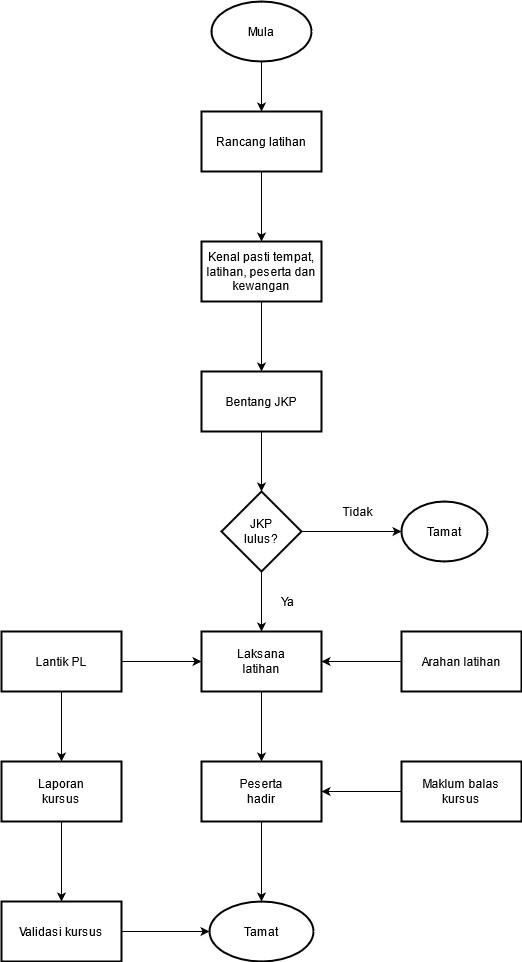

\newpage
\fancyhead[R]{\textbf{No: Keluaran: 01\\No Pindaan: 00\\Tarikh Kuatkuasa: `r params$doc_date`}}
\fancyhead[L]{\textbf{MS ISO 9001:2015\\OpenApps Sdn Bhd (548151-W)\\`r params$doc_id`}}
\clearpage
\pagenumbering{Roman}

# I    Rekod Pindaan

|Tarikh Pindaan|No Pindaan/No Keluaran|Rujukan Pindaan Mukasurat |Butir-butir Pindaan|Diluluskan Oleh|
|-------------|-------------|-------------|-------------|-------------|
|             |             |             |             |             |
|             |             |             |             |             |
|             |             |             |             |             |
|             |             |             |             |             |
|             |             |             |             |             |
|             |             |             |             |             |
|             |             |             |             |             |
|             |             |             |             |             |
|             |             |             |             |             |

# II   Senarai Pemegang Dokumen

| No. Salinan Terkawal   | Pemegang Dokumen              |
|------------------------|-------------------------------|
| `r params$doc_id`(01)  | `r a_list$pemilik_dok[1]`     |
|                        |                               |
| `r params$doc_id`(02)  | `r a_list$pemilik_dok[2]`     |
|                        |                               |
| `r params$doc_id`(03)  | `r a_list$pemilik_dok[3]`     |
|                        |                               |
| `r params$doc_id`(04)  | `r a_list$pemilik_dok[4]`     |
|                        |                               |
| `r params$doc_id`(05)  | `r a_list$pemilik_dok[5]`     |
|                        |                               |
| `r params$doc_id`(06)  | `r a_list$pemilik_dok[6]`     |
|                        |                               |
| `r params$doc_id`(07)  | `r a_list$pemilik_dok[7]`     |
|                        |                               |
| `r params$doc_id`(08)  | `r a_list$pemilik_dok[8]`     |
|                        |                               |
| `r params$doc_id`(09)  | `r a_list$pemilik_dok[9]`     |
|                        |                               |
| `r params$doc_id`(10)  | `r a_list$pemilik_dok[10]`    |
|                        |                               |
| `r params$doc_id`(11)  | `r a_list$pemilik_dok[11]`    |
|                        |                               |
| `r params$doc_id`(12)  | `r a_list$pemilik_dok[12]`    |
|                        |                               |
| `r params$doc_id`(13)  | `r a_list$pemilik_dok[13]`    |

\newpage
\clearpage
\pagenumbering{arabic}
\setcounter{page}{1}

# 1.0   Objektif

 Prosedur ini menggariskan langkah-langkah pihak Pengurusan Syarikat mengendalikan latihan dalaman dan latihan luaran dengan baik dan berkesan setelah dikenalpasti keperluan rancangan latihan.

# 2.0   Skop

 Prosedur ini digunapakai oleh pihak Pengurusan Syarikat yang terlibat dalam perancangan, pengendalian dan pelaksanaan latihan dalaman dan luaran untuk semua Staf Syarikat.
 
# 3.0   Rujukan

MK.OA.01 di mana seksyen yang berkaitan adalah:
  
  a.   Seksyen 4.4.2 Menyelenggarakan maklumat didokumentasikan; dan
  
  a.   Seksyen 7.2 Kekompetenan.
  
# 4.0   Definisi

## 4.1  Kursus/Latihan Dalaman

 Sebarang kursus/program latihan yang dianjurkan oleh Bahagian Pengurusan Syarikat kepada kakitangan di dalam lokasi sahaja.

## 4.2  Kursus/Latihan Luaran

 Sebarang kursus/program latihan yang dianjurkan oleh agensi luar dan dimajukan kepada Syarikat untuk diturut serta oleh kakitangannya.

## 4.3  Urusetia

 Urusetia kursus adalah pegawai dan staf yang dilantik untuk mengurus dan mengelola sesuatu kursus/latihan.

## 3.4 Penyelia Latihan

 Penyelia Latihan adalah staf yang dilantik untuk menyelia dan mengawal perjalanan kursus secara langsung.

## 3.5 Pegawai Latihan

 Pegawai Latihan adalah pegawai yang dilantik untuk mengurus dan merancang perjalanan kursus secara langsung.

# 5.0   Singkatan

  a.    PJB - Pengurus Jabatan/Bahagian.
  a.    PL - Penyelia Latihan.
  a.    SM - Sumber Manusia.

# 6.0   Tanggungjawab dan Tindakan

## 6.1    Perancangan & Pelaksanaan Kursus/Latihan

\begin{table}[th]
\begin{tabular}{|l|l|}
\hline
Tanggungjawab      & Tindakan                                                                       \\ \hline
Pengurus Kewangan/ & 1. Merancang untuk mengendalikan kursus/latihan berasaskan                     \\
Pentadbiran        & bilangan kakitangan dan peruntukan kewangan.                                   \\
                   & 2. Arahkan Pengurus Kewangan/Pentadbiran mengenalpasti tempat,                 \\
                   & tarikh, keperluan, peserta kursus dan peruntukan kewangan.                     \\ \hline
Pengurus Kewangan/ & 3.  Kenalpasti tempat, tarikh dan keperluan latihan.                           \\
Pentadbiran        & serta memajukan permohonan peruntukan kewangan dari MD                        \\
                   & untuk pembelian peralatan (jika perlu) dan pastikan surat jawapan              \\
                   & permohonan dan kelulusan itu diterima oleh Kerani Kewangan.                    \\ \hline
Kerani Kewangan    & 4.  Terima kelulusan Kewangan dari MD.                                        \\
                   & 5.  Kemukakan sebutharga dari 3 pembekal kepada MD.                           \\
                   & 6.  Terima keperluan peralatan kursus/latihan dari pembekal.                   \\ \hline
Eksekutif SM       & 7.  Terima arahan dari Pengurus SM untuk Lantik PL.                            \\
                   & 8.  Arahkan PL untuk mengendalikan Kursus/Latihan.                             \\
                   & 9.  Terima dari PL Arahan Pentadbiran Kursus/Latihan, disemak dan tandatangan. \\
                   & 10. Terima senarai peserta kursus dari PJB.                                    \\ \hline
PL                 & 11. Dapatkan senarai peserta kursus dari PJB salinan kepada Eksekutif SM.      \\
                   & 12. Kendalikan kursus/latihan seperti Arahan Pentadbiran Kursus/Latihan.       \\
                   & 13. Edarkan Borang Maklum Balas Kursus/Latihan.                                \\
                   & 14. Sediakan laporan kursus/latihan.                                           \\
                   & 15. Sediakan laporan penilaian kursus serta agihkan kepada PJB.                \\ \hline
\end{tabular}
\end{table}                              

# 7.0 Aliran Kerja

{width=70%}\

# 8.0 Rekod Kualiti

|Bil   |Rekod |Tempoh Penyimpanan|Lokasi|Klasifikasi|
|------|----------------------------|---------------------|------|-----------|
|1.    |Rekod Kehadiran Peserta Kurus/Latihan|5 Tahun|Bilik Fail|Terhad|
|2.    |Rekod Kurus/Latihan                  |5 Tahun|Bilik Fail|Terhad|
|3.    |Laporan Penilaian Kursus/Latihan     |5 Tahun|Bilik Fail|Terhad|
|4.    |Borang Maklum Balas Kursus/Latihan   |5 Tahun|Bilik Fail|Terhad|

\newpage

# 9.0 Lampiran

## A - Nama-nama Peserta Yang Menghadiri Kursus

**Senarai Peserta Kursus/latihan** [PK(S).04.B01]

**Tarikh:**

**Masa:**

**Tempat:**

**Jumlah:**

**Bil**   **No Kp dan Nama**    **Jawatan**   **Jabatan**    **No tel**   **Tandatangan**                                   
--------- --------------------- ------------- -------------- ------------ ---------------------------
1.        No kp  dan Nama       Pengurus      HR             012          TT
2.        No kp  dan Nama       Pengurus      HR             012          TT
3.        No kp  dan Nama       Pengurus      HR             012          TT

: Senarai Peserta Kursus/latihan 

\newpage

## B - Borang Maklum Balas Kursus/Latihan

**Borang Maklum Balas Kursus/Latihan [PK(S).OA.04.B02]

  **Markah**   **Penilaian**
  ------------ ---------------
  1            Lemah
  2            Sederhana
  3            Baik
  4            Amat Baik

**1. [Pelaksanaan Kursus]**

  **BIL.**   **MARKAH**                                   **1**   **2**   **3**   **4**
  ---------- -------------------------------------------- ------- ------- ------- -------
  1.1        Makan/Minuman (Jika ada)                                             
  1.2.       Isi kandungan Kursus secara keseluruhannya                           
  1.3.       Jangka Masa dan tempoh Kursus                                        
  1.4.       Kerjasama dari pihak urusetia                                        
  1.5.       Objektif Kursus Tercapai                                             

**[2. Penceramah]**

**Nama Ceramah 1 : Jawatan :**

  **BIL.**   **MARKAH**                                         **1**   **2**   **3**   **4**
  ---------- -------------------------------------------------- ------- ------- ------- -------
  1.1        Liputan Tajuk Ceramah                                                      
  1.2.       Kefahaman yang diperolehi dari Penceramah                                  
  1.3.       Kemahiran/Pengetahuan yang diperolehi penceramah                           
  1.4.       Objektif Kursus Tercapai                                                   

**Nama Ceramah 2 : Jawatan :**

  **BIL.**   **MARKAH**                                              **1**   **2**   **3**   **4**
  ---------- ------------------------------------------------------- ------- ------- ------- -------
  1.1        Liputan Tajuk Ceramah                                                           
  1.2.       Kefahaman yang diperolehi dari Penceramah                                       
  1.3.       Kemahiran/Pengetahuan yang diperolehi dari penceramah                           
  1.4.       Objektif Kursus Tercapai                                                        

**Nama Ceramah 3 : Jawatan :**

  **BIL.**   **MARKAH**                                         **1**   **2**   **3**   **4**
  ---------- -------------------------------------------------- ------- ------- ------- -------
  1.1        Liputan Tajuk Ceramah                                                      
  1.2.       Kefahaman yang diperolehi dari Penceramah                                  
  1.3.       Kemahiran/Pengetahuan yang diperolehi penceramah                           
  1.4.       Objektif Kursus Tercapai                                                   

**Nama Ceramah 4 : Jawatan :**

  **BIL.**   **MARKAH**                                              **1**   **2**   **3**   **4**
  ---------- ------------------------------------------------------- ------- ------- ------- -------
  1.1        Liputan Tajuk Ceramah                                                           
  1.2.       Kefahaman yang diperolehi dari Penceramah                                       
  1.3.       Kemahiran/Pengetahuan yang diperolehi dari penceramah                           
  1.4.       Objektif Kursus Tercapai                                                        

**Nama Ceramah 5 : Jawatan :**

  **BIL.**   **MARKAH**                                              **1**   **2**   **3**   **4**
  ---------- ------------------------------------------------------- ------- ------- ------- -------
  1.1        Liputan Tajuk Ceramah                                                           
  1.2.       Kefahaman yang diperolehi dari Penceramah                                       
  1.3.       Kemahiran/Pengetahuan yang diperolehi dari penceramah                           
  1.4.       Objektif Kursus Tercapai                                                        

**Nama Ceramah 6 : Jawatan :**

  **BIL.**   **MARKAH**                                              **1**   **2**   **3**   **4**
  ---------- ------------------------------------------------------- ------- ------- ------- -------
  1.1        Liputan Tajuk Ceramah                                                           
  1.2.       Kefahaman yang diperolehi dari Penceramah                                       
  1.3.       Kemahiran/Pengetahuan yang diperolehi dari penceramah                           
  1.4.       Objektif Kursus Tercapai                                                        

**Nama Ceramah 7 : Jawatan :**

  **BIL.**   **MARKAH**                                              **1**   **2**   **3**   **4**
  ---------- ------------------------------------------------------- ------- ------- ------- -------
  1.1        Liputan Tajuk Ceramah                                                           
  1.2.       Kefahaman yang diperolehi dari Penceramah                                       
  1.3.       Kemahiran/Pengetahuan yang diperolehi dari penceramah                           
  1.4.       Objektif Kursus Tercapai                                                        

**[3 Am :]**

3.1. Sila nyatakan ketrampilan anda mengenai kursus ini dalam skala penilaian **SEBELUM** dan **SELEPAS** kursus berpandu pada markah seperti berikut:

  Tidak tahu langsung   1
  --------------------- ---
  Tahu sedikit          2
  Sederhana             3
  Baik                  4
  Amat Baik             5

  Bil   **Perkara**                                              **Sebelum**   **Selepas**
  ----- -------------------------------------------------------- ------------- -------------
  a\.   Kefahaman / Pengetahuan                                                
  b\.   Kemahiran / Kebolehan untuk mengendalikan program ini                 

3.2. Apakah cadangan anda untuk kakitangan lain untuk menghadiri kursus
ini pada masa akan datang?

\_________________________________________________________________

\_________________________________________________________________

\_________________________________________________________________

***Terima kasih atas kerjasama anda. Selamat maju jaya dalam kerjaya anda.***

\newpage

## C - Penilaian Keberkesanan Kursus/Latihan

**PENILAIAN KEBERKESANAN KURSUS/LATIHAN** [PK(S).OA.04.B03]

(Borang ini diisi oleh Ketua Jabatan/Penyelia untuk menilai keberkesanan kursus yang berkaitan dengan tugas 3 bulan setelah seseorang anggota menamatkan kursus yang melebihi 3 hara.

Nama: \__________________________________

Kursus Yang Telah Dihadiri:\__________________________________

Tarikh :\__________________

Tempat :\__________________________________

  Bil  Pemerhatian                                                         Terbaik   Baik       Sederhana   Tidak Memuaskan
  ---- ------------------------------------------------------------------- --------- ---------- ----------- ---------------
                                                                           (9)       (8 -- 7)   (6 -- 4)    (3 -- 1)
  1\.  Pengetahuan Am                                                                                         
  2\.  Pengetahuan berkaitan kursus                                                                           
  3\.  Keyakinan diri/ Sikap/Kerjasama                                                                        
  4\.  Kemahiran Am                                                                                           
  5\.  Kemahiran berkaitan Kursus                                                                             
  6\.  Ketekunan/kecenderungan terhadap tugas 
       yang berkaitan dengan kursus                                    
                                                                                                                 
          Jumlah Pemerhatian                                                                                     

Kategori Penilaian: Terbaik/Baik/Sederhana/Tidak Memuaskan

Tarikh: \__________________

Bahagian/Cawangan:.................. T/Tangan Ketua Jabatan/Penyelia ............

Nama:\__________________________________

Nota: Penilaian ini hendaklah dimajukan semula kepada Jabatan Sumber Manusia, dalam masa 2 minggu dari tarikh terima borang.

