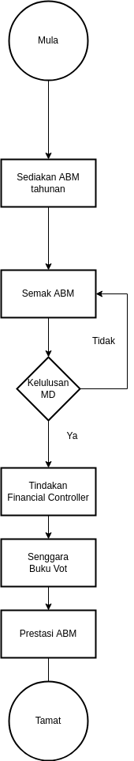

\newpage
\fancyhead[R]{\textbf{No: Keluaran: 01\\No Pindaan: 00\\Tarikh Kuatkuasa: `r params$doc_date`}}
\fancyhead[L]{\textbf{MS ISO 9001:2015\\OpenApps Sdn Bhd (548151-W)\\`r params$doc_id`}}
\clearpage
\pagenumbering{Roman}

# I    Rekod Pindaan

|Tarikh Pindaan|No Pindaan/No Keluaran|Rujukan Pindaan Mukasurat |Butir-butir Pindaan|Diluluskan Oleh|
|-------------|-------------|-------------|-------------|-------------|
|             |             |             |             |             |
|             |             |             |             |             |
|             |             |             |             |             |
|             |             |             |             |             |
|             |             |             |             |             |
|             |             |             |             |             |
|             |             |             |             |             |
|             |             |             |             |             |
|             |             |             |             |             |

# II   Senarai Pemegang Dokumen

| No. Salinan Terkawal   | Pemegang Dokumen              |
|------------------------|-------------------------------|
| `r params$doc_id`(01)  | `r a_list$pemilik_dok[1]`     |
|                        |                               |
| `r params$doc_id`(02)  | `r a_list$pemilik_dok[2]`     |
|                        |                               |
| `r params$doc_id`(03)  | `r a_list$pemilik_dok[3]`     |
|                        |                               |
| `r params$doc_id`(04)  | `r a_list$pemilik_dok[4]`     |
|                        |                               |
| `r params$doc_id`(05)  | `r a_list$pemilik_dok[5]`     |
|                        |                               |
| `r params$doc_id`(06)  | `r a_list$pemilik_dok[6]`     |
|                        |                               |
| `r params$doc_id`(07)  | `r a_list$pemilik_dok[7]`     |
|                        |                               |
| `r params$doc_id`(08)  | `r a_list$pemilik_dok[8]`     |
|                        |                               |
| `r params$doc_id`(09)  | `r a_list$pemilik_dok[9]`     |
|                        |                               |
| `r params$doc_id`(10)  | `r a_list$pemilik_dok[10]`    |
|                        |                               |
| `r params$doc_id`(11)  | `r a_list$pemilik_dok[11]`    |
|                        |                               |
| `r params$doc_id`(12)  | `r a_list$pemilik_dok[12]`    |
|                        |                               |
| `r params$doc_id`(13)  | `r a_list$pemilik_dok[13]`    |

\newpage
\clearpage
\pagenumbering{arabic}
\setcounter{page}{1}

# 1.0   Objektif

 Prosedur ini menggariskan langkah-langkah bagi memastikan penyediaan Program Anggaran Belanja Mengurus Tahunan dilaksanakan dengan berkesan.

# 2.0   Skop

 Prosedur ini digunapakai oleh Cawangan Tadbir Syarikat di dalam penyediaan Program Anggaran Belanja Mengurus Tahunan Syarikat.

# 3.0   Rujukan

##   3.1   MK.OA.01

 a.   Seksyen 5.1  Kepimpinan dan komitmen; dan

 a.   Seksyen 7.1 Sumber.

##    3.2.  Perakaunan Syarikat

Penjenisan Kod bagi Hasil dan Perbelanjaan.

##    3.3   Buku Panduan Sistem Belanjawan yang disediakan oleh Bahagian Kewangan Tahun 1994.

##    3.4.  Sistem Buku Vot Manual.

##    3.5.  Akta Syarikat 1956.

# 4.0   Definisi

 Bajet adalah sumber yang diperuntukan oleh Jabatan Kewangan/Pentadbiran bagi keperluan yang telah diputuskan oleh Pengurusan Syarikat.

# 5.0   Singkatan

\newpage

# 6.0   Tanggungjawab dan Tindakan

\begin{table}[th]
\begin{tabular}{|l|l|}
\hline
Tanggungjawab                  & Tindakan                                                                    \\ \hline
Eksekutif Kewangan/            & 1. Sediakan anggaran perbelanjaan mengurus tahunan                          \\ \hline
Pentadbiran                    & keperluan Syarikat.                                                         \\ \hline
Pengurus Kewangan/             & 2. Semak keperluan di perenggan 1 dan kemukakan                             \\ 
Pentadbiran                    & kepada MD untuk kelulusan.                                                 \\ \hline
MD                            & 3. Luluskan keperluan di perenggan 2.                                       \\ \hline
Kerani Kewangan/               & 4. Majukan kepada Financial Controller - Kewangan/Pentadbiran.              \\
Pentadbiran                    &                                                                             \\ \hline
Eksekutif Kewangan/Pentadbiran & 5. Selenggarakan Buku Vot dan kemaskinikan setiap masa                      \\
                               & Pastikan tandatangan ringkas setiap tanggungan di dalam Buku Vot.           \\ \hline
\end{tabular}
\end{table}

# 7.0 Aliran Kerja

{width=20%}
\newpage

# 8.0 Rekod Kualiti

|Bil   |Rekod |Tempoh Penyimpanan|Lokasi|Klasifikasi|
|------|----------------------------|---------------------|------|-----------|
|1.    |Buku Vot                    |5 Tahun              |Bilik Fail|Terhad|
|2.    |Buku Daftar Pembekal        |5 Tahun              |Bilik Fail|Terhad|
|2.    |Buku Daftar Invois          |5 Tahun              |Bilik Fail|Terhad|

# 9.0 Lampiran

Tidak berkenaan
