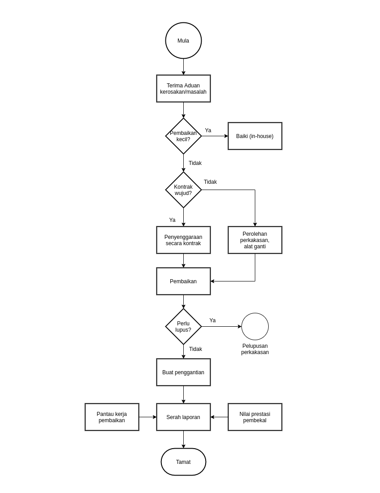
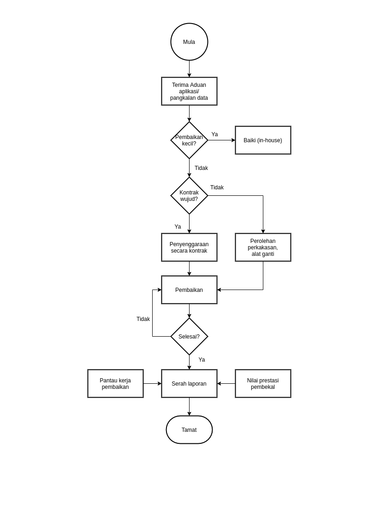
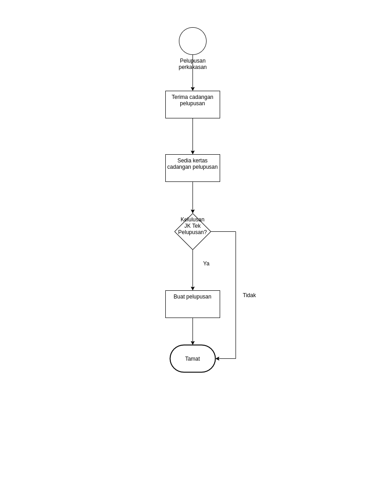
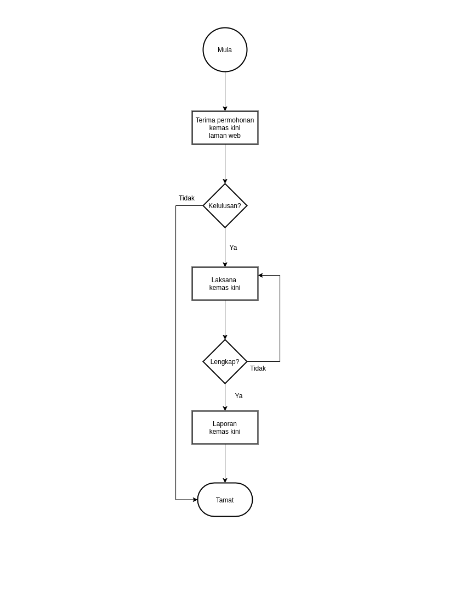

\newpage
\fancyhead[R]{\textbf{No: Keluaran: 01\\No Pindaan: 00\\Tarikh Kuatkuasa: `r params$doc_date`}}
\fancyhead[L]{\textbf{MS ISO 9001:2015\\OpenApps Sdn Bhd (548151-W)\\`r params$doc_id`}}
\clearpage
\pagenumbering{Roman}

# I    Rekod Pindaan

|Tarikh Pindaan|No Pindaan/No Keluaran|Rujukan Pindaan Mukasurat |Butir-butir Pindaan|Diluluskan Oleh|
|-------------|-------------|-------------|-------------|-------------|
|             |             |             |             |             |
|             |             |             |             |             |
|             |             |             |             |             |
|             |             |             |             |             |
|             |             |             |             |             |
|             |             |             |             |             |
|             |             |             |             |             |
|             |             |             |             |             |
|             |             |             |             |             |

# II   Senarai Pemegang Dokumen

| No. Salinan Terkawal   | Pemegang Dokumen              |
|------------------------|-------------------------------|
| `r params$doc_id`(01)  | `r a_list$pemilik_dok[1]`     |
|                        |                               |
| `r params$doc_id`(02)  | `r a_list$pemilik_dok[2]`     |
|                        |                               |
| `r params$doc_id`(03)  | `r a_list$pemilik_dok[3]`     |
|                        |                               |
| `r params$doc_id`(04)  | `r a_list$pemilik_dok[4]`     |
|                        |                               |
| `r params$doc_id`(05)  | `r a_list$pemilik_dok[5]`     |
|                        |                               |
| `r params$doc_id`(06)  | `r a_list$pemilik_dok[6]`     |
|                        |                               |
| `r params$doc_id`(07)  | `r a_list$pemilik_dok[7]`     |
|                        |                               |
| `r params$doc_id`(08)  | `r a_list$pemilik_dok[8]`     |
|                        |                               |
| `r params$doc_id`(09)  | `r a_list$pemilik_dok[9]`     |
|                        |                               |
| `r params$doc_id`(10)  | `r a_list$pemilik_dok[10]`    |
|                        |                               |
| `r params$doc_id`(11)  | `r a_list$pemilik_dok[11]`    |
|                        |                               |
| `r params$doc_id`(12)  | `r a_list$pemilik_dok[12]`    |
|                        |                               |
| `r params$doc_id`(13)  | `r a_list$pemilik_dok[13]`    |

\newpage
\clearpage
\pagenumbering{arabic}
\setcounter{page}{1}

# 1.0   Objektif

Prosedur ini menyediakan garispanduan bagi memastikan proses penyenggaraan perkakasan, perisian dan sistem rangkaian komputer dan laman web Syarikat dilaksanakan dengan terancang dan berkesan.

# 2.0   Skop

Prosedur ini digunapakai oleh kakitangan Cawangan ICT (*Information, Communication and Technology*) semasa untuk menyelenggara sistem komputer Syarikat yang meliputi aspek-aspek berikut:

a.    Penyenggaraan Perkakasan dan peralatan komputer, perisian, rangkaian sistem komputer dan laman web Syarikat.

a.    Pelupusan Komputer/peralatan perkakasan komputer.

# 3.0   Rujukan

MK.OA.01 iaitu Seksyen 7.1.3 Prasarana.

# 4.0   Definisi

## 4.1    Penyenggaraan

 Kerja-kerja yang dijalankan bagi menjamin kestabilan dan keselamatan perkakasan, perisian dan rangkaian komputer. Berfungsi berada pada tahap sempurna secara berterusan dan menepati kemudahan serta fungsinya.

## 4.2    Perkakasan dan peralatan komputer

 Semua peralatan komputer Syarikat seperti server, komputer mikro, pencetak, komputer bimbit, pengimbas. CD- Writer serta peralatan lain yang berkaitan dengan komputer seperti UPS, mouse, external speaker, zip drive dan lain-lain.

## 4.3    Perisian komputer

Perisian aplikasi yang terdapat Syarikat.

## 4.4    Rangkaian sistem

 Komputer-komputer individu yang dihubungkan kepada pelayan utama Syarikat dengan tujuan berkomunikasi antara satu dengan yang lain dan berkongsi maklumat.

## 4.5    Kerosakan besar

 Satu keadaan di mana kerosakan yang berlaku pada perkakasan dan peralatan komputer perisian dan rangkaian komunikasi komputer yang melibatkan fungsi /operasi utama terjejas seperti kerosakan pada *konfigurasi server* *LAN* yang terdapat di Syarikat.

## 4.6    Kerosakan Kecil

 Satu keadaan di mana kerosakan yang berlaku pada perkakasan dan peralatan komputer, perisian dan rangkaian komunikasi komputer yang tidak dapat berfungsi dengan keadaan biasa yang tidak menjejaskan secara langsung kesan operasi /fungsi utama dan boleh diperbaiki dalam tempoh masa yang singkat.

# 5.0   Singkatan

a.    PTM - Pengurus Teknologi Maklumat.

a.    TMO - Teknologi Maklumat Operasi.

a.    TMTek - Juteknik Teknologi Maklumat.

# 6.0   Tanggungjawab dan Tindakan

\begin{longtable}{|l|l|}
\hline
Tanggungjawab & Tindakan                                                                                        \\ \hline
\endhead
%
TM-Tek        & \textbf{PENYENGGARAAN PERKAKASAN, PERALATAN KOMPUTER,}                                          \\
              & \textbf{RANGKAIAN SISTEM DAN PANGKALAN DATA}                                                    \\
              & \textbf{A. PENGENDALIAN ADUAN KEROSAKAN/MASALAH SISTEM}                                         \\
              & 1. Terima aduan kerosakan atau masalah komputer dari pengguna menggunakan                       \\
              & Borang ICT PK(S).OA.06.B01 dan catatkan aduan ke dalam Buku Log Aduan                           \\
              & (Borang Aduan Kerosakan Perkakasan/Perisian Komputer) (*Lampiran A*).                           \\
              & 2. Kenalpasti jenis aduan dan maklum kepada pegawai yang bertanggungjawab iaitu:                \\
              & i) PTM bagi kerosakan besar perkakasan,perisian dan rangkaian.                                  \\
              & ii) TMTek bagi kerosakan kecil perkakasan,perisian dan rangkaian.                               \\
              & iii) TMO bagi masalah sistem aplikasi dan pangkalan data.                                       \\
              & 3. Serahkan Borang ICT PK(S).OA.06.B01 kepada pegawai yang bertanggungjawab                     \\
              & untuk tindakan pembaikan.                                                                       \\
              & 4. Sekiranya aduan yang dikenalpasti adalah masalah sistem aplikasi dan pangkalan data,         \\
              & serahkan Borang ICT PK(S).OA.06.B01 kepada TM-Op dan rujuk kepada                               \\
              & Proses {[}Pengendalian Masalah Sistem dan Pangkalan Data{]}(\#para48) (Langkah 48-52).          \\ \hline
PTM, TM-Op    & 5. Jalankan pemeriksaan dan ambil langkah-langkah pembaikan yang bersesuaian.                   \\
TM-Tek        & 6. Jalankan ujian untuk memastikan samada kerosakan                                             \\
              & dapat diatasi (dibaiki sendira. atau tidak.                                                     \\
              & 7. Sekiranya masalah dapat diatasi (dibaiki sendira.:                                           \\
              & i) Catatkan masalah yang dihadapi, langkah                                                      \\
              & pembaikan, tarikh pembaikan, masa pembaikan                                                     \\
              & dan dapatkan tandatangan pengadu di Borang ICT PK(S).OA.06.B01.                                 \\
              & ii) Serahkan Borang ICT PK(S).OA.06.B01 yang telah lengkap                                      \\
              & kepada TM-Tek.                                                                                  \\
              & iii) Catatkan tarikh terima Borang dan                                                          \\
              & tandatangan pada Buku Log Aduan Kerosakan dan                                                   \\
              & failkan Borang ICT PK(S).OA.06.B01.                                                             \\
              & iv) Sediakan laporan bulanan suku tahunan                                                       \\
              & bagi pihak pengurusan berdasarkan Buku Log Aduan Kerosakan.                                     \\
              & 8. Sekiranya masalah tidak dapat diatasi (dibaiki sendira.,                                     \\
              & hubungi syarikat penyenggara.                                                                   \\
              & 9. Tentukan peralatan dalam tempoh jaminan (waranta. syarikat penyelenggaraan.                  \\
              & 10. Sekiranya peralatan telah tamat tempoh jaminan (waranta. syarikat penyelenggaraan,          \\
              & Semak dengan syarikat samada peralatan atau gantian perlu diganti atau tidak.                   \\
              & i) Sekiranya tidak ada peralatan / komputer perlu diganti, teruskan dengan Prosedur             \\
              & Pembaikan (Langkah 20 - 22).                                                                    \\
              & ii) Sekiranya ada keperluan penggantian komponen/peralatan teruskan dengan Prosedur             \\
              & Gantian (Langkah 23 - 30).                                                                      \\ \hline
TM-Op /       & \textbf{B. PENYELENGGARAAN (PENCEGAHAN) YANG DIKONTRAKKAN}                                      \\
TM-Tek        & 11. Kenalpasti perkakasan dan syarikat penyelenggaraan yang bertanggungjawab                    \\
              & menjalani penyelenggaraan dari dokumen perjanjian.                                              \\
              & 12. Hubungi syarikat penyelenggaraan untuk menjalankan penyelenggaraan mengikut jadual          \\
              & yang telah ditetapkan.                                                                          \\
              & 13. Pantau kerja-kerja penyelenggaraan yang dijalankan oleh syarikat penyelenggaraan.           \\
              & 14. Pastikan penyelenggaraan dibuat mengikut jadual.                                            \\
              & 15. Dapatkan laporan penyelenggaraan yang dibuat daripada pihak penyelenggaraan.                \\
              & 16. Sahkan laporan penyelenggaraan yang disediakan oleh pihak penyelenggaraan.                  \\
              & 17. Serahkan laporan prestasi pembekal kepada TM-Tek untuk difailkan.                           \\
              & 18. Bagi kes penyelenggaraan yang memerlukan /tidak memerlukan penggantian                      \\
              & komponen, ikuti langkah pada Prosedur Pembaikan (Ulangi Langkah 20-22).                         \\
              & 19. Sekiranya masalah tersebut memerlukan penggantian komponen / peralatan, patuhi              \\
              & Prosedur Gantian (Langkah 23 - 30).                                                             \\ \hline
PTM /         & \textbf{C. PEMBAIKAN, GANTIAN DAN PELUPUSAN}                                                    \\
TM-Op /       & \textbf{(PERKAKASAN DAN PERALATAN KOMPUTER)}                                                    \\
TM-Tek        & \textbf{PEMBAIKAN}                                                                              \\
              & 20. Minta syarikat penyenggaraan selesaikan masalah.                                            \\
              & 21. Buat pemeriksaan ke atas peralatan yang diselenggara bagi memastikan ianya memuaskan.       \\
              & 22. Jika peralatan masih bermasalah, arahkan pihak penyenggaraan menyelesaikan                  \\
              & hingga sempurna. Jika puashati patuhi Prosedur Laporan Penyelenggaraan (Langkah 38-42).         \\
              & \textbf{GANTIAN}                                                                                \\
              & 23. Periksa samada peralatan tersebut diselenggara di bawah kontrak penyenggara atau tidak.     \\
              & Jika peralatan dibawah kontrak penyenggara patuhi Prosedur Gantian Komponen                     \\
              & di dalam Kontrak Penyenggaraan (Langkah 25-30).                                                 \\
              & 24. Sekiranya ia tidak diselenggara di bawah kontrak penyenggaraan:                             \\
              & i. Dapatkan sebut harga daripada syarikat penyenggaraan.                                        \\
              & ii. Sekiranya nilai sebutharga tersebut kurang dari RM 50,000 teruskan langkah c),              \\
              & jika sebaliknya rujuk Prosedur Perolehan.                                                       \\
              & iii. Minta kelulusan bagi membuat penyenggaraan dari Pengurus ICT.                              \\
              & iv Sekiranya mendapat kelulusan: - Failkan sebutharga/surat kelulusan.                          \\
              & v  Sekiranya tidak diluluskan: - Maklumkan pihak pembekal untuk pembatalan.                     \\
              & vi. Failkan makluman di dalam fail berkenaan.                                                   \\
              & Rujuk Prosedur Pelupusan (Langkah 31 - 36)                                                      \\ \hline
PTM           & \textbf{GANTIAN KOMPONEN DI BAWAH KONTRAK PENYELENGGARAAN}                                      \\
              & 25. Minta syarikat di bawah kontrak penyenggara ganti komponen.                                 \\
              & 26. Buat pemeriksaan ke atas peralatan yang diganti bagi memastikan ianya memuaskan.            \\
              & 27. Jika puashati ikuti Prosedur Laporan Penyelenggaraan (Langkah 37 - 41).                     \\
              & 28. Jika peralatan masih bermasalah, arahkan pihak penyelenggaraan                              \\
              & menyelesaikan sehingga sempurna.                                                                \\
              & 29. Buat penilaian prestasi pembekal yang menjalankan kerja-kerja penyelenggaraan               \\
              & setelah kerja sempurna.                                                                         \\
              & 30. Rekodkan ke dalam fail.                                                                     \\
              & \textbf{PELUPUSAN}                                                                              \\
              & 31. Terima cadangan untuk melupuskan dari cawangan.                                             \\
              & Sediakan satu kertas kerja mengenai cadangan pelupusan peralatan dan kemukakan kepada           \\
              & Lembaga Pelupusan Peralatan Komputer.                                                           \\
              & 32. Dapatkan keputusan persetujuan dari Lembaga Pelupusan Peralatan Komputer.                   \\
              & 33. Tubuhkan satu Jawatankuasa Teknikal bagi mengkaji cadangan pelupusan tersebut.              \\
              & 34. Dapatkan cadangan dan hasil kajian yang mendalam ke atas semua aspek mengenai peralatan     \\
              & yang terlibat dari Jawatakuasa Teknikal mengenai Pelupusan.                                     \\
              & 35. Dapatkan laporan lengkap mengenai cadangan serta syor-syor dari Jawatankuasa Teknikal       \\
              & Pelupusan tersebut.                                                                             \\
              & 36. Jalankan pelupusan mengikuti peraturan pelupusan yang telah ditetapkan.                     \\
              & \textbf{D.  LAPORAN PENYELENGGARAAN}                                                            \\
              & 37. Dapatkan laporan penyelenggaraan daripada pihak penyenggara.                                \\
              & 38. Sahkan laporan penyelenggaraan dari syarikat penyenggaraan.                                 \\
              & 39. Serahkan laporan penyelenggaraan kepada TM-Tek untuk difailkan.                             \\
              & 40. Catatkan pembaikan yang telah dibuat, tarikh siap pembaikan dan                             \\
              & tandatangani Borang ICT 1.                                                                      \\
              & 41. Catatkan tarikh terima Borang ICT PK(S).OA.06.B01 di dalam                                  \\
              & buku log aduan dan failkan Borang ICT PK(S).OA.06.B01 dan laporan.                              \\
              & \textbf{E. PENGENDALIAN MASALAH SISTEM APLIKASI DAN PANGKALAN DATA}                             \\
              & 42. Terima Borang ICT PK(S).OA.06.B01 tentang aduan masalah                                     \\
              & berkaitan sistem daripada TM-Tek.                                                               \\
              & 43. Jalankan pemeriksaan dan ambil langkah-langkah pembaikan yang bersesuaian.                  \\
              & 48. Jalankan ujian untuk memastikan samada masalah dapat diatasi (dibaiki sendira. atau tidak.  \\
              & 49. Sekiranya masalah dapat diatasi (dibaiki sendira.:                                          \\
              & i. Catatkan masalah yang dihadapi, langkah pembaikan, tarikh pembaikan, masa pembaikan          \\
              & dan tandatangan pengadu di Borang ICT PK(S).OA.06.B01.                                          \\
              & ii. Serah Borang ICT PK(S).OA.06.B01 kepada TM-Tek.                                             \\
              & 50. Sekiranya masalah tidak dapat diatasi (dibaiki sendira. hubungi syarikat                    \\
              & penyelenggaraan, teruskan dengan Prosedur Pembaikan (Ulangi Langkah 20-22).                     \\
              & \textbf{F. PEMANTAUAN KERJA PENYENGGARAAN (PENCEGAHAN)}                                         \\
              & \textbf{YANG DIKONTRAKKAN}                                                                      \\
              & 51. Kenalpasti masalah dan syarikat penyenggara yang bertanggungjawab menjalani                 \\
              & penyenggaraan dari dokumen perjanjian.                                                          \\
              & 52. Hubungi syarikat penyenggara untuk menjalankan penyenggaraan mengikut jadual yang           \\
              & telah ditetapkan.                                                                               \\
              & 53. Pantau kerja-kerja penyenggaraan yang dijalankan oleh syarikat penyenggaraan.               \\ \hline
PTM           & 54. Pastikan penyenggaraan dibuat mengikut jadual.                                              \\
              & 55. Dapatkan laporan penyenggaraan yang dibuat daripada pihak penyenggaraan.                    \\
              & 56. Sahkan laporan penyenggaraan yang disediakan oleh pihak penyenggaraan.                      \\
              & 57. Serahkan laporan kepada TM-Tek untuk difailkan.                                             \\
              & 58. Sekiranya terdapat masalah dalam penyenggaraan, teruskan dengan Prosedur                    \\
              & Pembaikan (Langkah 20-22).                                                                      \\
              & \textbf{G. PEMBAIKAN APLIKASI DAN PANGKALAN DATA}                                               \\
              & \textbf{PEMBAIKAN}                                                                              \\
              & 59. Minta syarikat penyelenggaraan membaiki kerosakan.                                          \\
              & 60. Buat pemeriksaan ke atas masalah pada sistem yang diselenggara bagi memastikan ianya        \\
              & telah diperbaiki dan berfungsi dengan sempurna.                                                 \\
              & 61. Jika sistem masih bermasalah, arahkan pihak penyenggaraan menyelesaikan hingga              \\
              & sempurna. Jika puashati ikut Prosedur Laporan Penyelenggaraan (Langkah 77 - 81).                \\
              & 62. Buat penilaian prestasi ke atas mutu kerja-kerja pembaikan yang dijalankan oleh             \\
              & syarikat penyelenggaraan.                                                                       \\
              & 63. Failkan.                                                                                    \\ \hline
TM-Tek        & \textbf{PENGEMASKINIAN LAMAN WEB}                                                               \\
              & 64. Terima arahan pengemaskinian laman web melalui Borang ICT PK(S).OA.06.B02 (Borang           \\
              & Pengemaskinian Laman Web Syarikat) (Lampiran B).                                                \\
              & 65. Minitkan kepada Web Master untuk tindakan susulan bersama Borang ICT PK(S).OA.06.B02.       \\
              & 66. Serahkan Borang ICT PK(S).OA.06.B02 kepada WebTeam.                                         \\
              & 67. Jalankan pengemaskinian kandungan laman web.                                                \\
              & 68. Catatkan tarikh pengemaskinian dan tanda tangan di Borang ICT PK(S).OA.06.B02.              \\
              & 69. Serahkan Borang ICT PK(S).OA.06.B02 kepada Web Master untuk semakan.                        \\
              & 70. Semak pengemaskinian yang telah dibuat.                                                     \\
              & 71. Sekiranya ADA masalah kembalikan Borang ICT PK(S).OA.06.B02                                 \\
              & kepada WEB TEAM untuk pengemaskinian semula.                                                    \\
              & 72. Sekiranya TIADA masalah serahkan Borang ICT PK(S).OA.06.B02 kepada                          \\
              & PTM untuk kelulusan.                                                                            \\
              & 73. Sekiranya masih ADA masalah kembalikan Borang ICT PK(S).OA.06.B02 kepada                    \\
              & Web Master untuk pengemaskinian semula.                                                         \\
              & 74. Sekiranya TIADA masalah luluskan pengemaskinian laman web.                                  \\
              & 75. Maklumkan kepada Ketua Jabatan melalui memo.                                                \\
              & 76. Sediakan laporan bulanan/suku tahun bagi pihak pengurusan.                                  \\
              & \textbf{H. LAPORAN PENYENGGARAAN}                                                               \\
              & 77. Dapatkan laporan penyenggaraan daripada pihak penyenggara.                                  \\
              & 78. Sahkan laporan penyenggaraan dari syarikat penyenggaraan.                                   \\
              & 79. Serahkan laporan penyenggaraan kepada TM-Tek untuk difailkan.                               \\
              & 80. Catatkan pembaikan yang telah dibuat, tarikh siap pembaikan dan tandatangani                \\
              & Borang ICT PK(S).OA.06.B01.                                                                     \\
              & 81. Serahkan Borang ICT PK(S).OA.06.B01 kepada TM-Tek.                                          \\ \hline
\end{longtable}

\newpage

# 7.0 Aliran Kerja

{width=70%}

\newpage 

# 8.0 Rekod Kualiti

|Bil   |Rekod |Tempoh Penyimpanan|Lokasi|Klasifikasi|
|------|-------------------------------|---------|---------------|-----------|
| 1    | Fail Laporan Aduan Kerosakan  | 3 tahun | Bilik Fail |Terhad|
| 2    | Fail Laman Web Syarikat       | 3 tahun | Bilik Fail |Terhad|
| 4    | Fail penyenggaraan perkakasan | 3 tahun | Bilik Fail |Terhad|
| 5    | Perjanjian Penyenggaraan      | 3 tahun | Bilik Fail |Terhad|
| 6    | Prosedur Pelupusan            | 3 tahun | Bilik Fail |Terhad|

\newpage

# 9.0 Lampiran

## A - Borang ICT PK(S).OA.06.B01

**BORANG LAPORAN KEROSAKAN [PK(S).OA.06.B01]**

**[PERKAKASAN/PERISIAN]**

**[BAHAGIAN I]**

(Diisi oleh pengguna)

A. **MAKLUMAT PENGGUNA**

Kp : \........................ 

Nama :\......................................................................

Cawangan/Sel:\...............................................................

No. Telefon :\........................ Samb: \........................

E-mail: \........................

**B. MAKLUMAT PERKAKAS**

No Siri Perkakas : \........................

**Sistem Pengoperasian yang digunakan**:

... Win 95 ... Win 98 ... Win ME ... Win 2008 ... Win XP ... Win NT

**Kategori Rangkaian**:

... Aplikasi ... Internet ... Lain-lain

C. **[MAKLUMAT KEROSAKAN]**

Ringkasan Kerosakan:

\...............................................................................

\...............................................................................

\...............................................................................

Tandatangan: \........................
Tarikh: \........................

Dimajukan dalam 2 salinan

**[BAHAGIAN II]**

(Diisi oleh Staf Teknikal, Sel ICT)

D. **[MAKLUMAT SENGGARAAN]**

.... Baiki .... Di hantar untuk dibaiki

Tindakan Pembaikan:

\...............................................................................

\...............................................................................

\...............................................................................

a\. [Peralatan Rosak]

  NAMA ALAT   NO SIRI   CATATAN
  ----------- --------- ---------
  Pencetak    SN                  
                        
                        

b\. [Peralatan Ganti]

  NAMA ALAT   NO SIRI   CATATAN
  ----------- --------- ---------
  Pencetak    SN                       
                        
                        

c\. [Peralatan yang Dihantar Untuk Dibaiki]

  NAMA PERALATAN   NO SIRI   TARIKH HANTAR   NO KERJA     TARIKH DI PULANGKAN
  ---------------- --------- --------------- ------------ ---------------------
  Pencetak         SN                                                         
                                                          
                                                          

Kp : \................................ 

Nama :\.........................................................................

Tandatangan: \................

Tarikh: \.....................

**[BAHAGIAN III]**

(Pengesahan Penyelia/ICT)

Catatan:

\...............................................................................

\...............................................................................

\...............................................................................

Kp : \................................ 

Nama :\.........................................................................

Tandatangan: \................

Tarikh: \.....................

**[BAHAGIAN IV]**

(Diisi oleh Kerani Sel ICT)

Kp : \................................ 

Nama :\.........................................................................

Tandatangan: \................

Tarikh: \.....................

\newpage

## B - Borang ICT PK(S).OA.06.B02

**BORANG MENGEMASKINI LAMAN WEB JRP [PK(S).OA.06.B02]**

Kp : \................................ 

Nama :\.........................................................................

Tandatangan: \................

Tarikh: \.....................

Maklumat untuk dikemaskini :

\...............................................................................

\...............................................................................

\...............................................................................

\...............................................................................

\...............................................................................

\...............................................................................

TINDAKAN ICT :

\...............................................................................

\...............................................................................

\...............................................................................

\...............................................................................

\...............................................................................

\...............................................................................

PENGESAHAN COP ICT:
