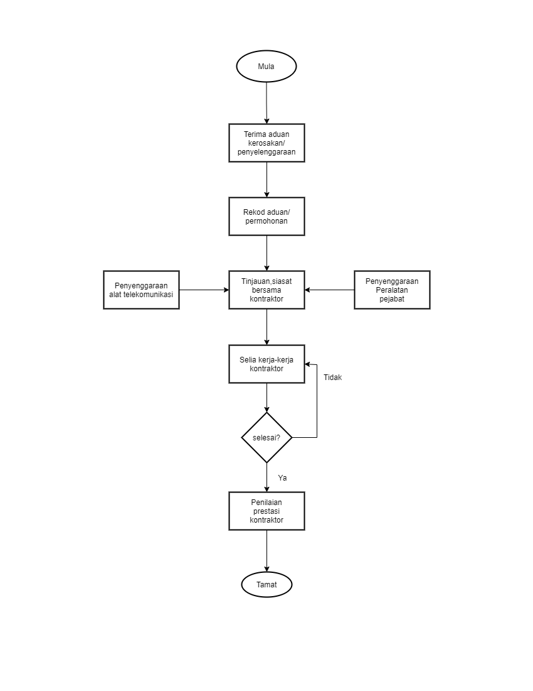
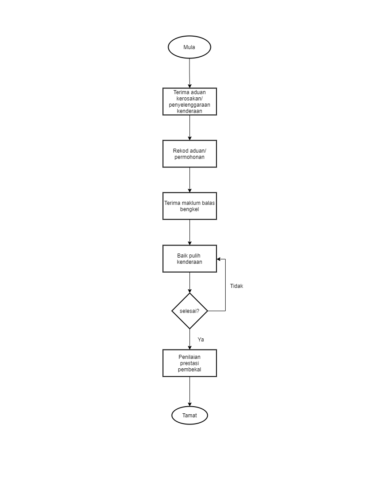

\newpage
\fancyhead[R]{\textbf{No: Keluaran: 01\\No Pindaan: 00\\Tarikh Kuatkuasa: `r params$doc_date`}}
\fancyhead[L]{\textbf{MS ISO 9001:2015\\OpenApps Sdn Bhd (548151-W)\\`r params$doc_id`}}
\clearpage
\pagenumbering{Roman}

# I    Rekod Pindaan

|Tarikh Pindaan|No Pindaan/No Keluaran|Rujukan Pindaan Mukasurat |Butir-butir Pindaan|Diluluskan Oleh|
|-------------|-------------|-------------|-------------|-------------|
|             |             |             |             |             |
|             |             |             |             |             |
|             |             |             |             |             |
|             |             |             |             |             |
|             |             |             |             |             |
|             |             |             |             |             |
|             |             |             |             |             |
|             |             |             |             |             |
|             |             |             |             |             |

# II   Senarai Pemegang Dokumen

| No. Salinan Terkawal   | Pemegang Dokumen              |
|------------------------|-------------------------------|
| `r params$doc_id`(01)  | `r a_list$pemilik_dok[1]`     |
|                        |                               |
| `r params$doc_id`(02)  | `r a_list$pemilik_dok[2]`     |
|                        |                               |
| `r params$doc_id`(03)  | `r a_list$pemilik_dok[3]`     |
|                        |                               |
| `r params$doc_id`(04)  | `r a_list$pemilik_dok[4]`     |
|                        |                               |
| `r params$doc_id`(05)  | `r a_list$pemilik_dok[5]`     |
|                        |                               |
| `r params$doc_id`(06)  | `r a_list$pemilik_dok[6]`     |
|                        |                               |
| `r params$doc_id`(07)  | `r a_list$pemilik_dok[7]`     |
|                        |                               |
| `r params$doc_id`(08)  | `r a_list$pemilik_dok[8]`     |
|                        |                               |
| `r params$doc_id`(09)  | `r a_list$pemilik_dok[9]`     |
|                        |                               |
| `r params$doc_id`(10)  | `r a_list$pemilik_dok[10]`    |
|                        |                               |
| `r params$doc_id`(11)  | `r a_list$pemilik_dok[11]`    |
|                        |                               |
| `r params$doc_id`(12)  | `r a_list$pemilik_dok[12]`    |
|                        |                               |
| `r params$doc_id`(13)  | `r a_list$pemilik_dok[13]`    |

\newpage
\clearpage
\pagenumbering{arabic}
\setcounter{page}{1}

# 1.0   Objektif

 Prosedur ini menyediakan garis panduan bagi memastikan urusan
 penyenggaraan bangunan, kemudahan-kemudahan dan peralatan termasuk
 kenderaan dapat dijalankan dengan cekap serta memberi dan menyokong
 perlindungan yang bersesuaian ke atas semua aset ICT Syarikat mematuhi
 peraturan yang telah ditetapkan oleh pengurusan Syarikat.

# 2.0   Skop

 Prosedur ini digunapakai oleh kakitangan bahagian pentadbiran Syarikat ketika
 merancang, melaksana dan memantau kerja-kerja berikut:-

  2.1 Kerja-kerja pembaikan, penyenggaraan dan pengubahsuaian bangunan.

  2.2 Penyenggaraan kemudahan-kemudahan peralatan pejabat.

  2.3 Penyenggaraan Alat Telekomunikasi.

  2.4 Penyelenggaraan pengangkutan (Tidak melibatkan pembaikan
 kerosakan).

 Mengawal dan melindungi setiap aset Syarikat berdasarkan peraturan yang
 telah ditetapkan, serta memberi kesedaran kepada semua kepentingan
 aset yang membantu dalam organisasi.

# 3.0   Rujukan

MK.OA.01 Seksyen-seksyen berkaitan:

 a.   Seksyen 7.1.3 Prasarana.

 a.   Seksyen 7.1.4. Persekitaran untuk operasi proses.

# 4.0   Definisi

Tiada

# 5.0   Singkatan

Tiada

\newpage

# 6.0   Tanggungjawab dan Tindakan

\begin{longtable}{|l|l|}
\hline
Tanggungjawab      & Tindakan                                                                              \\ \hline
\endhead
%
\hline
\endfoot
%
\endlastfoot
%
                   & \textbf{A. PENYENGGARAAN BANGUNAN}                                                    \\ \hline
Eksekutif Kewangan & 1. Terima aduan kerosakan atau permohonan daripada Cawangan (Aktiviti penyelenggaraan \\
/Pentadbiran       & Lampiran A).                                                                          \\
                   & 2. Rekod aduan atau permohonan kerosakan.                                             \\
                   & 3. Buat tinjauan di lokasi berkenaan.                                                 \\
                   & 4. Hubungi kontraktor penyelenggaraan bangunan bagi meninjau kerosakan.               \\ \hline
                   & \textbf{B. PENYELIAAN KERJA-KERJA KONTRAKTOR}                                         \\ \hline
Eksekutif Kewangan & 1. Selia kerja-kerja yang dilaksanakan oleh pihak kontraktor dari semasa  ke semasa.  \\
/Pentadbiran       & 2. Rekodkan penilaian prestasi pembekal yang menjalankan kerja-kerja senggaraan.      \\ \hline
                   & \textbf{C. PENYENGGARAAN PERALATAN PEJABAT}                                           \\ \hline
Kerani Kewangan    & 1. Terima aduan kerosakan atau permohonan penyenggaraan dari                          \\
/Pentadbiran       & Cawangan (Aktiviti Penyelenggaraan Lampiran A).                                       \\
                   & 2. Rekod aduan atau permohonan penyenggaraan.                                         \\
                   & 3. Maklum kepada Pembekal untuk kenalpasti kerosakan dan menjalankan senggaraan.      \\
                   & 4. Dapatkan Sebutharga dari 3 Pembekal.                                               \\
                   & 5. Jalankan proses perolehan rujuk Prosedur Kualiti PK(S).OA.03 bagi                  \\
                   & Tindakan Pembelian Secara Terus.                                                      \\
                   & 6. Pantau kerja-kerja pembaikan yang dibuat.                                          \\
                   & 7. Rekodkan penilaian prestasi pembekal yang menjalankan kerja-kerja senggaraan.      \\ \hline
                   & \textbf{D. PENYENGGARAAN ALAT TELEKOMUNIKASI}                                         \\ \hline
Eksekutif Kewangan & 1. Terima aduan kerosakan daripada Cawangan (Aktiviti penyelenggaraan                 \\
/Pentadbiran       & Lampiran A).                                                                          \\
                   & 2. Rekodkan aduan kerosakan.                                                          \\
                   & 3. Hubungi pembekal telekomunikasi bagi menilai kerosakan untuk dibuat senggaraan.    \\
                   & 4. Memantau kerja-kerja pembaikan yang dibuat oleh pihak pembekal.                    \\
                   & 5. Rekodkan penilaian prestasi pembekal.                                              \\ \hline
Pemandu            & \textbf{E. PENYELENGGARAAN KERETA UTILITI}                                            \\
                   & 1. Terima aduan kerosakan atau permohonan penyelenggaraan.                            \\
                   & 2. Rekod aduan atau permohonan penyelenggaraan.                                       \\
                   & 3. Hantar ke bengkel bertauliah untuk penyelenggaraan semasa mengikut rekod servis.   \\
                   & 3. Bagi kes-kes kerosakan kecil hendaklah memaklumkan                                 \\
                   & jenis kerosakan ke bengkel bertauliah.                                                \\
                   & 4. Bagi kes-kes kerosakan besar melebihi 50\%, maklumkan                              \\
                   & jenis-jenis kerosakan dan terima arahan selanjutnya dari bengkel bertauliah.          \\
                   & 5. Terima kenderaan yang dibaikpulih daripada bengkel bertauliah.                     \\
                   & 6. Periksa kenderaan yang telah di baikpulih berada didalam keadaan baik.             \\
                   & 7. Teliti tarikh penyelenggaraan susulan dalam buku rekod penyelenggaraan.            \\ \hline
                   & \textbf{F. TANGGUNGJAWAB KE ATAS INVENTORI ASET}                                      \\ \hline
Eksekutif Kewangan & 1. Kenalpasti semua aset dan rekodkan dalam Daftar Harta Modal/Inventori.             \\
/Pentadbiran       & 2. Senaraikan aset di perkara 1 kepada pengguna yang dibenarkan.                      \\
                   & 3. Kemaskini rekod daftar harta modal/inventori dalam keadaan berikut:                \\
                   & a) Penerimaan aset baru.                                                              \\
                   & b) Pelupusan aset yang usang.                                                         \\ \hline
\end{longtable}

\newpage

# 7.0 Aliran Kerja

{width=70%}

{width=70%}

\newpage

# 8.0 Rekod Kualiti

|Bil   |Rekod                       |Tempoh Penyimpanan|Lokasi  |Klasifikasi|
|------|----------------------------|----------|----------------|-----------|
| 1    | Buku Rekod Aduan           | 7 Tahun  | Bilik Fail |Terhad|
| 2    | Fail Sebutharga            | 7 Tahun  | Bilik Fail |Terhad|
| 3    | Fail Penyelenggaraan Aset  | 7 Tahun  | Bilik Fail |Terhad|

# 9.0 Lampiran

## A - Laporan Penyelenggaraan

Jadual 1: Laporan Penyelenggaraan Peralatan Pejabat/Alat Telekomunikasi/Kenderaan Utiliti

-----------------------------------------------------------
Siri Tarikh    Ringkasan Penyelenggaraan Peralatan Pejabat/
               Alat Telekomunikasi/Kenderaan Utiliti
---- --------- --------------------------------------------
1.   1/3/2021  Catatan

2.   1/9/2021  Catatan

-----------------------------------------------------------

