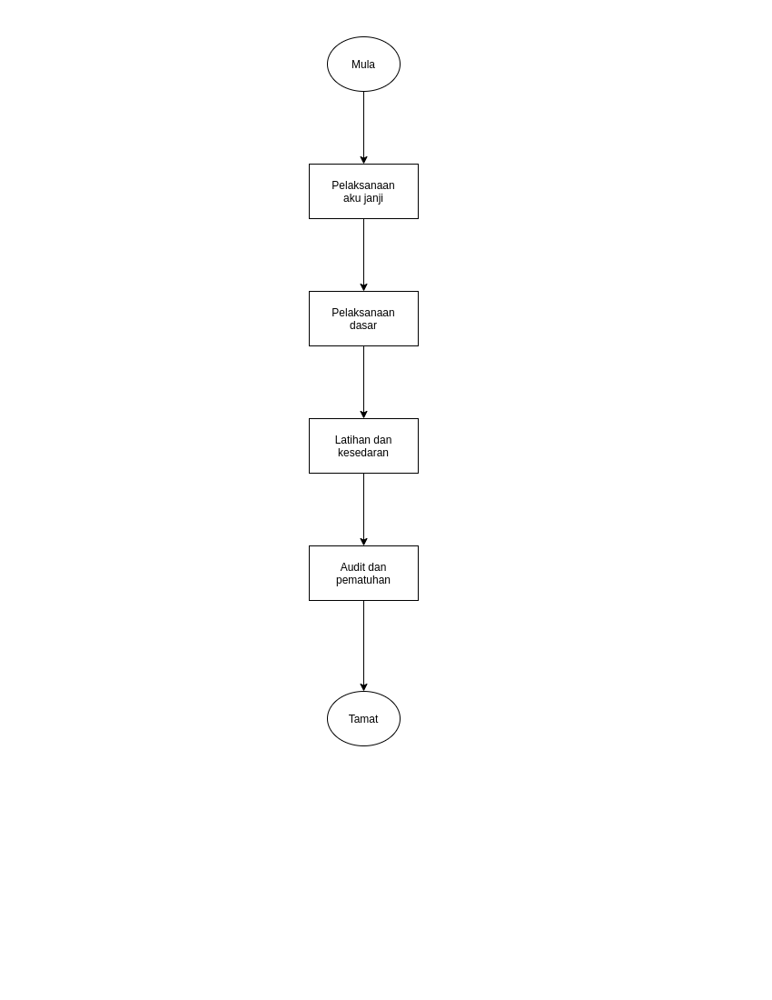

\newpage
\fancyhead[R]{\textbf{No: Keluaran: 01\\No Pindaan: 00\\Tarikh Kuatkuasa: `r params$doc_date`}}
\fancyhead[L]{\textbf{MS ISO 9001:2015\\OpenApps Sdn Bhd (548151-W)\\`r params$doc_id`}}
\clearpage
\pagenumbering{Roman}

# I    Rekod Pindaan

|Tarikh Pindaan|No Pindaan/No Keluaran|Rujukan Pindaan Mukasurat |Butir-butir Pindaan|Diluluskan Oleh|
|-------------|-------------|-------------|-------------|-------------|
|             |             |             |             |             |
|             |             |             |             |             |
|             |             |             |             |             |
|             |             |             |             |             |
|             |             |             |             |             |
|             |             |             |             |             |
|             |             |             |             |             |
|             |             |             |             |             |
|             |             |             |             |             |

# II   Senarai Pemegang Dokumen

| No. Salinan Terkawal   | Pemegang Dokumen              |
|------------------------|-------------------------------|
| `r params$doc_id`(01)  | `r a_list$pemilik_dok[1]`     |
|                        |                               |
| `r params$doc_id`(02)  | `r a_list$pemilik_dok[2]`     |
|                        |                               |
| `r params$doc_id`(03)  | `r a_list$pemilik_dok[3]`     |
|                        |                               |
| `r params$doc_id`(04)  | `r a_list$pemilik_dok[4]`     |
|                        |                               |
| `r params$doc_id`(05)  | `r a_list$pemilik_dok[5]`     |
|                        |                               |
| `r params$doc_id`(06)  | `r a_list$pemilik_dok[6]`     |
|                        |                               |
| `r params$doc_id`(07)  | `r a_list$pemilik_dok[7]`     |
|                        |                               |
| `r params$doc_id`(08)  | `r a_list$pemilik_dok[8]`     |
|                        |                               |
| `r params$doc_id`(09)  | `r a_list$pemilik_dok[9]`     |
|                        |                               |
| `r params$doc_id`(10)  | `r a_list$pemilik_dok[10]`    |
|                        |                               |
| `r params$doc_id`(11)  | `r a_list$pemilik_dok[11]`    |
|                        |                               |
| `r params$doc_id`(12)  | `r a_list$pemilik_dok[12]`    |
|                        |                               |
| `r params$doc_id`(13)  | `r a_list$pemilik_dok[13]`    |

\newpage
\clearpage
\pagenumbering{arabic}
\setcounter{page}{1}

# 1.0   Objektif

Syarikat mengamalkan budaya kerja unggul  dengan  ciri-ciri  moral  dan  etika  yang  kukuh, oleh itu Syarikat telah menggubal dasar integriti, akauntabiliti dan anti-rasuah sebagai pandu arah di dalam setiap urusniaga. Setiap pegawai syarikat adalah tertakluk kepada dasar tersebut serta perlu menghayati prinsip-prinsip moral dan  etika yang unggul.

# 2.0   Skop

##    2.1   Pelanggaran Dasar IAA-R

Syarikat memandang serius terhadap pelanggaran dasar IAA-R dan pegawai syarikat yang berkenaan boleh dikenakan tindakan tatatertib serta penamatan perkhidmatan. Pelanggaran dasar IAA-R oleh pelanggan boleh menyebabkan kontrak dibatalkan.

##    2.2   Pegawai Integriti

Pegawai Integriti bertanggungjawab untuk melaksanakan enam (6) fungsi teras seperti berikut: 

a.  Tadbir Urus. Memastikan tadbir urus yang terbaik dilaksanakan; 

b.  Pengukuhan Integriti. Memastikan pembudayaan, penginstitusian dan pelaksanaan integriti dalam syarikat;

c.  Pengesanan dan Pengesahan. Bertindak terhadap pelanggaran integriti dan akauntabiliti dengan:
    1.  Mengesan dan mengesahkan aduan  salahlaku jenayah serta pelanggaran tatakelakuan  dan etika syarikat serta   memastikan tindakan susulan yang sewajarnya diambil; dan  
  
    2. Melaporkan salahlaku  jenayah  kepada  agensi  penguatkuasaan  yang  bertanggungjawab;
  
d.  Pengurusan Aduan. Menerima   dan   mengambil   tindakan   ke   atas   semua   aduan/maklumat   mengenai salahlaku   jenayah   serta pelanggaran   tatakelakuan   dan   etika   syarikat;  

e.  Pematuhan. Memastikan   pematuhan   terhadap   undang-undang   dan   peraturan   yang   berkuatkuasa; dan

f.  Tatatertib. Melaksanakan fungsi urus setia Lembaga Tatatertib.

# 3.0   Rujukan

MK.OA.01 iaitu seksyen 5.2.1 Dasar Integriti, Akauntabiliti dan Anti-Rasuah.

# 4.0   Definisi

##    4.1   Aku Janji 

Pengakuan oleh pegawai syarikat yang menjadi asas untuk melaksanakan sesuatu tindakan (tugas, tanggungjawab, kewajiban dan sebagainya) (Sumber Kamus Dewan Edisi ke-4)

##    4.2   Dasar Integriti, Akauntabiliti dan Anti-Rasuah 

Penyataan dasar merujuk kepada seksyen 5.2.1 MK.OA.01.

##    4.3   Lembaga Tatatertib 

Jawatankuasa yang dipengerusikan oleh Pegawai Integriti berkaitan pentadbiran dan pengurusan bagi menguatkuasakan tatakelakuan (pematuhan atau pelanggaran) berhubung Dasar Integriti, Akauntabiliti dan Anti-Rasuah terhadap pegawai syarikat.

# 5.0   Singkatan

a.  IAA-R - Integriti, Akauntabiliti dan Anti-Rasuah.

b.  MD - Pengarah Urusan

# 6.0   Tanggungjawab dan Tindakan

\begin{longtable}{|l|l|}
\hline
Tanggungjawab    & Tindakan                                                                             \\ \hline
\endhead
%
\hline
\endfoot
%
\endlastfoot
%
Pegawai Syarikat & \textbf{A. AKU JANJI IAA-R}                                                          \\
                 & Setiap pegawai syarikat dikehendaki:                                                 \\
                 & a. Membuat Aku Janji;                                                                \\
                 & b. Memahami keperluan Aku Janji; dan                                                 \\
                 & c. Mematuhi Aku Janji.                                                               \\ \hline
MD              & \textbf{B. MEMBANGUN DAN MENERAPKAN PELAKSANAAN DASAR IAA-R}                         \\
                 & a. Menyediakan garispanduan IAA-R pada semua dasar sumber manusia;                   \\
                 & b. Menentukan pemantauan, pengukuran dan analisis yang yang memadai;                 \\
                 & c. Melaporkan secara berkala kepada pihak pengurusan terhadap penilaian dasar IAA-R; \\
                 & d. Melantik Pegawai Integriti; dan                                                   \\
                 & e. Menubuhkan Lembaga Tatatertib.                                                    \\ \hline
                 & \textbf{C. LATIHAN DAN KESEDARAN IAA-R}                                              \\ 
Pegawai          & a. Menyediakan latihan dan kesedaran mengenai IAA-R                                  \\
Integriti        & secara berkala.                                                                      \\
                 & b. Rekod latihan dan kesedaran disimpan oleh                                         \\
                 & sumber manusia (Finance and Admin Dept.)                                             \\
                 & D. PELAPORAN TERHADAP PELANGGARAN IAA-R                                              \\
                 & a. Mengesan dan mengesahkan aduan  salahlaku jenayah                                 \\
                 & serta pelanggaran tatakelakuan; dan                                                  \\
                 & b. Melaporkan salahlaku  jenayah  kepada  agensi                                     \\
                 & penguatkuasaan yang bertanggungjawab.                                                \\
                 & \textbf{E. AUDIT DAN PEMATUHAN}                                                      \\
                 & a. Melaksanakan audit pematuhan dari semasa ke semasa.                               \\
                 & Audit hendaklah dijalankan secara dalaman atau                                       \\
                 & oleh pihak ketiga; dan                                                               \\
                 & b. Mengukur objektif pematuhan/pelanggaran IAA-R                                     \\
                 & dan melaksanakan tindakan pembetulan dan pencegahan.                                 \\ \hline
\end{longtable}

\newpage

# 7.0 Aliran Kerja

{width=70%}

\newpage

# 8.0 Rekod Kualiti

|Bil   |Rekod                                    |Tempoh Penyimpanan|Lokasi|Klasifikasi|
|------|-----------------------------------------|--------|-------------|-----------|
|1.    |Rekod latihan dan kesedaran (Fail Pegawai)|5 tahun |Bilik Fail |Terhad|
|      |                                         |        |            |
|2.    |Laporan Salahlaku (Fail Pegawai - Sulit) |5 tahun |Bilik Fail  |Sulit|
|      |                                         |        |            |
|3.    |Minit Lembaga Tatatertib                 |5 tahun |Bilik Fail  |Sulit|
|      |                                         |        |            |
|4.    |Laporan audit IAA-R                      |5 tahun |Bilik Fail  |Terhad|
|      |                                         |        |            |
|5.    |Aku janji [PK(S).OA.08.B01]              |5 tahun |Bilik Fail  |Sulit|

# 9.0 Lampiran

## A - Aku Janji [PK(S).OA.08.B01]

**Aku Janji Integriti, Akauntabiliti dan Anti-Rasuah** [PK(S).OA.08.B01]

Saya Kp ............... Nama: ........................... dengan suci hati mengikrarkan bahawa:

> Syarikat mengamalkan tadbir urus yang bertintegriti tinggi dan professional dengan **TIDAK MEMBENARKAN** pegawai dan staf serta keluarga terdekat menerima, meminta, memberi hadiah dan bantuan daripada dan kepada individu, entiti korporat dan pihak ketiga secara langsung atau tidak langsung di dalam atau di luar premis syarikat dalam menjalankan tugasan rasminya yang boleh meletakkan pegawai, staf dan keluarga terdekat dalam kedudukan konflik yang mungkin mempengaruhi proses membuat keputusan.

> Ini adalah selaras dengan Kod Etika dan Tatalaku Syarikat yang mengamalkan dasar toleransi sifar terhadap konflik berkepentingan.

Tandatangan: ................. Tarikh: ..............
\newline 
\newline 
\newline 

\newcommand\tab[1][1cm]{\hspace*{	#1}}
Tandatangan: ................. Tarikh: ..............  
Saksi: **Abdul Hamid Shaikh**  
\tab MD

