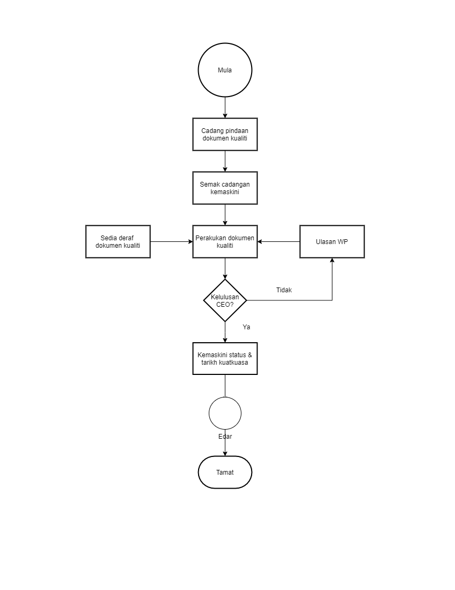

\newpage
\fancyhead[R]{\textbf{No: Keluaran: 01\\No Pindaan: 00\\Tarikh Kuatkuasa: `r params$doc_date`}}
\fancyhead[L]{\textbf{MS ISO 9001:2015\\OpenApps Sdn Bhd (548151-W)\\`r params$doc_id`}}
\clearpage
\pagenumbering{Roman}

# I    Rekod Pindaan

|Tarikh Pindaan|No Pindaan/No Keluaran|Rujukan Pindaan Mukasurat |Butir-butir Pindaan|Diluluskan Oleh|
|-------------|-------------|-------------|-------------|-------------|
|             |             |             |             |             |
|             |             |             |             |             |
|             |             |             |             |             |
|             |             |             |             |             |
|             |             |             |             |             |
|             |             |             |             |             |
|             |             |             |             |             |
|             |             |             |             |             |
|             |             |             |             |             |

# II   Senarai Pemegang Dokumen

| No. Salinan Terkawal   | Pemegang Dokumen              |
|------------------------|-------------------------------|
| `r params$doc_id`(01)  | `r a_list$pemilik_dok[1]`     |
|                        |                               |
| `r params$doc_id`(02)  | `r a_list$pemilik_dok[2]`     |
|                        |                               |
| `r params$doc_id`(03)  | `r a_list$pemilik_dok[3]`     |
|                        |                               |
| `r params$doc_id`(04)  | `r a_list$pemilik_dok[4]`     |
|                        |                               |
| `r params$doc_id`(05)  | `r a_list$pemilik_dok[5]`     |
|                        |                               |
| `r params$doc_id`(06)  | `r a_list$pemilik_dok[6]`     |
|                        |                               |
| `r params$doc_id`(07)  | `r a_list$pemilik_dok[7]`     |
|                        |                               |
| `r params$doc_id`(08)  | `r a_list$pemilik_dok[8]`     |
|                        |                               |
| `r params$doc_id`(09)  | `r a_list$pemilik_dok[9]`     |
|                        |                               |
| `r params$doc_id`(10)  | `r a_list$pemilik_dok[10]`    |
|                        |                               |
| `r params$doc_id`(11)  | `r a_list$pemilik_dok[11]`    |
|                        |                               |
| `r params$doc_id`(12)  | `r a_list$pemilik_dok[12]`    |
|                        |                               |
| `r params$doc_id`(13)  | `r a_list$pemilik_dok[13]`    |

\newpage
\clearpage
\pagenumbering{arabic}
\setcounter{page}{1}

# 1.0  Objektif

 Prosedur ini bertujuan menyediakan garis panduan bagi memastikan Dokumen Kualiti dan dokumen keselamatan maklumat seperti Manual Kualiti, Prosedur Kualiti, Prosedur Keselamatan Maklumat, Arahan Kerja. Dokumen sokongan dan lain-lain disedia, diedar, dipinda, dikemaskini dan disimpan dan di lupus dengan cekap dan teratur.

# 2.0  Skop

 Prosedur yang terdapat didalam Sistem Pengurusan Kualiti MS ISO 9001:2015 ini hendaklah digunapakai oleh pengurusan atasan Syarikat, pegawai dan kakitangan yang bertanggungjawab semasa proses penyediaan dan edaran dokumen. Dokumen yang berkaitan adalah seperti Manual Kualiti, Prosedur Kualiti dan Prosedur Sokongan.

# 3.0   Rujukan

3.1     Manual Kualiti MK.OA.01 - 4.4.2 Menyelenggarakan maklumat didokumentasikan.

# 4.0  Definisi

##   4.1   Dokumen Kualiti

 Dokumen yang dirujuk dan digunapakai dalam melaksanakan QMS. Dokumen yang dimaksudkan terdiri daripada Manual Kualiti, Prosedur Kualiti, Arahan Kerja, Dokumen Sokongan (dalaman dan luaran).

##    4.2 Dokumen Sokongan

 Dokumen Sokongan bermakna dokumen-dokumen yang dirujuk oleh Syarikat dalam melaksanakan sistem pengurusan kualiti.

##    4.3 Wakil Pengurusan

 Pegawai yang dilantik oleh Pengarah Urusan (MD). Bertanggungjawab memastikan Dokumen Kualti yang dirujuk dan digunapakai oleh PD adalah naskah keluaran/edisi yang terkini, ditempatkan di lokasi yang selamat dan mudah dirujuk oleh pihak yang memerlukan.

##    4.4   Pengurus Dokumen

 Pegawai yang dilantik oleh MD. Bertanggungjawab mengurus, membuat pembetulan, mengedar, mengawal dan menyenggara Dokumen Kualiti secara berterusan bagi menjamin kerahsiaan, intergriti, kesahihan dan ketersediaan kepada pengguna yang dibenarkan.

##    4.5   Arahan Kerja

 Satu arahan secara berperingkat yang menunjukkan bagaimana sesuatu kerja itu dilaksanakan.

##    4.6   Senarai Edaran Dokumen

 Senarai yang mengandungi maklumat berkaitan nama, jawatan penerima dan dokumen yang diedarkan.

##    4.7   Senarai Induk Dokumen

 Dokumen yang mengandungi semua dokumen kualiti yang digunakan dalam Sistem Pengurusan Kualiti.

##    4.8   Manual Kualiti

 Manual Kualiti merupakan satu pernyataan fakta tentang dasar, objektif kualiti, dan skop pelaksanaan MS ISO 9001:2015 dan merupakan rujukan kepada Sistem Pengurusan Kualiti.

##    4.9   Prosedur Kualiti

 Prosedur Kualiti menggariskan langkah-langkah yang perlu di patuhi dalam bagi melaksanakan sesuatu aktiviti. Perkara-perkara yang perlu diambil perhatian adalah seperti berikut:

 i. Bagaimana dilaksanakan;

 ii. Bila perlu dilaksanakan;

 iii. Di mana dilaksanakan;

 iv. Mengapa tindakan perlu diambil; dan

 v. Siapa yang melaksanakan.

##    4.10    Dokumen Dalaman

 Semua dokumen yang di wujudkan oleh Syarikat dan dijadikan rujukan kakitangan Syarikat dalam melaksanakan tugas seharian.
 
##    4.11    Dokumen Luaran

 Semua dokumen yang di wujudkan selain Syarikat dan dijadikan rujukan kakitangan Syarikat dalam melaksanakan tugas seharian.

##    4.12    Nombor Keluaran

 Nombor yang diberikan kepada pegawai yang terdapat di dalam senarai edaran yang dikeluarkan oleh Pengurus Dokumen.

# 5.0   Singkatan

a.    WP - Wakil Pengurusan, Timbalan MD.

b.    TWP - Timbalan Wakil Pengurusan.

c.    PD - Pengurus Dokumen.

d.    QMS - Sistem Pengurusan Kualiti.

e.    PJ - Pengurus Jabatan.

\newpage

# 6.0   Tanggungjawab dan Tindakan

\begin{longtable}{|l|l|}
\hline
Tanggungjawab & Tindakan                                                   \\ \hline
\endhead
%
\hline
\endfoot
%
\endlastfoot
%
WP            & \textbf{A.  MEWUJUDKAN DOKUMEN KUALITI}                    \\
              & 1. Tentukan dokumen kualiti yang perlu                     \\
              & diwujudkan berdasarkan aktiviti baru yang                  \\
              & dikenalpasti atau syor dari pihak pengurusan Syarikat.     \\
              & 2. Arahkan PJ yang bertanggungjawab bagi                   \\
              & menyediakan dokumen kualiti berkenaan.                     \\
              & 3.  Kenalpasti punca sebarang dokumen luaran               \\
              & dan semak ketepatan.                                       \\ \hline
PJ            & 4. Sediakan draf dokumen kualiti seperti yang              \\
              & diarahkan dengan merujuk kepada Kawalan Dokumen.           \\
              & 5. Kemukakan kepada WP untuk semakan dan ulasan.           \\
              & 6. Sediakan draf dokumen kualiti, senarai induk            \\
              & dokumen kualiti dan dokumen sokongan luaran.               \\ \hline
WP            & 7. Semak draf dokumen kualiti tersebut.                    \\
              & Pastikan kandungannya jelas dan formatnya                  \\
              & teratur. Sekiranya perlu pindaan                           \\
              & arahkan PJ membuat pembetulan semula.                      \\
              & 8. Perakukan dokumen kualiti berkenaan                     \\
              & setelah di semak dan dapatkan kelulusan MD.               \\ \hline
MD           & 9. Luluskan dokumen kualiti atau                           \\
              & mengarahkan pindaan jika perlu.                            \\
              & 10. Tentukan pegawai penerima dan tarikh                   \\
              & kuatkuasa pengunaan dokumen dan sediakan                   \\
              & salinan dokumen yang mencukupi.                            \\ \hline
PD            & 11. Tanda (cop) setiap helaian dokumen dengan              \\
              & perkataan 'SALINAN DOKUMEN TERKAWAL'.                      \\
              & kualiti dalam Senarai Induk Dokumen Kualiti                \\
              & seperti di Lampiran D. Failkan salinan sebenar.            \\
              & 12. Edarkan dokumen kepada penerima sebagaimana            \\
              & senarai edaran terkawal di Lampiran B dan                  \\
              & dapatkan tandatangan menggunakan Borang                    \\
              & Pengedaran Dokumen Kualiti seperti di Lampiran C.          \\
              & Failkan salinan sebenar Senarai Edaran Terkawal            \\
              & dan Borang Pengedaran Dokumen Kualiti.                     \\ \hline
              & \textbf{B. MENGKAJI SEMULA, MEMBUAT PINDAAN DAN}           \\
              & \textbf{MENGEMASKINI DOKUMEN}                              \\ \hline
PJ            & 13. Membuat kajian dan cadangan pindaan untuk              \\
              & mengemaskini dokumen kualiti menggunakan Borang            \\
              & Cadangan Pindaan seperti Lampiran A.                       \\
              & 14. Terima cadangan pindaan untuk kemaskini                \\
              & dokumen kualiti.                                           \\
              & 15. Semak cadangan pindaan dokumen.                        \\
              & 16. Dapatkan persetujuan daripada MD berkenaan            \\
              & cadangan atau pindaan. Jika MD tidak bersetuju            \\
              & kembalikan semula kepada PJ untuk dibuat                   \\
              & pindaan atau pembetulan.                                   \\
              & 17. Kemaskini status dokumen yang berkaitan                \\
              & iaitu No. Keluaran, Pindaan dari Tarikh                    \\
              & Kuatkuasapada setiap muka surat dokumen.                   \\
              & Catat di lampiran G.                                       \\ \hline
MD           & 18. Turunkan tandatangan bagi meluluskan dokumen           \\
              & yang dipinda dan menetapkan tarikh kuatkuasa.              \\ \hline
              & \textbf{C. PENGEDARAN DOKUMEN KUALITI}                     \\ \hline
MD           & 19. Serahkan dokumen baru yang diluluskan kepada           \\
              & WP untuk diserah kepada PD.                                \\ \hline
WP            & 20. Serah dokumen baru yang diluluskan kepada PD           \\
              & untuk  agihan.                                             \\ \hline
PD            & 21. Tandakan nombor salinan terkawal dan                   \\
              & copkan salinan terkawal di atas setiap dokumen             \\
              & kualiti yang baru.                                         \\
              & 22. Edarkan dokumen kualiti yang baru                      \\
              & dan dapatkan tandatangan pengesahan penerimaan             \\
              & dengan menggunakan borang pengedaran                       \\
              & dokumen kualiti.                                           \\
              & \textbf{D. PELUPUSAN DOKUMEN KUALITI}                      \\ \hline
PD            & 23. Arahkan pegawai seperti di dalam Senarai               \\
              & Edaran untuk mengembalikan dokumen asal.                   \\
              & 24. Menerima dokumen asal daripada pegawai.                \\
              & 25. Simpan satu salinan dokumen asal dalam fail            \\
              & khas dan dicop dengan perkataan "BATAL" selebihnya         \\
              & dimusnahkan.                                               \\
              & 26. Kemaskini dan failkan Borang Senarai                   \\
              & Dokumen Kualiti yang Dilupuskan seperti di                 \\
              & Lampiran F.                                                \\ \hline
WP            & 27. Buat pemeriksaan dari semasa ke semasa                 \\
              & untuk memastikan dokumen terkini sahaja digunakan.         \\ \hline
PD            & 28. Sedia dan failkan Senarai Induk Kualiti                \\
              & mengikut format di Lampiran D.                             \\ \hline
              & \textbf{E. KAWALAN KE ATAS DOKUMEN SOKONGAN LUARAN}        \\ \hline
WP            & 29. Kenalpasti semua dokumen sokongan luaran yang dirujuk. \\
              & 30. Arahkan PD untuk mengemaskini senarai                  \\
              & dokumen sokongan luaran seperti di Lampiran E.             \\ \hline
PD            & 31. Bincang dengan WP dari masa ke semasa                  \\
              & berkaitan dengan semua dokumen sokongan luaran             \\
              & yang perlu dikawal.                                        \\
              & 32. Ambil tindakan untuk mengemaskini senarai              \\
              & dokumen sokongan luaran.                                   \\ \hline
\end{longtable}

\newpage

# 7.0  Aliran Kerja

{width=70%}

\newpage

# 8.0  Rekod Kualiti

|Bil   |Rekod                       |Tempoh Penyimpanan|Lokasi  |Klasifikasi|
|------|----------------------------|------------------|--------|-----------|
| 1.   |Senarai Edaran Terkawal     |5 -- 7 tahun | PD      |Terhad|
|      |                            |             |         |      |  
| 2.   |Senarai Induk Dokumen Kualiti|5 -- 7 tahun| PD      |Terhad|
|      |                            |             |         |      |
| 3.   |Borang Cadangan Pindaan     |5 -- 7 tahun | PD      |Terhad|
|      |                            |             |         |      |
| 4.   |Borang Pengedaran Dokumen Kualiti|5 -- 7 tahun | PD |Terhad|
|      |                            |             |         |      |
| 5.   |Senarai Induk Dokumen       |5 -- 7 tahun | PD      |Terhad|
|      |Sokongan Dalan/Luaran       |             |         |      |
|      |                            |             |         |      | 
| 6.   |Dokumen Kualiti             |5 -- 7 tahun | PD      |Terhad|
|      |yang telah dilupuskan       |             |         |      |
|      |                            |             |         |      |
| 7.   |Rekod Pindaan Manual        |5 -- 7 tahun | PD      |Terhad|

\newpage

#   9.    Lampiran

## A - Borang Cadangan Pindaan

**BORANG CADANGAN PINDAAN DOKUMEN KUALITI [PK(W).OA.01.B01]**

(Arahan: Sila isi dan hantar borang ini kepada Wakil Pengurusan melalui Ketua Bahagian/Ketua Cawangan)

**1. MAKLUMAT PENCADANG** 

 a) Nama : ............................................

 b) Jawatan : .........................................

 c) Bahagian/Cawangan :................................

**2. DOKUMEN ASAL YANG DICADANG UNTUK DIPINDA**

*(Nyatakan nama dokumen yang dicadang, dipinda dengan jelas)*

**3. CADANGAN PINDAAN**

*(Nyatakan cadangan pindaan diperlukan)*

**4. RASIONAL CADANGAN PINDAAN**

*(Nyatakan alasan-alasan mengapa cadangan pindaan diperlukan)*

Tarikh:.................           Tandatangan .......................

**5. ULASAN DAN KEPUTUSAN WAKIL PENGURUSAN**

*(Nyatakan ulasan cadangan)*

Tarikh:.................           Tandatangan .......................

**6. KEPUTUSAN PENGURUS JABATAN**

*(Nyatakan ulasan cadangan)*

Tarikh:.................           Tandatangan .......................

\newpage

## B - Senarai Edaran Terkawal

Jadual 1: Senarai Edaran Terkawal

| No. Salinan Terkawal   | Pemegang Dokumen              |
|------------------------|-------------------------------|
| `r params$doc_id`(01)  | `r a_list$pemilik_dok[1]`     |
|                        |                               |
| `r params$doc_id`(02)  | `r a_list$pemilik_dok[2]`     |
|                        |                               |
| `r params$doc_id`(03)  | `r a_list$pemilik_dok[3]`     |
|                        |                               |
| `r params$doc_id`(04)  | `r a_list$pemilik_dok[4]`     |
|                        |                               |
| `r params$doc_id`(05)  | `r a_list$pemilik_dok[5]`     |
|                        |                               |
| `r params$doc_id`(06)  | `r a_list$pemilik_dok[6]`     |
|                        |                               |
| `r params$doc_id`(07)  | `r a_list$pemilik_dok[7]`     |
|                        |                               |
| `r params$doc_id`(08)  | `r a_list$pemilik_dok[8]`     |
|                        |                               |
| `r params$doc_id`(09)  | `r a_list$pemilik_dok[9]`     |
|                        |                               |
| `r params$doc_id`(10)  | `r a_list$pemilik_dok[10]`    |
|                        |                               |
| `r params$doc_id`(11)  | `r a_list$pemilik_dok[11]`    |
|                        |                               |
| `r params$doc_id`(12)  | `r a_list$pemilik_dok[12]`    |
|                        |                               |
| `r params$doc_id`(13)  | `r a_list$pemilik_dok[13]`    |

## C - Senarai Edaran Dokumen Kualiti

[SENARAI EDARAN DOKUMEN KUALITI]

Kepada,

Nama : Nama dan Jawatan

Siri Kod Dokumen   Nama Dokumen                             Jenis Dokumen       Tarikh
---- ------------- ---------------------------------------- ------------------- --------------
1.   MK.OA.01      Manual Kualiti 

\newpage

## D - Senarai Induk Dokumen Kualiti

Jadual 2: Senarai Induk Dokumen Kualiti

|Siri |Dokumen Kualiti                                             |
|-----|------------------------------------------------------------|
|1.   | `r paste0(doc_files$doc_id[1]," - ",doc_files$doc_title[1])`|
|2.   | `r paste0(doc_files$doc_id[2]," - ",doc_files$doc_title[2])`| 
|3.   | `r paste0(doc_files$doc_id[3]," - ",doc_files$doc_title[3])`| 
|4.   | `r paste0(doc_files$doc_id[4]," - ",doc_files$doc_title[4])`| 
|5.   | `r paste0(doc_files$doc_id[5]," - ",doc_files$doc_title[5])`| 
|6.   | `r paste0(doc_files$doc_id[6]," - ",doc_files$doc_title[6])`| 
|7.   | `r paste0(doc_files$doc_id[7]," - ",doc_files$doc_title[7])`| 
|8.   | `r paste0(doc_files$doc_id[8]," - ",doc_files$doc_title[8])`| 
|9.   | `r paste0(doc_files$doc_id[9]," - ",doc_files$doc_title[9])`| 
|10.  | `r paste0(doc_files$doc_id[10]," - ",doc_files$doc_title[10])`| 
|11.  | `r paste0(doc_files$doc_id[11]," - ",doc_files$doc_title[11])`| 
|12.  | `r paste0(doc_files$doc_id[12]," - ",doc_files$doc_title[12])`| 
|13.  | `r paste0(doc_files$doc_id[13]," - ",doc_files$doc_title[13])`| 
|14.  | `r paste0(doc_files$doc_id[14]," - ",doc_files$doc_title[14])`| 
|15.  | `r paste0(doc_files$doc_id[15]," - ",doc_files$doc_title[15])`| 
|16.  | `r paste0(doc_files$doc_id[16]," - ",doc_files$doc_title[16])`| 
|17.  | `r paste0(doc_files$doc_id[17]," - ",doc_files$doc_title[17])`|
|18.  | `r paste0(doc_files$doc_id[18]," - ",doc_files$doc_title[18])`|
|19.  | `r paste0(doc_files$doc_id[19]," - ",doc_files$doc_title[19])`|

\newpage

## E - Senarai Induk Dokumen Sokongan Luaran/Dalaman

Jadual 3:Sokongan Luaran

Siri  Nama Dokumen                    
----  --------------------------------
1.    Companies Act 2016              
2.    Patents Act 1983                
3.    Patents Regulations 1986
4.    Trade Marks Act 1976
5.    Trade Marks Regulations 1997
6.    Copyright Act 1987
7.    Employment Act 1955
8.    Industrial Relations Act 1967
9.    Industrial Relations Regulations 1980
10.   Pekeliling Perbendaharaan 1997 

Jadual 4:Sokongan Dalaman

Siri  Nama Dokumen                    
----  --------------------------------
1.    Pekeliling Perbendaharaan 1997              
2.    Patents Act 1983                
3.    Patents Regulations 1986
4.    Trade Marks Act 1976
5.    Trade Marks Regulations 1997
6.    Copyright Act 1987
7.    Employment Act 1955
8.    Industrial Relations Act 1967
9.    Industrial Relations Regulations 1980    

## F - Senarai Dokumen Kualiti Yang Telah Dilupuskan

Jadual 5: Senarai Dokumen Kualiti yang telah dilupuskan

Siri  Kod dan Nama Dokumen            Keluaran          Tarikh dilupuskan
----- ------------------------------- ----------------- -----------------
1.    Kod dan Nama Dokumen            1                 31/12/2021
2.    Kod dan Nama Dokumen            1                 31/12/2021     
3.    Kod dan Nama Dokumen            1                 31/12/2021
4.    Kod dan Nama Dokumen            1                 31/12/2021 

## G - Rekod Pindaan Dokumen Kualiti

Jadual 6: Rekod Pindaan Dokumen Kualiti

Siri Kod Dokumen   Nama Dokumen                             Jenis Pindaan       Tarikh Pindaan  Catatan
---- ------------- ---------------------------------------- ------------------- -------------- ------------------
1.   MK.OA.01      Manual Kualiti                           

