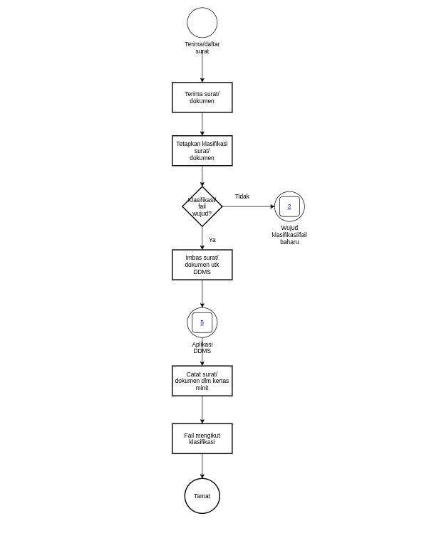
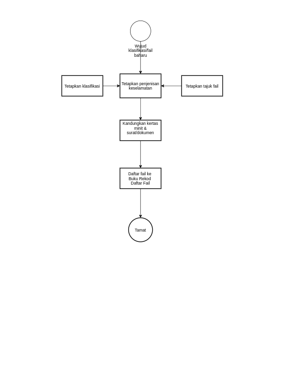
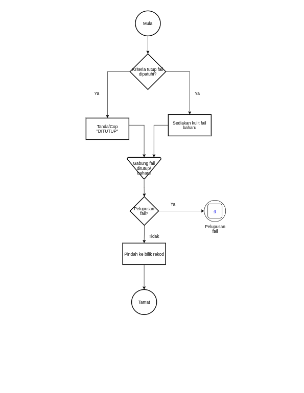
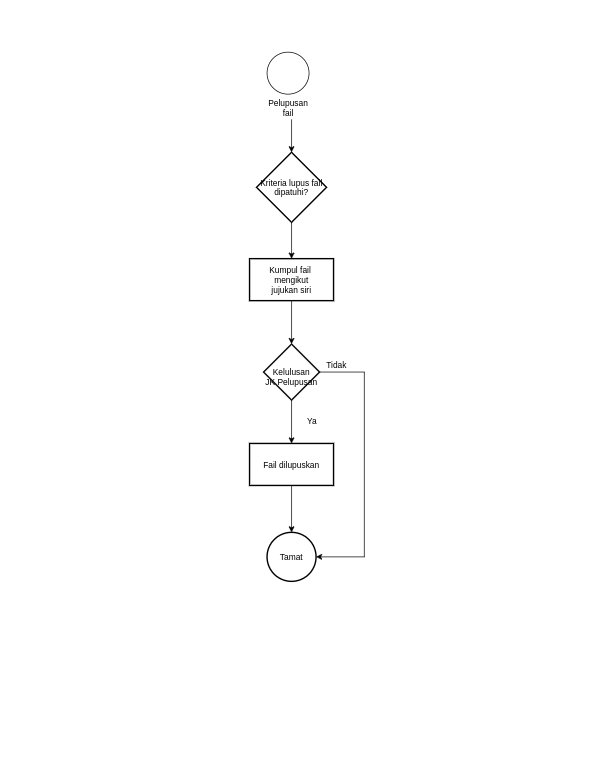
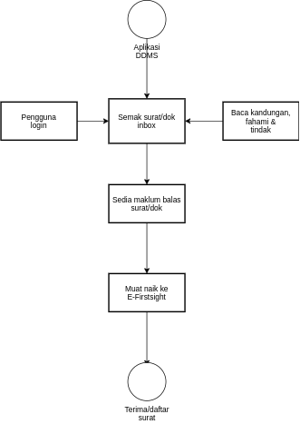

\newpage
\fancyhead[R]{\textbf{No: Keluaran: 01\\No Pindaan: 00\\Tarikh Kuatkuasa: `r params$doc_date`}}
\fancyhead[L]{\textbf{MS ISO 9001:2015\\OpenApps Sdn Bhd (548151-W)\\`r params$doc_id`}}
\clearpage
\pagenumbering{Roman}

# I    Rekod Pindaan

|Tarikh Pindaan|No Pindaan/No Keluaran|Rujukan Pindaan Mukasurat |Butir-butir Pindaan|Diluluskan Oleh|
|-------------|-------------|-------------|-------------|-------------|
|             |             |             |             |             |
|             |             |             |             |             |
|             |             |             |             |             |
|             |             |             |             |             |
|             |             |             |             |             |
|             |             |             |             |             |
|             |             |             |             |             |
|             |             |             |             |             |
|             |             |             |             |             |

# II   Senarai Pemegang Dokumen

| No. Salinan Terkawal   | Pemegang Dokumen              |
|------------------------|-------------------------------|
| `r params$doc_id`(01)  | `r a_list$pemilik_dok[1]`     |
|                        |                               |
| `r params$doc_id`(02)  | `r a_list$pemilik_dok[2]`     |
|                        |                               |
| `r params$doc_id`(03)  | `r a_list$pemilik_dok[3]`     |
|                        |                               |
| `r params$doc_id`(04)  | `r a_list$pemilik_dok[4]`     |
|                        |                               |
| `r params$doc_id`(05)  | `r a_list$pemilik_dok[5]`     |
|                        |                               |
| `r params$doc_id`(06)  | `r a_list$pemilik_dok[6]`     |
|                        |                               |
| `r params$doc_id`(07)  | `r a_list$pemilik_dok[7]`     |
|                        |                               |
| `r params$doc_id`(08)  | `r a_list$pemilik_dok[8]`     |
|                        |                               |
| `r params$doc_id`(09)  | `r a_list$pemilik_dok[9]`     |
|                        |                               |
| `r params$doc_id`(10)  | `r a_list$pemilik_dok[10]`    |
|                        |                               |
| `r params$doc_id`(11)  | `r a_list$pemilik_dok[11]`    |
|                        |                               |
| `r params$doc_id`(12)  | `r a_list$pemilik_dok[12]`    |
|                        |                               |
| `r params$doc_id`(13)  | `r a_list$pemilik_dok[13]`    |

\newpage
\clearpage
\pagenumbering{arabic}
\setcounter{page}{1}

# 1.0  Objektif

Prosedur ini menggariskan mengenai registri dan langkah-langkah pengurusan rekod kualiti untuk memastikan proses pendaftaran fail, pembukaan fail, penutupan fail, penggunaan dan kawalan fail, tindakan fail hilang atau tidak dapat dikesan, pembaikan kecil fail yang rosak, pengendalian fail tidak aktif, pelupusan dan pendaftaran surat supaya prosedur registri dan pengurusan rekod dapat dilaksanakan dengan betul dan sistematik.

# 2.0  Skop

 Prosedur ini digunapakai oleh Pusat Registri, Cawangan dan Bahagian dalam Syarikat dalam melaksanakan tugas registri dan pengurusan rekod di Syarikat.

# 3.0   Rujukan

 3.1 MK.OA.01.

 3.2 Akta Arkib Negara 2003 (Akta 629).

 3.4 Jadual Klasifikasi Urusan Am dan Fungsian.

 3.5 Jadual Pelupusan Rekod Urusan Am Terbitan Arkib

 3.6 Jadual Pelupusan Rekod Kewangan dan Perakaunan Terbitan Arkib.

# 4.0  Definisi

 4.1 Fail Rasmi. Dokumen rasmi syarikat yang dikandung, disusun dengan teratur dan didaftarkan. Fail ini diberi tajuk spesifik sepertimana yang telah ditetapkan dalam Klasifikasi Fail.

 4.2 Kertas Minit. Kertas atau format yang dilampirkan di sebelah kiri fail yang mencatatkan butiran dan maklumat lampiran. Ia boleh digunakan sebagai indeks kepada Lampiran. Yang terkandung di dalam fail. Kertas minit juga digunakan untuk memberi arahan atau maklumbalas ringkas ke atas lampiran yang berkenaan.

 4.3 Sampul Kecil. Kulit fail yang menepati format Am 435A-Pin.1/82. Kulit fail yang digunakan sebagai fail sementara apabila fail asal tidak dapat dikesan atau apabila lebih daripada seorang pegawai perlu mengambil tindakan segera ke atas fail yang sama.

 4.4 Klasifikasi Fail. Proses mengenalpasti dan mengumpulkan maklumat secara logikal ke dalam kategori/kumpulan yang sama atau seakan-akan sama, di mana setiap satu kategori/kumpulan rekod itu dikenali dengan identitinya sendiri.

 4.5 Daftar Fail. Format yang disediakan bagi mendaftar fail rasmi.

 4.6 Kad Keluar Fail/Kad Pergerakan Fail. Kad kawalan yang merekodkan pergerakan fail di registri.

 4.7 Indeks. Alat atau kaedah silang rujuk bagi membolehkan sesuatu dokumen dikenalpasti atau dicapai dengan pantas.

 4.8 SDP/BF. Simpan Dalam Perhatian *"Keep in view'' (KIV),* arahan yang dikeluarkan oleh mana-mana pegawai kepada kakitangan registri untuk menyimpan sementara sesebuah fail dan memajukan kembali fail kepadanya pada tarikh yang ditetapkan, disebut juga sebagai *''bring forward''*(BF).

 4.9 Registri. Unit atau bahagian khusus di sesebuah pejabat yang bertanggungjawab terhadap urusan surat-menyurat dokumen dan fail-fail.

 4.10 Bilik Fail. Bilik penyimpanan, penyelenggaraan dan pengawalan fail-fail (rekod) aktif sahaja.

 4.11 Bilik Fail Bilik atau ruang khusus sebagai tempat simpanan bagi menempatkan rekod-rekod separa aktif dan tidak aktif sementara menunggu rekod-rekod tersebut dikaji dan ditentukan tindakan pelupusan yang perlu diambil.

 4.12 Bilik Fail Keselamatan. Sebuah bilik yang diperkuatkan untuk menempatkan fail-fail dan dokumen terperingkat jabatan.

 4.13 Bilik Kebal. Bilik khas yang kukuh binaanya di mana ia tidak mudah untuk dipecahkan atau dirobohkan. Sesebuah Bilik Kebal dibina bertujuan untuk menyimpan rekod atau fail terperingkat yang mempunyai kepentingan kepada syarikat.

 4.14 Pelupusan. Cara menguruskan pengasingan rekod dengan tujuan pemusnahan, pemindahan atau selain.

 4.15 Rekod Awam. Bahan dalam bentuk bertulis atau bentuk lain yang menyatakan fakta atau peristiwa atau selainya merakamkan maklumat dan termasuklah kertas, dokumen, daftar, bahan bercetak, buku, peta, pelan, lukisan, gambar foto, mikrofilem, filem sinematograf, rakaman bunyi, rekod yang dihasilkan secara elektronik tanpa mengira bentuk atau ciri-ciri fizikal dan apa-apa salinannya.

 4.17 Pegawai Rekod Jabatan (PRJ). Eksekutif yang dilantik sebagai Pegawai Rekod Jabatan bertanggungjawab dalam merancang, memantau dan melaksanakan program aktiviti berkaitan pengurusan rekod di Pusat Tanggungjawab masing-masing.

 4.18 Pegawai Pengelasan. Pengurus Jabatan yang dilantik sebagai pegawai pengelasan untuk pengurusan rekod jabatan.

# 5.0  Singkatan

a. JPR - Jadual Pelupusan Rekod

a. PRJ - Pegawai Rekod Jabatan

a. PTRJ - Pembantu Tadbir Rekod Jabatan

# 6.0   Tanggungjawab dan Tindakan

\begin{longtable}{|l|l|}
\hline
Tanggungjawab & Tindakan                                                                \\ \hline
\endhead
%
\hline
\endfoot
%
\endlastfoot
%
              & \textbf{A.Penerimaan dan Pendaftaran Surat}                             \\ \hline
PRJ/PTRJ      & (1) Terima surat/dokumen.                                               \\
              & (2) Daftar ke dalam Buku Rekod Daftar Surat Masuk                       \\ \hline
PTRJ          & (3) Imbas surat/dokumen dan muat naik ke Sistem E-Firstsight.           \\ \hline
PTRJ          & (4) Surat/dokumen yang asal dikandung mengikut kod klasifikasi fail dan \\
              & perjenisan keselamatan fail.                                            \\
              & (5) Catatkan di kertas minit.                                           \\
              & (6) Simpan fail mengikut perjenisan keselamatan.                        \\
              & Fail terperingkat disimpan ditempatberkunci dan dikawal.                \\
              & \textbf{B. Pembukaan Fail dan Pendaftaran Fail}                         \\ \hline
PRJ/PTRJ      & (7) Teliti kandungan surat/dokumen yang hendak diwujudkan fail.         \\
              & (8) Semak dan kenal pasti klasifikasi fail dan kod klasifikasi.         \\
              & (9) Tentukan nama dan tajuk fail baharu:                                \\
              & a. Tebuk lubang pada kulit fail dan kertas minit.                       \\
              & b. Tulis tajuk fail dan nombor rujukan fail.                            \\
              & c. Masukkan tali hijau dan kertas minit.                                \\ \hline
PTRJ          & (10) Masukkan kandungan, catat nombor kandungan pada bahagian atas      \\
              & sebelah kanan surat/dokumen dan minitkan lampiran                       \\
              & pada kertas minit di sebelah kanan fail.                                \\ \hline
PTRJ          & (11) Daftar fail baharu dalam Buku Daftar Fail dan sediakan indeks.     \\
              & \textbf{C. Penutupan Fail}                                              \\ \hline
PRJ           & (12) Pastikan fail memenuhi kriteria penutupan fail.                    \\ \hline
PTRJ          & (13) Cop atau tuliskan DITUTUP PADA .....                               \\
              & (14) Lihat jilid (sekiranya jilid baru dibuka                           \\
              & pada muka hadapan (kulit fail)                                          \\
              & (15) Buka kulit fail baharu dgn klasifikasi yg sama.                    \\
              & (16) Tanda sebagai jilid ke-2 dan seterusnya.                           \\
              & (17) Fail yang ditutup diikat bersama fail baharu selama 3 bulan        \\
              & atau untuk tempoh tertentu.                                             \\ \hline
PTRJ          & (18) Pindahkan fail yg ditutup ke Bilik Fail untuk disimpan             \\
              & sementara menunggu proses pelupusan.                                    \\
              & \textbf{D. Penggunaan dan Kawalan Fail}                                 \\ \hline
PTRJ          & (19) Isi borang permohonan fail.                                        \\
              & (20) Rekod Pinjaman dan Pemulangan Fail.                                \\
              & (21) Asingkan doket kad pergerakan fail dari fail.                      \\
              & (22) Semak fail yg tidak dipulangkan melebihi tempoh yang ditetapkan.   \\ \hline
PRJ/PTRJ      & (23) Hubungi pemimjam untuk mengetahui status fail.                     \\
              & (24) Kemaskini tarikh dipulangkan pada rekod pinjaman.                  \\
              & (25) Kembalikan doket kad pergerakan fail ke fail.                      \\
              & \textbf{E. Pelupusan Fail}                                              \\ \hline
PRJ           & (26) Asingkan fail telah tamat tindakan/telah capai tempoh simpanan     \\
              & sebagaimanana Jadual Pelupusan Rekod.                                   \\ \hline
PRJ/PTRJ      & (27) Susun mengikut nombor turutan atau siri fail dan diikat.           \\
              & (28) Senaraikan di dalam borang pelupusan.                              \\ \hline
PRJ           & (29) Buat penilaian ke atas setiap unit rekod, dan kenal pasti          \\
              & rekod bernilai kepada organisasi.                                       \\
              & (30) Catat dalam borang permohonan pelupusan, samada:                   \\
              & a. untuk disimpan/dipindah,                                             \\
              & b. untuk dimusnah.                                                      \\
              & (31) Kemukakan kepada JK Pelupusan Rekod untuk kelulusan.               \\
              & (32) Buat tindakan pengasingan atau pemusnahan rekod.                   \\ \hline
\end{longtable}

\newpage

# 7.0 Aliran Kerja

{width=70%}

\newpage

{width=70%}

\newpage

{width=70%}

\newpage

{width=70%}

\newpage

{width=70%}

\newpage

# 8.0 Rekod Kualiti

----------------------------------------------------------------------------
Bil   Jenis Rekod                  Tempoh Penyimpanan Lokasi     Klasifikasi
----- ---------------------------- ------------------ ---------- -----------
1\.   Buku Daftar                  5 tahun            Bilik Fail Terhad
		  Surat Masuk/Keluar       
		
2\.   Kertas Minit (Am 10)         5 tahun            Bilik Fail Terhad
		
3\.   Buku Rekod Pembukaan Fail    5 tahun            Bilik Fail Terhad
		
4\.   Buku Rekod Pengeluaran Fail  5 tahun            Bilik Fail Terhad
		
5\.   Buku Rekod Pelupusan Fail    5 tahun            Bilik Fail Terhad

6\.   Buku Daftar                  5 tahun            Bilik Fail Terhad
		  Surat Terperingkat  
------------------------------------------------------------------------
		
# 9.0 Lampiran

## A - Format Daftar Surat

Jadual 1: Format Daftar Surat Menyurat

--------------------------------------------------------------------------------------------------
Siri Tarikh     No. Fail      Nombor-nombor Tarikh       Daripada      Perkara          Dirujukkan
     Penerimaan               yang lain     surat        siapa                          kepada    
---- ---------- ------------- ------------- ------------ ------------- ---------------- ----------
1.   1/1/2021   ............. ............. ............ ............. ................ ..........

2.   1/1/2021   ............. ............. ............ ............. ................ ..........

--------------------------------------------------------------------------------------------------

## B - Kad Pergerakan Fail

Kad Pergerakan Fail [PK(W).OA.B01]  
Fahrasat di bawah perkara:  
Tajuk Fail:  

|    Dihantar      |    Dihantar      |    Dihantar      |
|:----------------:|:----------------:|:----------------:|
|Kepada\ \ \ Tarikh|Kepada\ \ \ Tarikh|Kepada\ \ \ Tarikh|  
|..................|..................|..................|
|..................|..................|..................|
|..................|..................|..................|
|..................|..................|..................|
|..................|..................|..................|
|..................|..................|..................|
|..................|..................|..................|
|..................|..................|..................|
|..................|..................|..................|
|..................|..................|..................|
|..................|..................|..................|
|..................|..................|..................|
|..................|..................|..................|
|..................|..................|..................|
|                  |                  |                  |

## C - Borang Permintaan Fail

Borang Permintaan Fail [PK(W).OA.B02]   
(Hendaklah diisi oleh Pegawai yang meminjam)  

Kepada,    
Bahagian Registri,  

Sila majukan fail berikut kepada saya:

No. Fail               Tajuk
---------------------- -----------------------
1. ................... .......................
2. ................... .......................
3. ................... .......................
4. ................... .......................
5. ................... .......................
6. ................... .......................
7. ................... .......................

Sekian, terima kasih.

Tandatangan: ............... Jawatan: ...............  
Nama: ...................... Tarikh : ...............

## D - Borang Makluman Pergerakan Fail

Borang Permintaan Fail [PK(W).OA.B03]   
  
Kepada,    
Bahagian Registri,  

Adalah dimaklumkan bahawa fail berikut telah saya serahkan  
untuk tindakan Pegawai di bawah ini:

Nama Pegawai           No. Fail                Tajuk
---------------------- ----------------------- ---------------------------
1. ................... ....................... ...........................
2. ................... ....................... ...........................
3. ................... ....................... ...........................
4. ................... ....................... ...........................
5. ................... ....................... ...........................
6. ................... ....................... ...........................
7. .................... ....................... ..........................

Sekian, terima kasih.

Tandatangan: ............... Jawatan: ...............  
Nama: ...................... Tarikh : ...............

\newpage

## E - Borang Lanjutan Penggunaan Fail

Borang Lanjutan Penggunaan Fail [PK(W).OA.02.B04]  
(Diisi selepas tempoh 14 hari merujuk)

Kepada,    
Bahagian Registri,  

Saya mohon melanjutkan tempoh penggunaan fail berikut    
untuk rujukan:

No. Fail               Tajuk
---------------------- -----------------------
1. ................... .......................
2. ................... .......................
3. ................... .......................
4. ................... .......................
5. ................... .......................
6. ................... .......................
7. ................... .......................

Sila kemaskini maklumat tersebut ke dalam Kad Pergerakan Fail.  

Sekian, terima kasih.

Tandatangan: ............... Jawatan: ...............  
Nama: ...................... Tarikh : ...............

## F - Borang Pertanyaan Kedudukan Fail

Borang Pertanyaan Kedudukan Fail [PK(W).OA.02.B05]    
(Untuk kegunaan Bahagian Registri sahaja)  
(Diisi dalam 2 salinan)

Kepada,    
Nama Pegawai: ............... Bahagian/Unit: .............  
Jawatan: ....................  

Fail-fail berikut masih belum dikembalikan ke Bahagian Registri  
selepas 14 hari diminta untuk rujukan:

No. Fail               Tajuk
---------------------- -----------------------
1. ................... .......................
2. ................... .......................
3. ................... .......................
4. ................... .......................
5. ................... .......................

Sila maklumkan kedudukan fail tersebut ke Bahagian Registri.  

Sekian, terima kasih.

Tandatangan: ............... Jawatan: ...............  
Nama: ...................... Tarikh : ...............

\newpage

## G - Borang Permohonan Membawa Fail Keluar dari Kawasan Pejabat

Borang Permohonan Membawa Fail Keluar dari Kawasan Pejabat [PK(W).OA.02.B06]     
  
Kepada,    
Bahagian Registri,  

Adalah dimaklumkan bahawa fail berikut akan dibawa keluar dari  
kawasan pejabat:  

Tajuk                  No. Fail                Lokasi                      Tujuan            Tarikh
---------------------- ----------------------- --------------------------- ----------------- -------------
1. ................... ....................... ........................... ................. .............
2. ................... ....................... ........................... ................. .............
3. ................... ....................... ........................... ................. .............
4. ................... ....................... ........................... ................. .............
5. ................... ....................... ........................... ................. .............
6. ................... ....................... ........................... ................. .............
7. ................... ....................... ........................... ................. .............

Harap maklum, terima kasih.

Tandatangan: ............... Jawatan: ...............  
Nama: ...................... Tarikh : ...............

