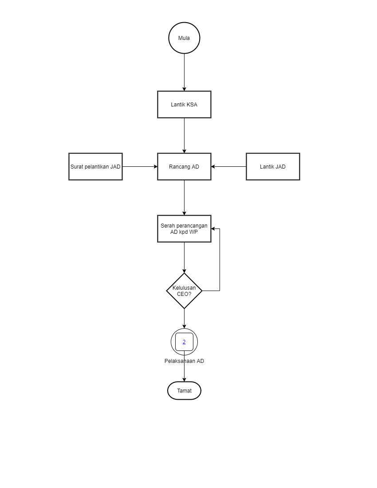
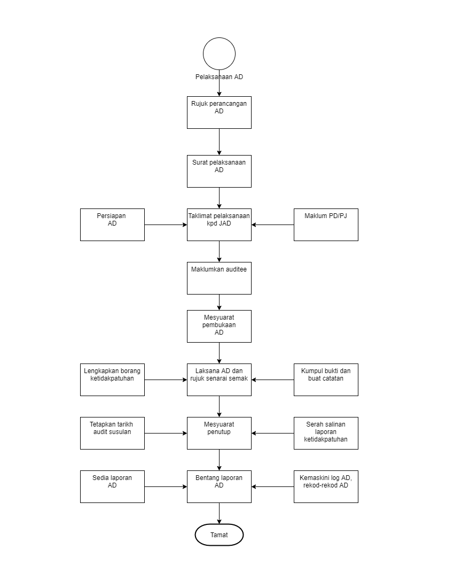

\newpage
\fancyhead[R]{\textbf{No: Keluaran: 01\\No Pindaan: 00\\Tarikh Kuatkuasa: `r params$doc_date`}}
\fancyhead[L]{\textbf{MS ISO 9001:2015\\OpenApps Sdn Bhd (548151-W)\\`r params$doc_id`}}
\clearpage
\pagenumbering{Roman}

# I    Rekod Pindaan

|Tarikh Pindaan|No Pindaan/No Keluaran|Rujukan Pindaan Mukasurat |Butir-butir Pindaan|Diluluskan Oleh|
|-------------|-------------|-------------|-------------|-------------|
|             |             |             |             |             |
|             |             |             |             |             |
|             |             |             |             |             |
|             |             |             |             |             |
|             |             |             |             |             |
|             |             |             |             |             |
|             |             |             |             |             |
|             |             |             |             |             |
|             |             |             |             |             |

# II   Senarai Pemegang Dokumen

| No. Salinan Terkawal   | Pemegang Dokumen              |
|------------------------|-------------------------------|
| `r params$doc_id`(01)  | `r a_list$pemilik_dok[1]`     |
|                        |                               |
| `r params$doc_id`(02)  | `r a_list$pemilik_dok[2]`     |
|                        |                               |
| `r params$doc_id`(03)  | `r a_list$pemilik_dok[3]`     |
|                        |                               |
| `r params$doc_id`(04)  | `r a_list$pemilik_dok[4]`     |
|                        |                               |
| `r params$doc_id`(05)  | `r a_list$pemilik_dok[5]`     |
|                        |                               |
| `r params$doc_id`(06)  | `r a_list$pemilik_dok[6]`     |
|                        |                               |
| `r params$doc_id`(07)  | `r a_list$pemilik_dok[7]`     |
|                        |                               |
| `r params$doc_id`(08)  | `r a_list$pemilik_dok[8]`     |
|                        |                               |
| `r params$doc_id`(09)  | `r a_list$pemilik_dok[9]`     |
|                        |                               |
| `r params$doc_id`(10)  | `r a_list$pemilik_dok[10]`    |
|                        |                               |
| `r params$doc_id`(11)  | `r a_list$pemilik_dok[11]`    |
|                        |                               |
| `r params$doc_id`(12)  | `r a_list$pemilik_dok[12]`    |
|                        |                               |
| `r params$doc_id`(13)  | `r a_list$pemilik_dok[13]`    |

\newpage
\clearpage
\pagenumbering{arabic}
\setcounter{page}{1}

# 1.0  Objektif

Prosedur ini bertujuan menyediakan garispanduan Audit dalaman Syarikat dilaksanakan secara terancang dan berkesan. Audit dalaman akan mengenalpasti kepatuhan dan ketidakpatuhan akan keberkesanan Sistem Pengurusan Kualiti untuk keperluan penambahbaikan.

# 2.0  Skop

Prosedur ini digunapakai oleh WP, KSA, KPAD dan JAD bagi semua aktiviti Audit dalaman Syarikat semasa merancang, melaksanakan dan menilai keberkesanan Sistem Pengurusan Kualiti Syarikat.

# 3.0   Rujukan

 3.1 MK.OA.01 dengan seksyen-seksyen berikut:

 a. Seksyen 9.2 Audit dalaman;

 a. Seksyen 9.1 Pemantauan, pengukuran, analisis dan penilaian;

 a. Seksyen 10.3 Penambahbaikan berterusan;

 a. Seksyen 10.2.1.1 Tindakan pembetulan; dan

 a. Seksyen 10.2.1.2 Tindakan pencegahan.

# 4.0  Definisi

##    4.1 Audit dalaman

Suatu proses pemeriksaan untuk menilai keberkesanan Sistem Pengurusan Kualiti Syarikat melalui pemeriksaan sistematik yang dijalankan oleh Pegawai terlatih yang dilantik sebagai JAD.

##    4.2  Auditee

Semua kakitangan Syarikat di dalam Sistem Pengurusan Kualiti MS ISO 9001:2015 di Cawangan dan Sel tertakluk untuk diaudit.

##    4.3  juruaudit dalaman

Kakitangan pasukan AD yang terlatih dan dilantik oleh MD.

##    4.4  Audit Susulan

Suatu proses pengauditan semula dan susulan Audit dalaman bagi mempastikan tindakan pembetulan ke atas Ketakakuran yang dikenalpasti semasa pengauditan awal.

##    4.5  Ketakakuran

Percanggahan atau pelanggaran terhadap keperluan di dalam Sistem Pengurusan Kualiti MS ISO 9001:2015 Syarikat yang ditemui semasa proses pengauditan dijalankan.

###   4.5.1 Major

Ketakakuran ke atas mana-mana prosedur/keperluan standard/pekeliling dan perundangan yang telah menjejaskan produk akhir/perkhidmatan dan
memberi kesan buruk secara langsung kepada Sistem Pengurusan Kualiti keseluruhannya.

###   4.5.2 Minor

 Ketakakuran/kepincangan yang telah berlaku tidak menjejaskan secara langsung produk akhir atau Sistem Pengurusan Kualiti keseluruhannya.

###   4.5.3  Pemerhatian

Sebarang kepincangan atau penambahbaikan yang perlu diambil berikutan  dari prosedur kualiti yang tidak jelas. Ia belum menjejaskan Sistem
Pengurusan Kualiti secara keseluruhannya.

##    4.6  Senarai Semak Audit

Satu siri soalan bertulis di dalam format khas yang dijadikan panduan oleh JAD kepada perkara-perkara yang perlu diperiksa semasa pengauditan.

# 5.0   Singkatan

  5.1   WP     \-   Wakil Pengurusan
  
  5.2   TWP    \-   Timbalan Wakil Pengurusan
  
  5.3   KSA    \-   Ketua Sistem Audit
  
  5.4   KPAD   \-   Ketua Pasukan Audit dalaman
  
  5.5   PAD    \-   Pasukan Audit dalaman
  
  5.6   JAD    \-   Juru Audit dalaman
  
  5.7   PD     \-   Pengurus Dokumen
  
  5.8   PJ     \-   Pengurus Jabatan
  
  5.9   AD     \-   Audit dalaman

\newpage

# 6.0   Tanggungjawab dan Tindakan

\begin{longtable}{|l|l|}
\hline
Tanggungjawab & Tindakan                                                                     \\ \hline
\endhead
%
\hline
\endfoot
%
\endlastfoot
%
              & \textbf{A  PERANCANGAN AD}                                                   \\ \hline
MD           & 1. Bincang dengan WP dari semasa ke semasa mengenai perlaksanaan AD.         \\
              & 2. Lantik KSA.                                                               \\ \hline
WP            & 3. Arahkan KSA rancang dan sediakan perancangan Audit dalaman tahunan.       \\ \hline
KSA           & 4. Rancang dan sediakan Perancangan AD Tahunan, 2 kali setahun berdasarkan   \\
              & format di Lampiran 1.                                                        \\
              & 5. Serahkan draf perancangan AD Tahunan kepada WP.                           \\
              & 6. Terima draf Perancangan AD Tahunan dan                                    \\ \hline
WP            & 7. Kemukakan draf akhir Perancangan AD Tahunan kepada MD untuk kelulusan.   \\ \hline
MD           & 8. Terima draf akhir Perancang AD Tahunan untuk pertimbangan dan kelulusan.  \\
              & 9. Bincang dengan WP sekiranya perlu.                                        \\
              & \textbf{B  PELANTIKAN JAD}                                                   \\ \hline
KSA           & 10. Sediakan senarai calon untuk dilantik sebagai JAD.                       \\
              & 11. Kenalpasti pegawai yang telah mendapat latihan JAD.                      \\
              & 12. Pastikan pegawai yang belum mendapat latihan JAD diberi latihan JAD.     \\ \hline
WP            & 13. Terima cadangan lantikan calon JAD dan keluarkan surat lantikan.         \\
              & 14. Susul perlaksanaan AD dari semasa ke semasa.                             \\
              & 15. Bincang dengan KSA sekiranya perlu mengenai;                             \\
              & i)  Status kepentingan audit.                                                \\
              & ii) Penemuan dari perlaksanaan audit yang lepas.                             \\
              & \textbf{C  PERSIAPAN SEBELUM AD}                                             \\ \hline
KSA           & 16. Rujuk perancangan perlaksanaan AD (Lampiran 1).                          \\
              & 17. Keluarkan surat perlaksanaan AD kepada KPAD.                             \\
              & 18. Beri taklimat kepada JAD berdasarkan perancangan, skop AD dan log audit. \\ \hline
KPAD          & 19. Maklumkan kepada PD/PJ mengenai AD yang akan                             \\
              & dilaksanakan serta keperluan AD yang berkaitan.                              \\
              & 20. Baca dan fahami:-                                                        \\
              & a.  MK.OA.01.                                                                \\
              & b. Piawaian ISO 9001:2015.                                                   \\
              & c.  Prosedur Kualiti dan dokumen sokongan berkaitan.                         \\
              & d.  Rujuk prosedur AD.                                                       \\ \hline
PAD           & 21. Buat persediaan sebelum melaksanakan AD:                                 \\
              & a.  Format laporan AD. (Lampiran 2).                                         \\
              & b. Borang ketidakpatuhan (Lampiran 3).                                       \\
              & d. Senarai semak (Lampiran 4).                                               \\
              & \textbf{D  PELAKSANAAN AD}                                                   \\ \hline
KPAD          & 22. Maklumkan kepada Auditee berhubung tarikh AD.                            \\
              & 23. Pastikan semua ahli PAD hadir melaksanakan AD                            \\
              & tepat mengikut jadual.                                                       \\
              & 24. Adakan mesyuarat pembukaan AD dengan jabatan/sel                         \\
              & yang akan diaudit.                                                           \\ \hline
PAD           & 25. Laksanakan AD berdasarkan Senarai Semak yang disediakan.                 \\
              & 26. Kumpul bukti audit dan buat catatan semasa.                              \\
              & 27. Proses temuduga, pemerhatian dan pemeriksaan ke atas rekod-rekod kualiti \\
              & sebagai bukti objektif.                                                      \\
              & 28. Catatkan butiran ketidakpatuhan yang dikesan semasa dan                  \\
              & tindakan pembetulan (jika ada) di dalam Borang Ketidakpatuhan.               \\
              & Bincang tarikh untuk membuat audit susulan dengan Auditee.                   \\ \hline
KPAD          & 29. Adakan Mesyuarat Penutup AD dengan jabatan/sel yang berkaitan.           \\
              & 30. Maklum mengenai ketidakpatuhan yang ditemui                              \\
              & dan tindakan pembetulan yang akan diambil oleh jabatan/sel yang berkaitan.   \\
              & 31. Maklum tarikh Audit Susulan (jika ada).                                  \\
              & 32. Sediakan Laporan AD dan serahkan kepada KSA                              \\
              & (terus ke tindakan ke 37).                                                   \\
              & \textbf{E  PELAKSANAAN AUDIT SUSULAN}                                        \\ \hline
KSA           & 33. Minta PAD untuk membuat Audit Susulan (jika ada).                        \\ \hline
PAD           & 34. Rujuk semula laporan AD dan ketidakpatuhan yang dikeluarkan.             \\
              & 35. Buat audit susulan yang diperlukan.                                      \\
              & 36. Pastikan tindakan pembetulan yang diperlukan                             \\
              & dilaksanakan dengan  berkesan.                                               \\ \hline
KPAD          & 37. Sediakan Laporan Audit Susulan dan serah kepada KSA / WP.                \\
              & \textbf{F  PENYEDIAAN LAPORAN KESELURUHAN AD}                                \\ \hline
KSA           & 38. Kumpulkan semua Laporan AD yang telah dilaksanakan (Lampiran 2).         \\
              & 39. Kemaskini Log AD (Lampiran 5)                                            \\
              & 40. Sediakan dan kemukakan Laporan Keseluruhan AD kepada WP.                 \\
              & \textbf{F  PENYIMPANAN REKOD AD}                                             \\ \hline
WP            & 41. Kemaskini rekod-rekod berkaitan AD.                                      \\
              & Failkan semua laporan dan rekod pelaksanaan AD.                              \\
              & 42. Semak Laporan Keseluruhan AD.                                            \\
              & 43. Bentangkan Laporan Keseluruhan AD di dalam MKSP.                         \\ \hline
\end{longtable}

\newpage

# 7.0  Aliran Kerja

{width=70%}

\newpage

# 8.0  Rekod Kualiti

|Bil      |Rekod                   |Tempoh Penyimpanan|Lokasi|Klasifikasi|
|---------|------------------------|---------|---------------|-----------|
| 1.      | Perancangan AD Tahunan | 7 Tahun | Unit Kualiti  |Terhad     |
|         |                        |         |               |           |
| 2.      | Laporan AD             | 7 Tahun | Unit Kualiti  |Terhad     |
|         |                        |         |               |           |
| 3.      | Log AD                 | 7 Tahun | Unit Kualiti  |Terhad     |
|         |                        |         |               |           |
| 4.      | Laporan Ketidakpatuhan | 7 Tahun | Unit Kualiti  |Terhad     |
|         |                        |         |               |           |
| 5.      | Senarai juruaudit      | 7 Tahun | Unit Kualiti  |Terhad     |
|         |                        |         |               |           |
| 6.      | Rekod Perlantikan JAD  | 7 Tahun | Unit Kualiti  |Terhad     |

\newpage

# 9.0  Lampiran

##    A - Perancangan AD

Jadual 1: Perancangan AD 2021

Siri  Jan Feb Mac Apr Mei Jun Jul Ogos Sep Okt Nov Dis
----  --- --- --- --- --- --- --- ---- --- --- --- ---
1.                 x
2.                                        x

Tandatangan: ...................  
Wakil Pengurusan

##    B - Laporan AD

  Tarikh Audit :                   
  Bahagian/Unit Diaudit:           
  Ketua Auditor:                   
  Auditor:
  
  1. Nama Auditor
  
  2. Nama Auditor
  
  **Kepada**                       
  **Ketua Sistem Audit dalaman**   
  **Ringkasan Audit**              
                                   
  
  .......................  
  (Tandatangan)                    
  Ketua Auditor  

Jadual 2: Ringkasan Laporan AD

  Siri   Tarikh    Penemuan                       Bahagian/Cawangan     
  ----   --------- ------------------------------ -----------------
  1.     29/3/2021 Major .... Minor .... OFI .... Akaun
                   Major .... Minor .... OFI .... Sumber Manusia

\newpage

##    C - Laporan Ketakakuran

Jadual 3: Laporan Ketakakuran [PK(W).OA.03.B01]

\begin{table}[th]
\begin{tabular}{p{15cm}}
\hline
[PK(W).OA.03.B01]                                               \\ \hline
\centerline{\textbf{LAPORAN KETAKAKURAN}}                       \\ \hline
Bil / Tahun: 1/2022 \> \> \> \> \> \> \> \> \> \> \>Tarikh: 1/6/2022 \\
Bahagian/ Unit Yang Diaudit: Pengurusan                         \\
Tajuk Prosedur/ Dokumen:  MK.OA.01                              \\
Auditee : Azmi                                                  \\
Auditor : Sarina                                                \\ \hline
1.  Ketakakuran. OFI \> \> \> \> \> \> \> \> Klausa: 8.0        \\ \hline
                                                                \\
Pemerhatian Huraian:                                            \\
Keterangan auditor termasuk rujukan dok, klausa berkaitan, dan punca ketakakuran.\\
                                                                \\ \hline
2.  Punca Ketakakuran. Latihan                                  \\ \hline
3.  Penemuan:                                                   \\ \hline
Keterangan auditor termasuk rujukan dok, klausa berkaitan, dan punca ketakakuran.\\
                                                                \\
T/Tangan Auditor:                                               \\
                                                                \\
T/Tangan Auditee:                                               \\ \hline
4.  Nota penambahbaikan:                                        \\
                                                                \\
T/Tangan Auditor:                                               \\
                                                                \\
T/Tangan Auditee:                                               \\ \hline
5.  Tindakan Pembetulan                                         \\
                                                                \\
                                                                \\
Tarikh untuk menyelesaikan ketakakuran:                         \\
T/Tangan Auditor:                                               \\
                                                                \\
T/Tangan Auditee:                                               \\ \hline
6.  Verifikasi (Untuk diisi oleh Auditor semasa audit susulan): \\
Keterangan auditor termasuk rujukan dok, klausa berkaitan, dan punca ketakakuran.\\
Tindakan Pembetulan:      Selesai/Tidak?                        \\
T/Tangan Auditor:                                               \\ \hline
\end{tabular}
\end{table}

\newpage

##    D - Contoh Senarai Semak 

Bil. Audit: .....  No Helaian: ......   Tarikh :  ............

Prosedur/proses: ....................   Auditor: ................................

Jadual 4: Senarai Semak

Bil  Rujukan               Perkara-perkara untuk diperiksa dan klausa berkaitan Auditee           Respon/Penemuan Bukti
---- --------------------- ---------------------------------------------------- ----------------- -----------------------------
1.   Rujukan               Penyediaan *Delivery Order*                          Kp dan Nama       Semak DO

##    E - Log AD

**LOG Audit dalaman**      **AUDIT NO : (Bil)....../........(Tahun)** 

Jadual 5: Log AD

Bil  No Laporan Ketakakuran Tarikh Siap Dipersetujui Tindakan                  Tarikh Susulan Kedudukan/Catatan
---- ---------------------- ------------------------ ------------------------- -------------- -----------------
1.   No laporan             Tarikh  

