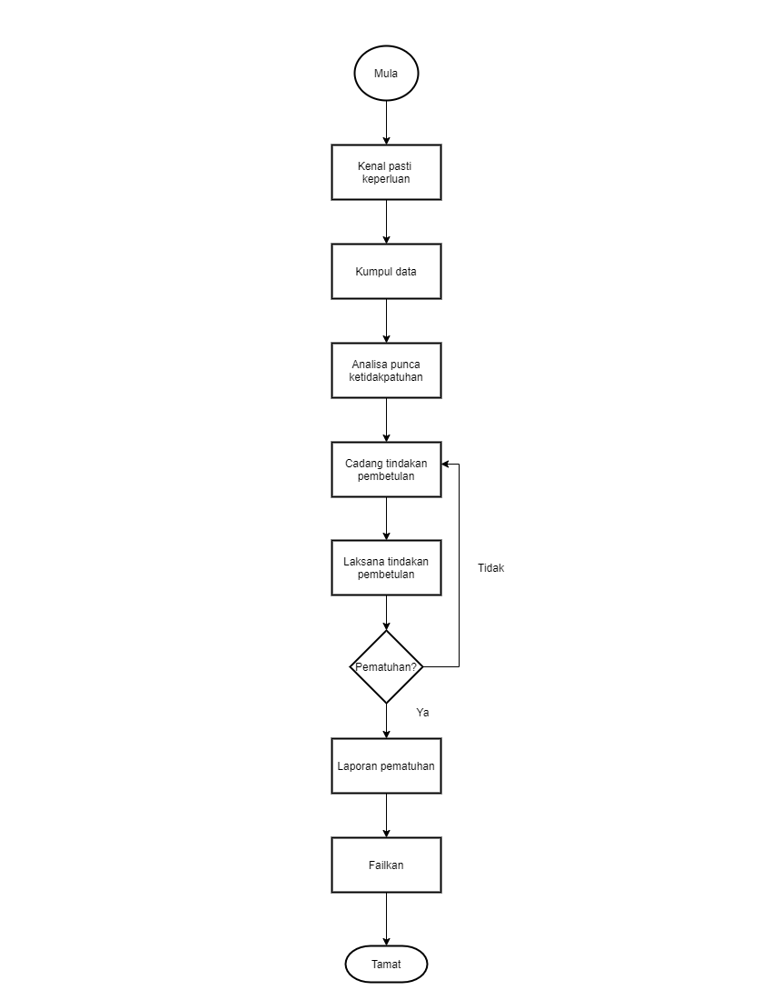

\newpage
\fancyhead[R]{\textbf{No: Keluaran: 01\\No Pindaan: 00\\Tarikh Kuatkuasa: `r params$doc_date`}}
\fancyhead[L]{\textbf{MS ISO 9001:2015\\OpenApps Sdn Bhd (548151-W)\\`r params$doc_id`}}
\clearpage
\pagenumbering{Roman}

# I    Rekod Pindaan

|Tarikh Pindaan|No Pindaan/No Keluaran|Rujukan Pindaan Mukasurat |Butir-butir Pindaan|Diluluskan Oleh|
|-------------|-------------|-------------|-------------|-------------|
|             |             |             |             |             |
|             |             |             |             |             |
|             |             |             |             |             |
|             |             |             |             |             |
|             |             |             |             |             |
|             |             |             |             |             |
|             |             |             |             |             |
|             |             |             |             |             |
|             |             |             |             |             |

# II   Senarai Pemegang Dokumen

| No. Salinan Terkawal   | Pemegang Dokumen              |
|------------------------|-------------------------------|
| `r params$doc_id`(01)  | `r a_list$pemilik_dok[1]`     |
|                        |                               |
| `r params$doc_id`(02)  | `r a_list$pemilik_dok[2]`     |
|                        |                               |
| `r params$doc_id`(03)  | `r a_list$pemilik_dok[3]`     |
|                        |                               |
| `r params$doc_id`(04)  | `r a_list$pemilik_dok[4]`     |
|                        |                               |
| `r params$doc_id`(05)  | `r a_list$pemilik_dok[5]`     |
|                        |                               |
| `r params$doc_id`(06)  | `r a_list$pemilik_dok[6]`     |
|                        |                               |
| `r params$doc_id`(07)  | `r a_list$pemilik_dok[7]`     |
|                        |                               |
| `r params$doc_id`(08)  | `r a_list$pemilik_dok[8]`     |
|                        |                               |
| `r params$doc_id`(09)  | `r a_list$pemilik_dok[9]`     |
|                        |                               |
| `r params$doc_id`(10)  | `r a_list$pemilik_dok[10]`    |
|                        |                               |
| `r params$doc_id`(11)  | `r a_list$pemilik_dok[11]`    |
|                        |                               |
| `r params$doc_id`(12)  | `r a_list$pemilik_dok[12]`    |
|                        |                               |
| `r params$doc_id`(13)  | `r a_list$pemilik_dok[13]`    |

\newpage
\clearpage
\pagenumbering{arabic}
\setcounter{page}{1}

# 1.0  Objektif

Prosedur ini bertujuan untuk menggariskan langkah-langkah yang perlu diambil bagi memastikan ketidakpatuhan disiasat serta tindakan pembetulan yang sewajarnya dilaksanakan untuk mengelakkan ia berlaku semula sebagai asas penambahbaikan Sistem Pengurusan Kualiti.

# 2.0  Skop

Prosedur ini digunapakai oleh pihak pengurusan atasan Syarikat untuk menganalisa masalah dan mengenalpasti tindakan pembetulan yang sesuai dalam pelaksanaan Sistem Pengurusan Kualiti dan punca-punca ketidakpatuhan yang diterima adalah melalui:

 i\) Maklumbalas Pelanggan;

 ii\) Laporan Penemuan Audit;

 iii\) Laporan Kajian Kepuasan Pelanggan;

 iv\) Kawalan Produk yang Tidak Memenuhi Spesifikasi; dan

 v\) Minit Mesyuarat.

# 3.0   Rujukan

3.1 MK.OA.01 pada seksyen-seksyen yang berikut:

 a. Seksyen 10.3 Penambahbaikan berterusan;

 a. Seksyen 10.2.1.1 Tindakan pembetulan; dan

 a. Seksyen 10.2.1.2 Tindakan pencegahan.

# 4.0  Definisi

##    4.1   Ketidakpatuhan

Ketidakpatuhan adalah pelanggaran ke atas mana-mana prosedur, pekeliling yang berkuatkuasa, piawaian MS ISO 9001:2015 serta perundangan yang berkuatkuasa.

##    4.2  Laporan Penemuan Audit

Laporan penemuan audit yang disediakan oleh juruaudit dalaman dan luaran ke atas ketidakpatuhan yang dikenalpasti semasa pengauditan yang dijalankan.

##    4.3  Borang Maklumbalas Pelanggan

Maklumbalas yang diisi oleh pelanggan atau borang yang mengandungi maklumat berhubung dengan perkhidmatan yang disediakan.

##    4.4  Laporan Kajian Kepuasan Pelanggan

Kajian yang dibuat oleh bahagian-bahagian untuk mengkaji tahap kepuasan pelanggan dalaman dan luaran terhadap perkhidmatan yang diberikan.

# 5.0   Singkatan

WP - Wakil Pengurusan

TWP - Timbalan Wakil Pengurusan

MK - Manual Kualiti

PK - Prosedur Kualiti

# 6.0   Tanggungjawab dan Tindakan

\begin{longtable}{|l|l|}
\hline
Tanggungjawab & Tindakan                                                                  \\ \hline
\endhead
%
\hline
\endfoot
%
\endlastfoot
%
TWP           & 1. Kenalpasti bidang-bidang untuk tindakan pembetulan melalui:            \\
              & i) Maklumbalas Pelanggan.                                                 \\
              & ii) Laporan Penemuan Audit.                                               \\
              & iii) Laporan Kajian Kepuasan Pelanggan.                                   \\
              & iv) Kawalan Produk yang Tidak Memenuhi Spesifikasi.                       \\
              & vi) Minit Mesyuarat.                                                      \\
              & 2. Arahkan TWP untuk mengumpul maklumat berkaitan tindakan                \\
              & pembetulan yang dicadangkan.                                              \\
              & 3. Bincang dengan Pengarah Urusan (MD) (jika perlu).             \\ \hline
TWP           & 4. Adakan mesyuarat peringkat bahagian untuk                              \\
              & membincangkan keperluan siasatan atau kes                                 \\
              & tertentu mengikut keperluan.                                              \\
              & 5. Kumpulkan maklumat dan buat analisa punca ketidakpatuhan.              \\
              & 6. Hubungi pelanggan/pihak pengadu untuk mengenalpasti                    \\
              & masalah sebenar dan punca-punca kepada sesuatu maklumbalas                \\
              & 7. Bincang dengan kakitangan Syarikat di mana ketidakpatuhan berlaku.     \\
              & 8. Kenalpasti cadangan tindakan pembetulan dan kakitangan                 \\
              & yang melaksanakan tindakan pembetulan.                                    \\
              & 9. Analisa cadangan tindakan pembetulan sama ada ianya                    \\
              & sesuai atau sebaliknya.                                                   \\
              & 10. Laksanakan tindakan pembetulan.                                       \\
              & 11. Lakukan pemantauan ke atas tindakan pembetulan yang                   \\
              & dikenalpasti supaya ketidakpatuhan tidak berulang.                        \\
              & 12. Jika tidak dapat dilaksanakan, bincang kembali                        \\
              & dengan WP yang terlibat untuk mendapatkan cadang balas.                   \\
              & 13. Sediakan laporan tindakan pembetulan ke atas                          \\
              & ketidakpatuhan yang diambil (Rujuk laporan format seperti di Lampiran 1). \\
              & 14. Sediakan laporan tindakan pembetulan yang mengandungi                 \\
              & aspek-aspek berikut:                                                      \\
              & i) Punca berlakunya ketidakpuasan pelanggan.                              \\
              & ii) Cadangan penyelesaian.                                                \\
              & iii) Pegawai yang bertanggungjawab.                                       \\
              & iv) Masalah yang perlu diambil tindakan serta merta.                      \\
              & 15. Serahkan laporan tindakan pembetulan                                  \\
              & kepada WP untuk pertimbangan.                                             \\ \hline
WP            & 16. Terima laporan dan sediakan ringkasan Cadangan Penambahbaikan         \\
              & (Rujuk Lampiran 2) kepada Pengarah Urusan (MD).                  \\
              & 17. Failkan semua laporan tindakan pembetulan dan pemantauan              \\
              & ke dalam Fail Tindakan Pembetulan.                                        \\ \hline
Kerani        & 18. Failkan semua laporan tindakan pembetulan dan                         \\
              & pemantauan ke dalam Fail Tindakan Pembetulan.                             \\ \hline
\end{longtable}

\newpage

# 7.0  Aliran Kerja

{width=70%}

\newpage

# 8.0  Rekod Kualiti

|Bil   |Rekod                                    |Tempoh Penyimpanan    |Lokasi       |Klasifikasi|
|------|-----------------------------------------|----------------------|-------------|-----------|
| 1    |Fail Aduan Pelanggan                     | 5 Tahun              |Pejabat WP   |Terhad     |
|      |                                         |                      |             |           |
| 2    |Laporan AD                               | 5 Tahun              |KSA          |Terhad     |
|      |                                         |                      |             |           |
| 3    |Kertas Minit Mesyuarat                   | 5 Tahun              |Jabatan/Sel  |Terhad     |
|      |                                         |                      |             |           |
| 4    |Fail Tindakan Pembetulan                 | 5 Tahun              |Pejabat WP   |Terhad     |

# 9.0  Lampiran

##    A - Format Laporan Tindakan Pembetulan

------------------------------------------------------------------------
Bil Seksyen Ketakakuran Bah/Caw  Jangkamasa Status tindakan
            dikesan     terlibat tindakan   pembetulan
                                 pembetulan
--- ------ ------------ -------  ---------- ---------------
1. ....... ............ .......  .......... ...............

2. ....... ............ .......  .......... ............... 

3. ....... ............ .......  .......... ............... 

------------------------------------------------------------------------

##    B - Cadangan Penambahbaikan

**BORANG CADANGAN PENAMBAHBAIKAN [PK(W).OA.04.B01]**

(Arahan: Sila isi dan hantar borang ini kepada Wakil Pengurusan melalui Ketua Bahagian/Ketua Cawangan)

**1. MAKLUMAT PENCADANG** 

 a) Nama : ............................................

 b) Jawatan : .........................................

 c) Bahagian/Cawangan :................................

**2. CADANGAN DAN RASIONAL**

*(Nyatakan cadangan diperlukan)*  

*(Nyatakan alasan-alasan mengapa cadangan diperlukan)*  

Tarikh:.................           Tandatangan .......................

**3. ULASAN DAN KEPUTUSAN WAKIL PENGURUSAN**

*(Nyatakan ulasan cadangan)*

Tarikh:.................           Tandatangan .......................

**4. KEPUTUSAN PENGURUS JABATAN**

*(Nyatakan ulasan cadangan)*

Tarikh:.................           Tandatangan .......................
