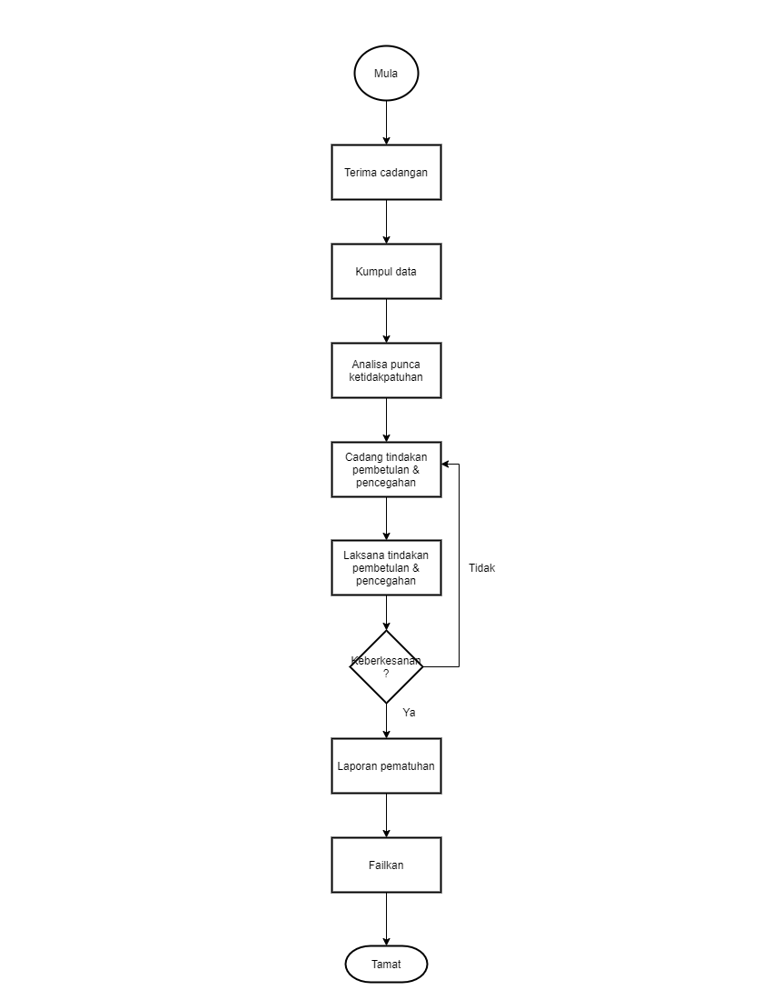

\newpage
\fancyhead[R]{\textbf{No: Keluaran: 01\\No Pindaan: 00\\Tarikh Kuatkuasa: `r params$doc_date`}}
\fancyhead[L]{\textbf{MS ISO 9001:2015\\OpenApps Sdn Bhd (548151-W)\\`r params$doc_id`}}
\clearpage
\pagenumbering{Roman}

# I    Rekod Pindaan

|Tarikh Pindaan|No Pindaan/No Keluaran|Rujukan Pindaan Mukasurat |Butir-butir Pindaan|Diluluskan Oleh|
|-------------|-------------|-------------|-------------|-------------|
|             |             |             |             |             |
|             |             |             |             |             |
|             |             |             |             |             |
|             |             |             |             |             |
|             |             |             |             |             |
|             |             |             |             |             |
|             |             |             |             |             |
|             |             |             |             |             |
|             |             |             |             |             |

# II   Senarai Pemegang Dokumen

| No. Salinan Terkawal   | Pemegang Dokumen              |
|------------------------|-------------------------------|
| `r params$doc_id`(01)  | `r a_list$pemilik_dok[1]`     |
|                        |                               |
| `r params$doc_id`(02)  | `r a_list$pemilik_dok[2]`     |
|                        |                               |
| `r params$doc_id`(03)  | `r a_list$pemilik_dok[3]`     |
|                        |                               |
| `r params$doc_id`(04)  | `r a_list$pemilik_dok[4]`     |
|                        |                               |
| `r params$doc_id`(05)  | `r a_list$pemilik_dok[5]`     |
|                        |                               |
| `r params$doc_id`(06)  | `r a_list$pemilik_dok[6]`     |
|                        |                               |
| `r params$doc_id`(07)  | `r a_list$pemilik_dok[7]`     |
|                        |                               |
| `r params$doc_id`(08)  | `r a_list$pemilik_dok[8]`     |
|                        |                               |
| `r params$doc_id`(09)  | `r a_list$pemilik_dok[9]`     |
|                        |                               |
| `r params$doc_id`(10)  | `r a_list$pemilik_dok[10]`    |
|                        |                               |
| `r params$doc_id`(11)  | `r a_list$pemilik_dok[11]`    |
|                        |                               |
| `r params$doc_id`(12)  | `r a_list$pemilik_dok[12]`    |
|                        |                               |
| `r params$doc_id`(13)  | `r a_list$pemilik_dok[13]`    |

\newpage
\clearpage
\pagenumbering{arabic}
\setcounter{page}{1}

# 1.0  Objektif

Prosedur ini bertujuan untuk menggariskan langkah-langkah yang perlu diambil untuk memastikan tindakan pencegahan yang sewajarnya dilaksana bagi mengelak kemungkinan berlakunya ketidakpatuhan dalam Sistem Pengurusan Kualiti.

# 2.0  Skop

Prosedur ini digunapakai oleh Pihak Pengurusan Atasan Syarikat untuk mengenalpasti dan menganalisa tindakan pencegahan bagi semua ketidakpatuhan yang berkaitan dengan keupayaan proses, ciri-ciri perkhidmatan dan keberkesanan pelaksanaan Sistem Pengurusan Kualiti.

# 3.0   Rujukan

 3.1 MK.OA.01 dengan seksyen-seksyen berikut:

 a. Seksyen 5.1  Kepimpinan dan komitmen;

 a. Seksyen 5.6.1 Tanggungjawab dan kuasa;

 a. Seksyen 8.5.1 Kawalan penyediaan pengeluaran dan perkhidmatan;

 a. Seksyen 8.5.2 Pengenalpastian dan kebolehkesanan; dan

 a. Seksyen 10.2.1.2 Tindakan pencegahan.

# 4.0  Definisi

4.1 Maklumbalas Pelanggan

Maklumbalas pelanggan yang berbentuk penghargaan, pujian mahupun aduan yang diterima sama ada secara lisan dan bertulis.

4.2 Laporan Audit dalaman

Dokumen yang mengandungi laporan penemuan-penemuan audit ke atas kreteria audit oleh auditor terhadap auditee yang menjelaskan ketidakpatuhan dan cadangan penambahbaikan kepada Sistem Pengurusan Kualiti.

4.3 Tindakan Pencegahan

Tindakan untuk mencegah dari berlakunya kemungkinan sesuatu kepincangan, kecacatan atau kemerosotan Sistem Pengurusan Kualiti dan Pengurusan Keselamatan Maklumat yang boleh menjejaskan berlakunya perkhidmatan yang tidak memenuhi spesifikasi.

# 5.0   Singkatan

5.1 WP - Wakil Pengurusan.

5.2 PD - Pengurus Dokumen.

5.3 PJ - Pengurus Jabatan.

5.4 MKSP - Mesyuarat Kajian Semula Pengurusan.

5.5 QMS - Sistem Pengurusan Kualiti.

# 6.0   Tanggungjawab dan Tindakan

\begin{longtable}{|l|l|}
\hline
Tanggungjawab   & Tindakan                                                                       \\ \hline
\endhead
%
\hline
\endfoot
%
\endlastfoot
%
WP              & 1. Arahkan PJ untuk mengenalpasti bidang-bidang tindakan pencegahan            \\
                & dan penambahbaikan ke atas kemungkinan kecacatan dan                           \\
                & kepincangan yang dikumpul melalui :                                            \\
                & a.  Laporan Audit.                                                             \\
                & b. Cadangan-cadangan penambahbaikan oleh kakitangan dalam QMS.                 \\
                & c. Sistem cadangan Syarikat.                                                   \\ \hline
PJ              & 2. Terima arahan dari WP.                                                      \\
                & 3. Kenalpasti kemungkinan punca masalah dan menggunakan statistik yang sesuai. \\ \hline
PD              & 4. Sedia laporan akhir kemungkinan masalah ketidakpatuhan dan                  \\
                & kemuka kepada WP.                                                              \\ \hline
WP              & 5. Terima laporan untuk dibentang dalam Mesyuarat Kajian Semula.               \\ \hline
MKSP            & 6. Bincang laporan dan lulus tindakan pencegahan dan                           \\
                & penambahbaikan untuk dilaksanakan.                                             \\ \hline
WP              & 7. Arahkan PJ mengambil tindakan.                                              \\ \hline
PJ              & 8. Laksanakan tindakan pencegahan dan sediakan                                 \\
                & Laporan Kemajuan Pelaksanaan kepada WP.                                        \\ \hline
WP              & 9. Teliti Laporan Kemajuan Keberkesanan Pelaksanaan yang bersesuaian.          \\
                & 10. Teliti aspek keberkesanan dan tindakan penambahbaikan yang diambil.        \\
                & 11. Kemuka kepada pihak pengurusan untuk makluman apabila berlaku kepincangan, \\
                & kemerosotan dan kecacatan untuk dibincang dalam MKSP.                          \\ \hline
Urus Setia MKSP & 12. Fail semula rekod berkaitan dengan tindakan pencegahan dan penambahbaikan. \\ \hline
\end{longtable}

\newpage

# 7.0  Aliran Kerja

{width=70%}

\newpage

# 8.0  Rekod Kualiti

|Bil   |Rekod                                 |Tempoh Penyimpanan|Lokasi|Klasifikasi|
|------|--------------------------------------|------------------|------|-----------|
|      |                                      |                  |      |           |
| 1    | Laporan Awal Kajian Masalah          | 5 Tahun          | WP   | Terhad    |
|      |                                      |                  |      |           |
| 2    | Laporan Akhir Kajian Kemungkinan     | 5 Tahun          | WP   | Terhad    |
|      | Masalah                              |                  |      |           |
| 3    | Borang Tindakan Pencegahan           | 5 Tahun          | WP   | Terhad    |
|      |                                      |                  |      |           |
| 4    | Laporan Kemajuan Pelaksanaan Tindakan| 5 Tahun          | WP   | Terhad    |
|      | Pencegahan dan Penambahbaikan        |                  |      |           |
|      |                                      |                  |      |           |
| 5    | Laporan Kemajuan Keberkesanan Tindakan| 5 Tahun         | WP   | Terhad    |
|      | Pencegahan dan Penambahbaikan        |                  |      |           |

\newpage

# 9.0  Lampiran

## A - Format Laporan Awal Kajian Masalah

[FORMAT LAPORAN AWAL KAJIAN MASALAH]

1. Tarikh Kajian:

2. Rujukan:

3. Siri Audit:

|Bil |Masalah Yang Dikenalpasti | Punca |  Tindakan Susulan |
|----|--------------------------|-------|-------------------|
|    |                          |       |                   |
|    |                          |       |                   |
|    |                          |       |                   |                                                        
|    |                          |       |                   |                                                        
|    |                          |       |                   |                                                        
|    |                          |       |                   |                                                        
|    |                          |       |                   |                                                        
                                                        
## B - Format Akhir Kajian Kemungkinan Masalah

[FORMAT LAPORAN AKHIR KAJIAN KEMUNGKINAN MASALAH]

1. Tarikh Mula Kajian:

2. Tarikh Akhir Kajian:

3. Rujukan:

4. Siri Audit:

| Bil   | Masalah              |Punca             | Cadangan Penambaikan|
|-------|----------------------|------------------|---------------------|
|       |                      |                  |                     |
|       |                      |                  |                     |
|       |                      |                  |                     |
|       |                      |                  |                     |
|       |                      |                  |                     |
|       |                      |                  |                     |
|       |                      |                  |                     |

\newpage

## C - Format Laporan Tindakan Pencegahan

[FORMAT TINDAKAN PENCEGAHAN]

|Bil   |Kelemahan             | Punca             |Cadangan            |
|------|----------------------|-------------------|--------------------|
|      |                      |                   |                    |
|      |                      |                   |                    |
|      |                      |                   |                    |
|      |                      |                   |                    |
|      |                      |                   |                    |
|      |                      |                   |                    |
|      |                      |                   |                    |
                                        
## D - Format Laporan Kemajuan Pelaksanaan Tindakan Pencegahan dan Penambahbaikan

[FORMAT LAPORAN KEMAJUAN PELAKSANAAN TINDAKAN PENCEGAHAN DAN PENAMBAHBAIKAN]

1. AM

2. PENDAHULUAN

3. TUJUAN

4. MASALAH-MASALAH YANG TELAH DIKENALPASTI

5. PELAKSANAAN  
A). TINDAKAN PENCEGAHAN  
B). PENAMBAHBAIKAN  

6. HASIL ANALISIS YANG DIBUAT

7. CADANGAN

8. RUMUSAN

\newpage

## E - Format Laporan Keberkesanan Tindakan Pencegahan dan Penambahbaikan

[FORMAT LAPORAN KEBERKESANAN PELAKSANAAN TINDAKAN PENCEGAHAN DAN
PENAMBAHBAIKAN]

1. AM

2. PENDAHULUAN

3. TUJUAN

4. MASALAH-MASALAH YANG TELAH DIKENALPASTI

5. PELAKSANAAN  
A). TINDAKAN PENCEGAHAN  
B). PENAMBAHBAIKAN

6. KEBERKESANAN DI ATAS TINDAKAN YANG TELAH DIAMBIL

7. LANGKAH-LANGKAH PENYELESAIAN  
A). DATA ANALISIS  
B). CARTA

8. CADANGAN

7. RUMUSAN
