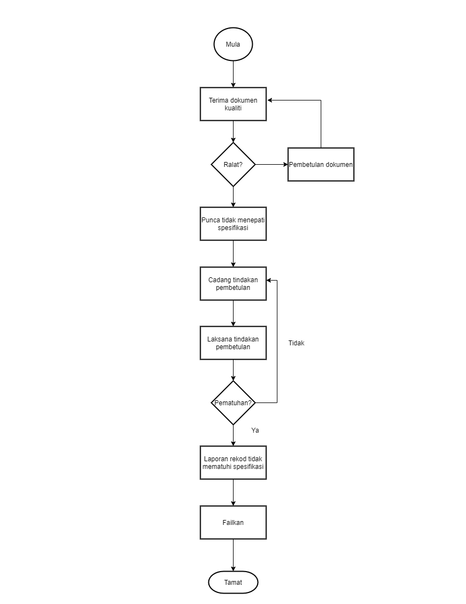

\newpage
\fancyhead[R]{\textbf{No: Keluaran: 01\\No Pindaan: 00\\Tarikh Kuatkuasa: `r params$doc_date`}}
\fancyhead[L]{\textbf{MS ISO 9001:2015\\OpenApps Sdn Bhd (548151-W)\\`r params$doc_id`}}
\clearpage
\pagenumbering{Roman}

# I    Rekod Pindaan

|Tarikh Pindaan|No Pindaan/No Keluaran|Rujukan Pindaan Mukasurat |Butir-butir Pindaan|Diluluskan Oleh|
|-------------|-------------|-------------|-------------|-------------|
|             |             |             |             |             |
|             |             |             |             |             |
|             |             |             |             |             |
|             |             |             |             |             |
|             |             |             |             |             |
|             |             |             |             |             |
|             |             |             |             |             |
|             |             |             |             |             |
|             |             |             |             |             |

# II   Senarai Pemegang Dokumen

| No. Salinan Terkawal   | Pemegang Dokumen              |
|------------------------|-------------------------------|
| `r params$doc_id`(01)  | `r a_list$pemilik_dok[1]`     |
|                        |                               |
| `r params$doc_id`(02)  | `r a_list$pemilik_dok[2]`     |
|                        |                               |
| `r params$doc_id`(03)  | `r a_list$pemilik_dok[3]`     |
|                        |                               |
| `r params$doc_id`(04)  | `r a_list$pemilik_dok[4]`     |
|                        |                               |
| `r params$doc_id`(05)  | `r a_list$pemilik_dok[5]`     |
|                        |                               |
| `r params$doc_id`(06)  | `r a_list$pemilik_dok[6]`     |
|                        |                               |
| `r params$doc_id`(07)  | `r a_list$pemilik_dok[7]`     |
|                        |                               |
| `r params$doc_id`(08)  | `r a_list$pemilik_dok[8]`     |
|                        |                               |
| `r params$doc_id`(09)  | `r a_list$pemilik_dok[9]`     |
|                        |                               |
| `r params$doc_id`(10)  | `r a_list$pemilik_dok[10]`    |
|                        |                               |
| `r params$doc_id`(11)  | `r a_list$pemilik_dok[11]`    |
|                        |                               |
| `r params$doc_id`(12)  | `r a_list$pemilik_dok[12]`    |
|                        |                               |
| `r params$doc_id`(13)  | `r a_list$pemilik_dok[13]`    |

\newpage
\clearpage
\pagenumbering{arabic}
\setcounter{page}{1}

# 1.0  Objektif

 Prosedur ini menyediakan garis panduan bagi memastikan produk/perkhidmatan Syarikat yang tidak memenuhi spesifikasi, seperti dalam peraturan yang telah ditetapkan; dikawal, diasingkan dan diambil tindakan pembetulan secara teratur dan berkesan.

# 2.0  Skop

 Prosedur ini digunapakai oleh semua kakitangan Syarikat untuk semua penghasilan produk dan penyampaian perkhidmatan yang tidak memenuhi spesifikasi dikesan; dikawal, diasingkan dan diambil tindakan pembetulan ke atas rekod-rekod yang tidak memenuhi spesifikasi.

# 3.0   Rujukan

3.1 MK.OA.01 dengan seksyen-seksyen berikut:

a. Seksyen 8.5.1 Kawalan penyediaan pengeluaran dan perkhidmatan;

a. Seksyen 8.5.2 Pengenalpastian dan kebolehkesanan;

a. Seksyen 8.5.2 Pengenalpastian dan kebolehkesanan; 

a. Seksyen 8.5.4 Pemeliharaan;

a. Seksyen 8.7 Kawalan output tak akur;

a. Seksyen 9.1 Pemantauan, pengukuran, analisis dan penilaian;

a. Seksyen 9.1.3  Analisis dan penilaian; dan

a. Seksyen 10.2 Ketakakuran dan tindakan pembetulan.

# 4.0  Definisi

4.1     Produk yang tidak memenuhi spesifikasi

Semua bentuk produk/perkhidmatan yang tidak mengikut peraturan yang ditetapkan sebagaimana keperluan yang ditetapkan dalam Sistem Pengurusan Kualiti.

# 5.0   Singkatan

 5.1 MD - Pengarah Urusan.

 5.2 WP - Wakil Pengurusan.

 5.3 PD - Pengurus Dokumen.

 5.4 PJ - Pengurus Jabatan.
 
 5.5 DO - Delivery Order.
 
 5.6 PO - Purchase Order.
 
 
# 6.0   Tanggungjawab dan Tindakan

\begin{longtable}{|l|l|}
\hline
Tanggungjawab & Tindakan                                                                             \\ \hline
\endhead
%
\hline
\endfoot
%
\endlastfoot
%
PJ            & A. Peringkat Penerimaan Dokumen (Input).                                             \\
              & 1. Tentukan penerimaan rekod-rekod kualiti dari pelanggan                            \\
              & menepati kehendak prosedur kualiti.                                                  \\
              & 2. Kenalpasti rekod-rekod kualiti yang tidak memenuhi                                \\
              & spesifikasi seperti:                                                                 \\
              & i.DO/PO/invois/sebut harga yang terdapat ralat.                                      \\
              & ii. DO/PO/invois/sebut harga yang mengelirukan.                                      \\
              & iii. Dokumen berkaitan item/serahan yang tidak memenuhi spesifikasi.                 \\
              & 3. Kembalikan rekod-rekod kualiti kepada pelanggan yang tidak                        \\
              & memenuhi spesifikasi sekiranya ada.                                                  \\
              & 4. Maklumkan kepada WP berhubung insiden penolakan rekod-rekod kualiti               \\
              & yang tidak memenuhi spesifikasi.                                                     \\ \hline
WP            & 5. Berikan komen ke atas penerimaan rekod-rekod kualiti                              \\
              & yang tidak memenuhi spesifikasi.                                                     \\ \hline
PJ            & 6. Minta pelanggan untuk menyediakan rekod-rekod baru yang memenuhi spesifikasi.     \\
              & 7. Perbetulkan prosedur dan rekod, di mana perlu.                                    \\
              & 8. Arahkan tindakan pembetulan dilaksanakan oleh kakitangan yang bertanggungjawab.   \\ \hline
WP            & 9. Sahkan tindakan pembetulan yang telah dilakukan adalah mengikut                   \\
              & prosedur yang telah ditetapkan.                                                      \\ \hline
PJ            & 10. Buat laporan penerimaan rekod-rekod kualiti yang tidak memenuhi spesifikasi      \\
              & dengan mengisi Borang Laporan Tindakan Pembetulan.                                   \\
              & B. Peringkat Pemerosesan Rekod                                                       \\
              & 11. Kenalpasti rekod-rekod kualiti yang tidak memenuhi spesifikasi seperti berikut:  \\
              & i.DO/PO/invois/sebut harga yang terdapat ralat.                                      \\
              & ii. DO/PO/invois/sebut harga yang mengelirukan.                                      \\
              & iii. Dokumen berkaitan item/serahan yang tidak memenuhi spesifikasi.                 \\
              & 12. Maklumkan kepada WP berhubung rekod kualiti yang tidak memenuhi spesifikasi.     \\
              & 13. Berikan komen ke atas rekod-rekod kualiti yang idak memenuhi spesifikasi.        \\
              & 14. Arahkan kakitangan yang bertanggungjawab untuk mengambil tindakan pembetulan     \\
              & ke atas rekod-rekod perkhidmatan yang tidak memenuhi spesifikasi.                    \\
              & 15. Pastikan tindakan pembetulan dilaksanakan oleh kakitangan yang bertanggungjawab  \\
              & seperti memperbetulkan rekod-rekod kualiti.                                          \\ \hline
WP            & 16. Sahkan tindakan pembetulan yang telah dilakukan adalah mengikut                  \\
              & prosedur yang telah ditetapkan.                                                      \\ \hline
PJ            & 17. Buat laporan rekod-rekod kualiti yang  tidak memenuhi spesifikasi dengan mengisi \\
              & Borang Laporan Tindakan Pembetulan.                                                  \\
              & C. Peringkat Pengeluaran (Output)                                                    \\ \hline
PJ            & 18. Semak rekod-rekod kualiti yang tidak memenuhi spesifikasi seperti berikut:       \\
              & i.DO/PO/invois/sebut harga yang terdapat ralat.                                      \\
              & ii. DO/PO/invois/sebut harga yang mengelirukan.                                      \\
              & iii. Dokumen berkaitan item/serahan yang tidak memenuhi spesifikasi.                 \\
              & 19. Maklumkan kepada WP berhubung rekod kualiti yang tidak memenuhi spesifikasi.     \\
              & 20. Berikan komen ke atas rekod-rekod kualiti yang idak memenuhi spesifikasi.        \\
              & 21. Arahkan kakitangan yang bertanggungjawab untuk mengambil tindakan pembetulan     \\
              & ke atas rekod-rekod perkhidmatan yang tidak memenuhi spesifikasi.                    \\
              & 22. Pastikan tindakan pembetulan dilaksanakan oleh kakitangan yang bertanggungjawab  \\
              & seperti memperbetulkan rekod-rekod kualiti.                                          \\ \hline
WP            & 23. Sahkan tindakan pembetulan yang telah dilakukan adalah mengikut                  \\
              & prosedur yang telah ditetapkan.                                                      \\ \hline
PJ            & 24. Buat laporan rekod-rekod kualiti yang  tidak memenuhi spesifikasi dengan mengisi \\
              & Borang Laporan Tindakan Pembetulan.                                                  \\ \hline
\end{longtable}

\newpage

# 7.0 Aliran Kerja

{width=70%}

\newpage

# 8.0  Rekod Kualiti

|Bil   |Rekod                                    |Tempoh Penyimpanan|Lokasi       |Klasifikasi|
|------|-----------------------------------------|------------------|-------------|-----------|
|1.    | Laporan Tindakan Pembetulan             | 5 tahun          | Pejabat WP  | Terhad    |

# 9.0  Lampiran

Tiada
