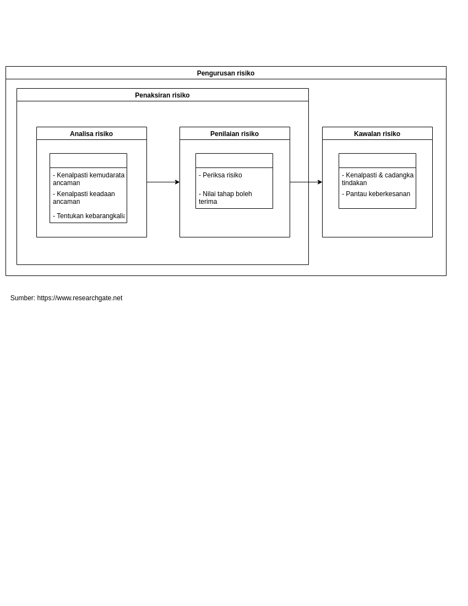
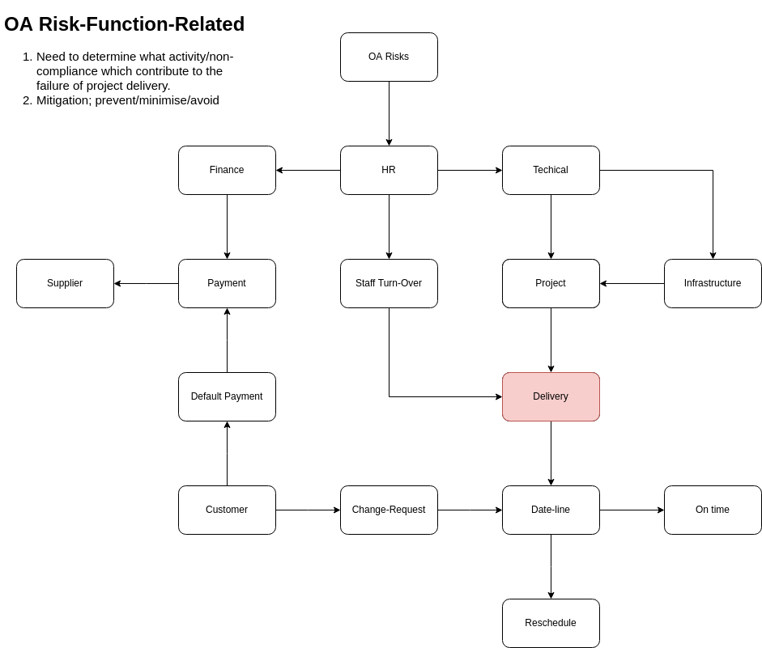
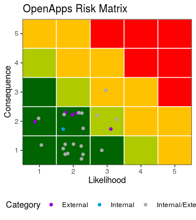

\newpage
\fancyhead[R]{\textbf{No: Keluaran: 01\\No Pindaan: 00\\Tarikh Kuatkuasa: `r params$doc_date`}}
\fancyhead[L]{\textbf{MS ISO 9001:2015\\OpenApps Sdn Bhd (548151-W)\\`r params$doc_id`}}
\newpage
\clearpage
\pagenumbering{Roman}

# I    Rekod Pindaan

|Tarikh Pindaan|No Pindaan/No Keluaran|Rujukan Pindaan Mukasurat |Butir-butir Pindaan|Diluluskan Oleh|
|-------------|-------------|-------------|-------------|-------------|
|             |             |             |             |             |
|             |             |             |             |             |
|             |             |             |             |             |
|             |             |             |             |             |
|             |             |             |             |             |
|             |             |             |             |             |
|             |             |             |             |             |
|             |             |             |             |             |
|             |             |             |             |             |

# II   Senarai Pemegang Dokumen

| No. Salinan Terkawal   | Pemegang Dokumen              |
|------------------------|-------------------------------|
| `r params$doc_id`(01)  | `r a_list$pemilik_dok[1]`     |
|                        |                               |
| `r params$doc_id`(02)  | `r a_list$pemilik_dok[2]`     |
|                        |                               |
| `r params$doc_id`(03)  | `r a_list$pemilik_dok[3]`     |
|                        |                               |
| `r params$doc_id`(04)  | `r a_list$pemilik_dok[4]`     |
|                        |                               |
| `r params$doc_id`(05)  | `r a_list$pemilik_dok[5]`     |
|                        |                               |
| `r params$doc_id`(06)  | `r a_list$pemilik_dok[6]`     |
|                        |                               |
| `r params$doc_id`(07)  | `r a_list$pemilik_dok[7]`     |
|                        |                               |
| `r params$doc_id`(08)  | `r a_list$pemilik_dok[8]`     |
|                        |                               |
| `r params$doc_id`(09)  | `r a_list$pemilik_dok[9]`     |
|                        |                               |
| `r params$doc_id`(10)  | `r a_list$pemilik_dok[10]`    |
|                        |                               |
| `r params$doc_id`(11)  | `r a_list$pemilik_dok[11]`    |
|                        |                               |
| `r params$doc_id`(12)  | `r a_list$pemilik_dok[12]`    |
|                        |                               |
| `r params$doc_id`(13)  | `r a_list$pemilik_dok[13]`    |

\newpage
\clearpage
\pagenumbering{arabic}
\setcounter{page}{1}

# 1.0   Objektif

Keperluan menaksir dan  mengurus risiko (Risk Assessment and Management)(RAM) dilaksanakan semasa proses pemantauan dan penyerahan projek integrasi sistem (PK(O).OA.02). Penaksiran risiko dilaksanakan dengan menilai isu-isu dalaman dan luaran yang boleh memberi impak kepada memuktamadkan serahan projek (project deliverable).

# 2.0   Skop

RAM dilaksanakan oleh pengurus projek sebagai tindakan pre-emptif untuk mengenal pasti kebarangkalian sesuatu risiko boleh mengakibatkan kelewatan serahan projek kepada pengguna.

Syarikat memilih 3 langkah RAM (lihat lampiran A) yang berikut:

Fasa penaksiran risiko

1.  Analisa risiko yang terdiri dari:   
    a. Kenalpasti kemudaratan atau ancaman;    
    b. Kenalpasti keadaan ancaman; dan    
    c. Tentukan kebarangkalian berlaku.
    
2.  Penilian risiko dengan langkah-langkah berikut:      
    a. Periksa risiko; dan  
    a. Nilai tahap boleh terima (Tolerable).

3.  Fasa kawalan risiko iaitu      
    a.  Kenalpasti bentuk kawalan; dan  
    b.  Pantau keberkesanan.

# 3.0   Rujukan

Pelaksanaan RAM merujuk kepada seksyen-seksyen di dalam MK.OA.01 yang berikut: 

i. Seksyen 4.4.1 (f);

i. Seksyen 6.1 Tindakan menyatakan risiko dan peluang; dan

i. Seksyen 9.1 Pemantauan, pengukuran, analisis dan penilaian.

# 4.0   Definisi

4.1 Mudarat (Consequence)
~ Tahap yang boleh meningkatkan kesan berisiko yang diukur pada 5 skala iaitu skala 1 (Tidak signifikan) sehingga 5 (Bencana) lihat Lampiran C.

4.2 Kebarangkalian (Likelihood)
~ Skala kemungkinan sesuatu kejadian berlaku yang diukur pada 5 skala iaitu skala 1 (Tidak signifikan) sehingga 5 (Paling kerap) lihat Lampiran C. 

4.3 Risiko (Risk)
~ Secara umum, kemungkinan sesuatu keadaan berlaku yang mengakibatkan kehilangan, kemusnahan dan kemudaratan yang khususnya berpunca dari pengendalian yang tidak teliti.

4.4 Pengurangan (Mitigation)
~ Kaedah atau langkah-langkah yang diambil untuk mengurangi, mengatasi atau mengelak risiko.

4.5 Risiko dan fungsi pelaksanaan OA
~ Risiko serta kesan terhadap penyerahan projek yang dijejak kepada fungsi utama pelaksanaan setiap jabatan bagi maksud mitigasi lihat lampiran B.

# 5.0   Singkatan

# 6.0   Tanggungjawab dan Tindakan

\begin{table}[th]
\begin{tabular}{|l|l|}
\hline
Tanggungjawab                   & Tindakan                                                            \\ \hline
Pengurus projek                 & 1. Laksana RAM.                                                     \\ \hline
Pengurus Jabatan                & 2. Kenal pasti sumber tersedia bagi pelaksanaan                     \\
                                & langkah-langkah pengurangan.                                        \\
                                & 3. Lantik pemilik proses untuk pelaksanaan di perenggan 2.          \\ \hline
Wakil pengurusan                & 4. Rekod risiko, inisiatif dan pemilik proses.                      \\ \hline
Pemilik proses                  & 5. Laksana inisiatif di perenggan 2 hingga 3 dan laporkan prestasi. \\ \hline
Pemilik proses/Wakil pengurusan & 6. Sediakan analisa pencapaian/kawalan risiko.                      \\ \hline
Wakil pengurusan                & 7. Laporkan pencapaian/kawalan risiko kepada                        \\
                                & pengurusan atasan syarikat.                                         \\ \hline
\end{tabular}
\end{table}

# 7.0 Aliran Kerja

# 8.0 Rekod Kualiti

| Bil | Rekod          | Tempoh Penyimpanan | Lokasi                   |Klasifikasi|
|-----|----------------|--------------------|--------------------------|-----------|
| 1.  | Laporan RAM    | 5 tahun            | Pejabat Wakil Pengurusan/Pengurus projek |Terhad|

\newpage

# 9.0 Lampiran

## A Pengurusan penaksiran risiko

{width=70%}
\newpage

## B Risiko dan fungsi pelaksanaan OA

{width=70%}
\newpage

## C Skala (Scale)

1. Consequence
~ is the amount of damage or harm a hazard could create and it is often ranked on a five point scale as follows:

| Scale      | Description                                                       |
|------------|-------------------------------------------------------------------|
| 5 Catastrophic | Operating conditions are such that human error, environment, design deficiencies, element, subsystem or component failure, or procedural deficiencies may commonly cause death or major system loss, thereby requiring immediate cessation of the unsafe activity or operation. |
| 4 Critical | Operating conditions are such that human error, environment, design deficiencies, element, subsystem or component failure or procedural deficiencies may commonly cause severe injury or illness or major system damage thereby requiring immediate corrective action. |
| 3 Moderate | Operating conditions are such that human error, environment, design deficiencies, element, subsystem or component failure or procedural deficiencies may commonly cause moderate injury or illness or major system damage thereby requiring immediate corrective action. |
| 2 Marginal | Operating conditions may commonly cause minor injury or illness or minor systems damage such that human error, environment, design deficiencies, subsystem or component failure or procedural deficiencies can be counteracted or controlled without severe injury, illness or major system damage. |
| 1 Negligible | Operating conditions are such that personnel error, environment, design deficiencies, subsystem or component failure or procedural deficiencies will result in no, or less than minor, illness, injury or system damage. |

2. Likelihood
~ the likelihood of the hazard occurring and ranked on a five point scale:

| Scale      | Description                                                       |
|------------|-------------------------------------------------------------------|
| 5 Certaint | Likely to occur often in the life of an item.                     |
| 4 Likely   | Will occur several times in the life of an item.                  |
| 3 Possible | Likely to occur some time in the life of an item.                 |
| 2 Rare     | Unlikely but possible to occur in the life of an item.            |
| 1 Unlikely | So unlikely, it can be assumed occurrence may not be experienced. |

\newpage

## D Matriks risiko

{width=70%}

## E Risiko dan langkah mitigasi
\small

```{r echo=FALSE, message=FALSE, warning=FALSE}
library(dplyr)
library(kableExtra)

oa_risk %>% 
  inner_join(oa_risk_mit, by="Id") %>% 
  group_by(Title) %>% 
  kbl() %>%
  column_spec(2,bold = T, latex_column_spec = "p{4cm}") %>% 
  column_spec(7,latex_column_spec = "p{3cm}")
```

